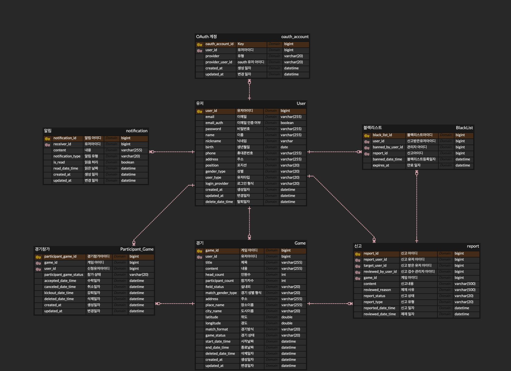
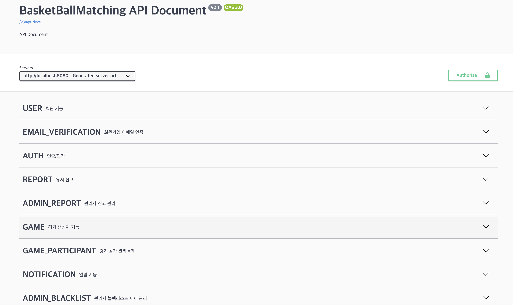
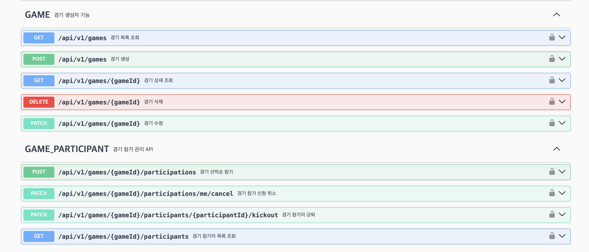
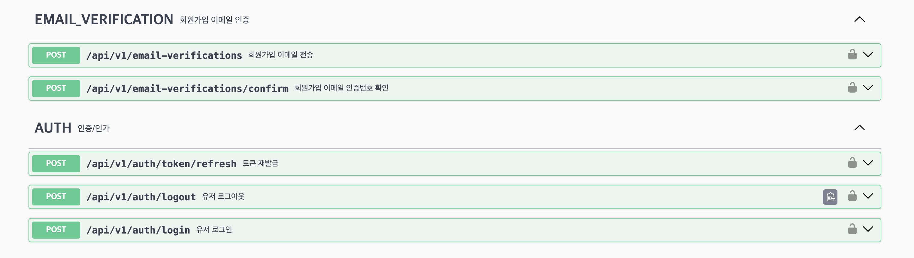

# 🏀 농구 매칭 서비스

> 함께 농구할 사람과 경기를 찾고, 참가부터 운영·신고·알림까지 관리하는 농구 매칭 백엔드 프로젝트

농구는 경기 형식에 따라 최소 6명에서 10명 이상의 인원이 필요해 개인이 원하는 시간과 장소에서 인원을 모으기 어렵습니다.

이 프로젝트는 사용자가 조건에 맞는 경기를 검색하고 선착순으로 참가할 수 있으며, 경기 생성자가 일정과 참가자를 관리할 수 있는 서비스를 목표로 시작했습니다. 이후 인증, 신고 검토, 블랙리스트 제재, 실시간 알림과 대용량 목록 조회 성능 개선까지 백엔드 운영에 필요한 흐름을 확장했습니다.

### 🗓️ 개발 기간

> 2025/10/05 ~ 2025/11/23 · 이후 리팩터링 및 성능 개선 진행

---

## 1️⃣ ERD



사용자·OAuth 계정·경기·참가자·신고·블랙리스트·알림의 최신 관계를 반영했습니다. 신고 처리와 제재·알림 테이블의 관계는 [신고·블랙리스트·알림 ERD 문서](docs/erd/moderation-notification-erd.md)에서 자세히 설명합니다.

---

## 🏛️ 시스템 아키텍처


- Spring Security와 JWT를 이용한 인증·인가
- MySQL을 영속 데이터의 원본으로 사용
- Redis를 Refresh Token, 로그아웃 Access Token, 인증번호 및 Pub/Sub에 사용
- SSE를 이용한 서버→클라이언트 실시간 알림
- Prometheus와 Grafana를 이용한 애플리케이션 지표 관측
- k6와 MySQL `EXPLAIN ANALYZE`를 이용한 목록 조회 성능 측정

---

## 📄 API 명세

각 API는 현재 Controller 구현을 기준으로 정리했습니다. 요청·응답 DTO, 검증 조건과 오류 응답은 애플리케이션 실행 후 Swagger UI에서도 확인할 수 있습니다.

```text
http://localhost:8080/swagger-ui/index.html
```

<details open>
<summary><b>Swagger UI 주요 화면</b></summary>

### 전체 API 도메인

회원·인증부터 경기 참가, 신고·블랙리스트, 알림까지 도메인별 API를 구분해 문서화했습니다.



### 경기·참가 API

경기 생성·조회·수정·삭제와 선착순 참가·취소·강퇴·참가자 목록 조회 API입니다.



### 인증·이메일 검증 API

회원가입 이메일 인증과 로그인·로그아웃·토큰 재발급 API입니다.



</details>

<details>
<summary><b>👤 사용자·이메일 인증 API</b></summary>

| Method | URI | 권한 | 기능 |
|:---:|---|:---:|---|
| `POST` | `/api/v1/email-verifications` | Public | 회원가입 이메일 인증번호 전송 |
| `POST` | `/api/v1/email-verifications/confirm` | Public | 회원가입 이메일 인증번호 확인 |
| `POST` | `/api/v1/users/signup` | Public | 이메일 인증 완료 후 회원가입 |
| `GET` | `/api/v1/users/availability/email` | Public | 이메일 사용 가능 여부 확인 |
| `GET` | `/api/v1/users/availability/nickname` | Public | 닉네임 사용 가능 여부 확인 |
| `GET` | `/api/v1/users/mypage` | USER, ADMIN | 자신의 회원 정보 조회 |
| `PATCH` | `/api/v1/users/mypage` | USER | 닉네임 등 회원 정보 수정 |
| `PATCH` | `/api/v1/users/mypage/password` | USER | 로그인 사용자의 비밀번호 변경 |
| `DELETE` | `/api/v1/users/mypage` | USER | 회원 탈퇴 및 관련 데이터 정리 |
| `POST` | `/api/v1/password-resets/email-verifications` | Public | 비밀번호 재설정 인증번호 전송 |
| `POST` | `/api/v1/password-resets/email-verifications/confirm` | Public | 비밀번호 재설정 인증번호 확인 |
| `PATCH` | `/api/v1/password-resets` | Public | 인증 완료 사용자의 비밀번호 재설정 |

</details>

<details>
<summary><b>🔐 인증·OAuth API</b></summary>

| Method | URI | 권한 | 기능 |
|:---:|---|:---:|---|
| `POST` | `/api/v1/auth/login` | Public | 이메일·비밀번호 로그인 및 Access/Refresh Token 발급 |
| `POST` | `/api/v1/auth/token/refresh` | Public | Refresh Token 검증 후 Access Token 재발급 |
| `POST` | `/api/v1/auth/logout` | USER | Refresh Token 제거 및 Access Token 로그아웃 처리 |
| `GET` | `/api/v1/auth/oauth2/kakao/authorization` | Public | OAuth state 생성 후 카카오 인증 화면으로 이동 |
| `GET` | `/api/v1/auth/oauth2/kakao/callback` | Public | 카카오 인가 코드 처리 및 일회용 로그인 티켓 발급 |
| `POST` | `/api/v1/auth/oauth2/token` | Public | 일회용 OAuth 티켓 검증 후 로그인 토큰 교환 |
| `POST` | `/api/v1/auth/oauth2/signup` | Public | 추가 정보 입력 후 OAuth 회원가입 |

OAuth 로그인은 콜백 URI에서 장기 인증 토큰을 직접 노출하지 않습니다. 짧은 수명의 일회용 티켓을 발급하고 별도 API에서 로컬·OAuth 계정 중복을 재검증한 뒤 토큰을 교환합니다.

</details>

<details>
<summary><b>🏀 경기 API</b></summary>

| Method | URI | 권한 | 기능 |
|:---:|---|:---:|---|
| `POST` | `/api/v1/games` | USER | 경기 생성 및 생성자 자동 참가 |
| `GET` | `/api/v1/games/{gameId}` | Public | 경기 상세 조회 |
| `GET` | `/api/v1/games` | Public | 경기 목록 검색·필터·정렬·페이징 |
| `PATCH` | `/api/v1/games/{gameId}` | USER / 생성자 | 경기 정보와 일정 수정 |
| `DELETE` | `/api/v1/games/{gameId}` | USER / 생성자 | 경기 삭제와 참가 관계 정리 |

경기 목록은 QueryDSL 동적 쿼리로 `keyword`, 지역, 날짜, 경기 형식, 경기장 상태, 참가 성별, 모집 상태와 정렬 조건을 조합합니다. 경기 일정은 최소 24시간 이후 생성 정책을 적용하며, 확정 참가자가 존재하면 경기 형식과 참가 성별 변경을 제한합니다.

</details>

<details>
<summary><b>👥 경기 참가·내 경기 조회 API</b></summary>

| Method | URI | 권한 | 기능 |
|:---:|---|:---:|---|
| `POST` | `/api/v1/games/{gameId}/participations` | USER | 모집 중인 경기에 선착순으로 즉시 참가 확정 |
| `PATCH` | `/api/v1/games/{gameId}/participations/me/cancel` | USER | 자신의 경기 참가 취소 |
| `GET` | `/api/v1/games/{gameId}/participants` | USER / 확정 참가자 | 함께 참가하는 사용자의 닉네임·포지션 조회 |
| `PATCH` | `/api/v1/games/{gameId}/participants/{participantId}/kickout` | USER / 생성자 | 참가자 강퇴 및 참가 인원 반영 |
| `GET` | `/api/v1/mypage/games/upcoming` | USER | 자신이 생성하거나 참가한 예정 경기 조회 |
| `GET` | `/api/v1/mypage/games/completed` | USER | 자신이 참가한 종료 경기 조회 |

별도의 참가 승인 절차 없이 선착순으로 `ACCEPT` 상태가 되며, 취소·강퇴·경기 삭제 이력은 `CANCEL`, `KICKOUT`, `DELETE` 상태로 구분합니다.

</details>

<details>
<summary><b>🚨 신고·관리자 검토 API</b></summary>

| Method | URI | 권한 | 기능 |
|:---:|---|:---:|---|
| `POST` | `/api/v1/games/{gameId}/reports` | USER / 확정 참가자 | 종료된 경기의 다른 확정 참가자 신고 |
| `GET` | `/api/v1/admin/reports` | ADMIN | `PENDING`, `APPROVED`, `REJECTED` 상태별 신고 목록 조회 |
| `PATCH` | `/api/v1/admin/reports/{reportId}` | ADMIN | 대기 중인 신고 승인 또는 거절 |

신고는 경기 종료 후 7일 이내에만 가능하며 `경기 + 신고자 + 신고 대상` 조합의 중복을 방지합니다. 신고 승인과 실제 블랙리스트 제재는 별도의 관리자 행위로 분리했습니다.

</details>

<details>
<summary><b>⛔ 블랙리스트 API</b></summary>

| Method | URI | 권한 | 기능 |
|:---:|---|:---:|---|
| `POST` | `/api/v1/admin/blacklists` | ADMIN | 승인된 신고를 근거로 7일 제재 생성 |
| `GET` | `/api/v1/admin/blacklists` | ADMIN | `ACTIVE`, `EXPIRED` 상태별 제재 이력 조회 |

같은 신고의 재사용과 활성 제재 중복을 방지합니다. 제재 생성 시 대상 사용자의 예정 경기와 참가 관계를 같은 트랜잭션에서 정리하고, 커밋 이후 Refresh Token 제거와 알림을 처리합니다. 만료 상태는 별도 배치 없이 `expiresAt`과 현재 시각을 비교해 계산합니다.

</details>

<details>
<summary><b>🔔 알림 API</b></summary>

| Method | URI | 권한 | 기능 |
|:---:|---|:---:|---|
| `GET` | `/api/v1/notifications/subscribe` | USER | `text/event-stream` SSE 연결 및 누락 이벤트 재전송 |
| `GET` | `/api/v1/notifications/unread` | USER | 자신의 읽지 않은 영속 알림 최신순 조회 |
| `PATCH` | `/api/v1/notifications/{notificationId}/read` | USER | 자신의 알림을 멱등하게 읽음 처리 |

경기 수정·삭제·강퇴·블랙리스트처럼 이후에도 확인해야 하는 알림은 DB에 저장한 뒤 SSE로 전송합니다. 경기 생성 알림은 Redis Pub/Sub으로 각 애플리케이션 인스턴스에 전파하는 실시간 전용 이벤트입니다.

</details>

---

## 🛠 기술 스택

### 👨‍💻 Backend

- Java 17
- Spring Boot 3.2
- Spring MVC
- Spring Data JPA
- Spring Security
- JWT Access/Refresh Token
- QueryDSL 5
- Bean Validation
- JavaMailSender
- Kakao OAuth2
- Springdoc OpenAPI / Swagger UI

### 💬 데이터·실시간 통신

- MySQL
- Redis
  - Refresh Token 저장
  - 로그아웃 Access Token 관리
  - 이메일 인증 상태 및 인증번호 관리
  - 경기 생성 알림 Pub/Sub
- SSE(Server-Sent Events)

### 📈 테스트·모니터링

- JUnit 5 / Mockito
- Testcontainers(MySQL, Redis)
- Gradle Test Tag 기반 단위·통합 테스트 분리
- Spring Boot Actuator
- Prometheus / Grafana
- k6
- MySQL `EXPLAIN`, `EXPLAIN ANALYZE`

### ⚙️ Infra & Tools

- Docker
- GitHub Actions
- IntelliJ IDEA Ultimate
- Postman / Swagger
- Git / GitHub

---

## 🧩 주요 기능

### 👤 사용자·인증

- [x] 이메일 인증 기반 회원가입
- [x] JWT 로그인, 토큰 재발급, 로그아웃
- [x] 카카오 OAuth2 로그인과 일회용 티켓 교환
- [x] 회원 정보 조회·수정, 비밀번호 변경, 회원 탈퇴
- [x] 비밀번호 재설정 이메일 인증
- [x] 탈퇴 커밋 이후 세션과 연관 경기 정리

### 🏀 경기·참가자

- [x] 경기 생성·상세 조회·수정·삭제
- [x] QueryDSL 기반 동적 필터·검색·정렬
- [x] 3대3·5대5 형식별 모집 인원 정책
- [x] 선착순 참가 확정과 참가 취소
- [x] 경기 생성자의 참가자 강퇴
- [x] 예정 경기·종료 경기 마이페이지 조회
- [x] 확정 참가자 간 닉네임·포지션 조회
- [x] 경기 상태와 참가 인원 자동 정합성 처리

### 🚨 신고·블랙리스트

- [x] 종료 후 7일 이내 확정 참가자 신고
- [x] 관리자 신고 상태별 목록 조회와 승인·거절
- [x] 신고 검토와 실제 제재 결정 분리
- [x] 승인된 신고 기반 7일 블랙리스트 제재
- [x] 제재 사용자의 로그인·인증 요청·경기 참가 차단
- [x] 제재 대상의 예정 경기와 참가 관계 자동 정리
- [x] 만료 시각 기반 `ACTIVE`·`EXPIRED` 상태 계산

### 🔔 알림

- [x] SSE 기반 실시간 알림 구독
- [x] 중요 알림 DB 저장과 읽지 않은 목록 조회
- [x] 사용자 소유권을 검증하는 멱등 읽음 처리
- [x] `Last-Event-ID` 기반 5분 이내 누락 이벤트 재전송
- [x] Redis Pub/Sub 기반 다중 인스턴스 경기 생성 알림 전파
- [x] 원본 트랜잭션 커밋 이후 알림 저장·전송

---

## 🚀 성능 개선

조회 성능, 동시성 정합성, ORM 쿼리 증폭을 서로 다른 문제로 분리해 측정했습니다. MySQL `EXPLAIN ANALYZE`, 요청당 Hibernate 쿼리 수 메트릭, k6, Prometheus, Grafana를 사용했고 개선 전·후에 같은 데이터와 요청 조건을 적용했습니다.

### 50만 건 경기 목록 인덱스

50만 건의 경기 데이터를 생성하고 목록 Content Query와 COUNT Query를 분리해 측정했습니다. `EXPLAIN ANALYZE` 5회 중앙값과 k6 20 RPS·3분·3회 결과를 비교했습니다.

### 기본 시작 시간순 조회

```sql
CREATE INDEX idx_game_list_active_start
    ON game_entity (deleted_date_time, start_date_time);
```

| 지표 | 적용 전 | 적용 후 | 개선 |
|---|---:|---:|---:|
| 목록 SQL 중앙값 | 254ms | 0.235ms | 99.91% 감소 |
| COUNT SQL 중앙값 | 123ms | 60.8ms | 50.57% 감소 |
| API 응답시간 p95 | 491.09ms | 44.83ms | 90.87% 감소 |

### 복합 필터 및 최신순 조회

| 시나리오 | 적용 전 | 적용 후 | 결과 |
|---|---:|---:|---:|
| 서울 COUNT | 133ms | 44.3ms | 66.7% 감소 |
| 서울 + 모집 중 + 3대3 COUNT | 138ms | 22.0ms | 84.1% 감소 |
| 최신순 Content SQL 중앙값 | 228ms | 0.103ms | 99.95% 감소 |
| 최신순 API p95 중앙값 | 5,461.72ms | 51.32ms | 99.1% 감소 |
| 최신순 dropped iteration | 484건 | 0건 | 요청 누락 제거 |

처음 추가한 인덱스가 다른 정렬 조건에 회귀를 만드는 것도 확인했습니다. 후보 인덱스를 바로 채택하지 않고 실행계획과 부하 테스트로 기각 근거를 남긴 뒤, 기본·필터·최신순 접근 패턴을 각각 담당하는 인덱스로 분리했습니다.

### 경기 참가 동시성 제어

정원 6명인 경기의 남은 5자리에 100명이 동시에 참가하는 상황을 재현했습니다. 락이 없을 때는 초과 승인과 집계 불일치가 발생했고, 낙관적 락 무재시도는 DB 정합성은 복구했지만 충돌 요청 39건이 시스템 오류로 종료됐습니다. 비관적 쓰기 락을 적용해 남은 자리에 정확히 5명만 참가하고 나머지 요청을 정상적인 정원 초과 응답으로 처리했습니다.

| 항목 | 락 없음 | 낙관적 락 무재시도 | 비관적 락 |
|---|---:|---:|---:|
| 참가 성공 | 12건 | 5건 | 5건 |
| 정상 정원 초과 | 52건 | 56건 | 95건 |
| 시스템 오류 | 36건 | 39건 | 0건 |
| 최종 `ACCEPT` | 13명 | 6명 | 6명 |
| DB 정합성 | FAIL | PASS | PASS |

비관적 락 채택 후 200·500·1,000 VU로 동시 요청 규모를 높였으며, 1,000 VU에서 참가 성공 5건, 정상 거절 995건, 시스템 오류 0건과 p95 2,024.20ms를 기록했습니다. 정합성과 API 계약은 유지했지만 요청 규모에 따라 락·커넥션 대기가 지연으로 나타나는 트레이드오프도 확인했습니다.

### 목록 조회 N+1 제거

Repository 조회와 DTO 변환 경로를 연결해 `LAZY` 연관관계의 일반 필드에 접근하는 목록을 선별했습니다. QueryDSL 커스텀 조회에는 Fetch Join을, Spring Data JPA 파생 쿼리에는 `EntityGraph`를 적용해 전역 `LAZY` 정책과 DB 페이지네이션을 유지했습니다.

| 대상 목록 | 검증 건수 | 개선 전 SELECT | 개선 후 SELECT | 결과 |
|---|---:|---:|---:|---|
| 내 예정·지난 경기 | 100건 | 103회 | 3회 | 97.09% 감소 |
| 경기 참가자 | 20건 | 24회 | 4회 | 83.33% 감소 |
| 관리자 블랙리스트 | 20건 | 23회 | 3회 | 86.96% 감소 |
| 관리자 신고 | 20건 | 유효한 기준선 미확보 | 3회 | 쿼리 수 상수 유지 |

내 경기 목록은 요청당 SELECT를 103회에서 3회로 줄였고, 최대 200 RPS 스트레스 구간의 p95를 4,744.71ms에서 14.70ms로 단축했습니다. 같은 구간에서 dropped iteration 4,445건과 HikariCP Pending Connection 최대 189건이 모두 0건으로 감소했습니다.

- [성능 테스트 재현 문서](performance/README.md)
- [경기 목록 필터 실험](performance/results/game-list-filter/README.md)
- [내 경기 N+1 개선 전 기준선](performance/results/my-game-list-n-plus-one/before/summary.md)
- [내 경기 N+1 개선 후 검증](performance/results/my-game-list-n-plus-one/after/summary.md)
- [필터 인덱스 설계 결정](docs/adr/game/game-list-filter-index.md)
- [최신순 인덱스 설계 결정](docs/adr/game/game-list-latest-index.md)
- [경기 참가 동시성 제어 결정](docs/adr/game/game-participation-concurrency-lock.md)
- [N+1 로딩 전략 결정](docs/adr/performance/n-plus-one-loading-strategy.md)
- [목록 조회 N+1 리팩터링](docs/refactoring/performance/list-query-n-plus-one-refactoring.md)

---

## ✅ 테스트와 CI

- Mockito 기반 서비스 단위 테스트로 정책 분기와 이벤트 데이터 검증
- Testcontainers MySQL·Redis 기반 통합 테스트로 JPA 매핑, 쿼리, 제약조건과 커밋 이후 이벤트 검증
- 공통 `@IntegrationTest`의 `@Tag("integration")`을 이용해 테스트 자동 분류
- GitHub Actions에서 `unitTest`, `integrationTest`, `bootJar` Job을 분리
- 단위·통합 테스트가 모두 성공한 경우에만 실행 가능한 JAR 빌드

```text
Pull Request / main push
       ├─ Unit Tests
       ├─ Integration Tests (Testcontainers)
       └─ Build Application (앞선 두 Job 성공 후)
```

---

## 📚 설계·리팩터링 문서

<details>
<summary><b>ADR — 주요 기술·정책 결정</b></summary>

- [OAuth 계정 식별 정책](docs/adr/auth/oauth-account-identity.md)
- [OAuth 일회용 티켓](docs/adr/auth/oauth-one-time-ticket.md)
- [OAuth state와 CSRF 방어](docs/adr/auth/oauth-state-csrf-protection.md)
- [선착순 즉시 참가 정책](docs/adr/game/direct-participation-policy.md)
- [경기 참가 동시성 제어](docs/adr/game/game-participation-concurrency-lock.md)
- [경기 목록 필터 인덱스](docs/adr/game/game-list-filter-index.md)
- [경기 목록 최신순 인덱스](docs/adr/game/game-list-latest-index.md)
- [경기 랭크 기능 제거](docs/adr/game/game-rank-removal.md)
- [신고 승인과 블랙리스트 제재 분리](docs/adr/report/report-review-and-sanction-separation.md)
- [블랙리스트 커밋 이후 처리](docs/adr/blacklist/blacklist-after-commit-processing.md)
- [영속 알림과 실시간 알림 분리](docs/adr/notification/persistent-and-realtime-notification.md)
- [N+1 로딩 전략](docs/adr/performance/n-plus-one-loading-strategy.md)

</details>

<details>
<summary><b>Refactoring — 기능별 개선 과정</b></summary>

- [인증 리팩터링](docs/refactoring/auth/auth-refactoring.md)
- [OAuth2 리팩터링](docs/refactoring/auth/oauth2-refactoring.md)
- [사용자 도메인 리팩터링](docs/refactoring/user/user-domain-refactoring.md)
- [경기 핵심 기능 리팩터링](docs/refactoring/game/game-core-refactoring.md)
- [경기 참가 기능 리팩터링](docs/refactoring/game/game-participant-refactoring.md)
- [신고 기능 리팩터링](docs/refactoring/report/report-refactoring.md)
- [블랙리스트 기능 리팩터링](docs/refactoring/blacklist/blacklist-refactoring.md)
- [알림 기능 리팩터링](docs/refactoring/notification/notification-refactoring.md)
- [목록 조회 N+1 리팩터링](docs/refactoring/performance/list-query-n-plus-one-refactoring.md)

</details>

<details>
<summary><b>Learning — 면접·복습용 학습 기록</b></summary>

- [OAuth state와 MockMvc](docs/learning/auth/oauth-state-and-mockmvc.md)
- [경기 통합 테스트](docs/learning/game/game-integration-test.md)
- [신고 정책과 상태 전이](docs/learning/report/report-policy-and-state.md)
- [블랙리스트 만료와 트랜잭션 이벤트](docs/learning/blacklist/blacklist-expiration-and-transaction-event.md)
- [SSE와 Redis Pub/Sub](docs/learning/notification/sse-and-redis-pubsub.md)

</details>

---

## 🔭 향후 개선 계획

- [ ] 인기 경기 집중 요청에서 락 대기시간과 운영 임계치 관측
- [ ] 페이지 크기 증가에도 쿼리 수가 상수인지 확인하는 N+1 회귀 테스트 추가
- [ ] 조회 빈도와 변경 빈도를 측정한 뒤 캐싱 대상 선정
- [ ] 이벤트 유실이 허용되지 않는 후속 작업에 Transactional Outbox 검토
- [ ] 배포 환경에서 선별한 개선 항목의 부하 테스트 및 비용 관측
