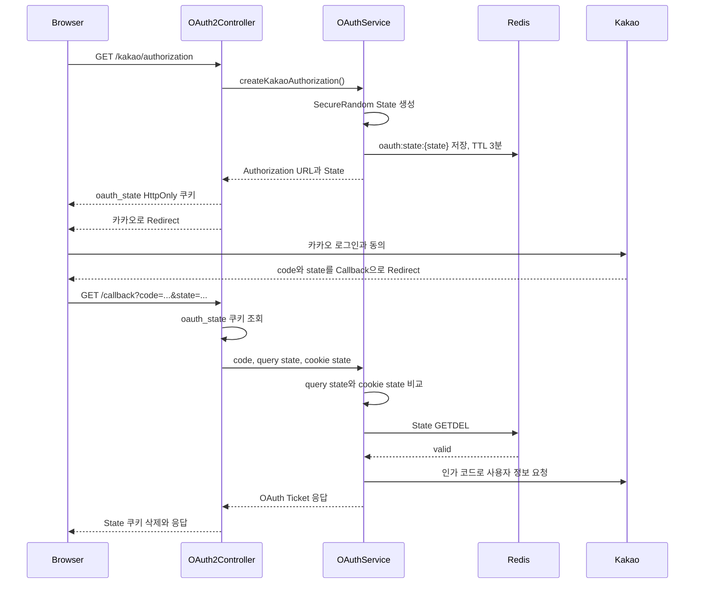

# OAuth State 검증 보안 리팩터링

## 1. 개요

기존 OAuth 흐름은 카카오가 전달한 Authorization Code만 검증했다.

OAuth Ticket에는 TTL과 일회성 소비가 적용되어 있었지만,
카카오 Callback이 현재 브라우저에서 시작된 인증 요청인지 확인하는 기능은 없었다.

이번 리팩터링에서는 OAuth State를 추가하고 다음 세 값을 연결했다.

```text
카카오 Authorization URL의 State
브라우저의 oauth_state 쿠키
Redis의 oauth:state:{state}
```

---

## 2. 기존 문제

### OAuth 요청과 Callback의 연결 부재

기존 Authorization URL에는 `state`가 없었다.

```java
return UriComponentsBuilder
        .fromUri(properties.authorizationUri())
        .queryParam("client_id", properties.clientId())
        .queryParam("redirect_uri", properties.redirectUri())
        .queryParam("response_type", "code")
        .build()
        .toUriString();
```

Callback에서는 인가 코드만 전달받았다.

```java
oAuthService.kakaoCallback(code);
```

서버는 해당 Callback이 현재 사용자가 시작한 로그인 요청인지 확인할 수 없었다.

### OAuth Ticket과 State의 역할 혼동

기존 OAuth Ticket은 Callback 이후 발급되며 다음 문제를 해결한다.

- Callback에서 서비스 JWT 직접 노출 방지
- 로그인과 회원가입 흐름 구분
- Ticket 재사용 방지

하지만 OAuth Ticket은 Callback이 완료된 다음 생성되기 때문에
Callback 이전의 Login CSRF를 방어할 수 없다.

```text
State  : OAuth 요청 시작부터 Callback까지 보호
Ticket : Callback 완료부터 JWT 발급 또는 회원가입까지 보호
```

---

## 3. 목표

- OAuth 요청을 시작한 브라우저와 Callback 연결
- State를 예측하기 어려운 난수로 생성
- State에 짧은 만료시간 적용
- State를 한 번만 사용할 수 있도록 처리
- Callback State 변조 및 누락 차단
- State 검증 전 외부 카카오 API 호출 차단
- Callback 완료 후 브라우저 State 쿠키 제거
- local과 prod의 Secure 쿠키 정책 분리
- 단위 테스트와 실제 Redis 통합 테스트 구성

---

## 4. 적용한 구조

### OAuthSecurityProperties

OAuth 보안 설정을 타입 안전하게 관리한다.

```java
@ConfigurationProperties(prefix = "app.oauth2.security")
public record OAuthSecurityProperties(
        Duration stateExpiration,
        boolean secureCookie
) {
}
```

### OAuthStateStore

담당 책임:

- `SecureRandom` 기반 State 생성
- URL-safe Base64 인코딩
- Redis State 저장 및 TTL 적용
- Callback State와 쿠키 State 비교
- Redis State 일회성 소비
- 잘못된 State를 프로젝트 예외로 변환

### OAuthStateCookieManager

담당 책임:

- State를 응답 쿠키에 저장
- Callback 요청에서 State 쿠키 조회
- Callback 처리 후 State 쿠키 삭제
- HttpOnly, SameSite, Secure, Path 속성 관리

### OAuthAuthorizationResult

서비스가 Controller에 인가 URL과 State를 함께 전달한다.

```java
public record OAuthAuthorizationResult(
        String authorizationUrl,
        String state
) {
}
```

### KakaoOAuthClient

카카오 Authorization URL에 State를 포함한다.

```java
.queryParam("state", state)
```

### OAuthService

OAuth State 발급과 소비 흐름을 조정한다.

```java
String state = oAuthStateStore.issue();

String authorizationUrl =
        kakaoOAuthClient.createAuthorizationUrl(state);
```

Callback에서는 카카오 API보다 먼저 State를 검증한다.

```java
validateAuthorizationCode(authorizationCode);
oAuthStateStore.consume(returnedState, cookieState);

KakaoUserInfoResponse userInfo =
        kakaoOAuthClient.getUserInfo(authorizationCode);
```

### OAuth2Controller

HTTP 요청과 쿠키 처리를 담당한다.

```java
OAuthAuthorizationResult result =
        oAuthService.createKakaoAuthorization();

oAuthStateCookieManager.add(
        response,
        result.state()
);

response.sendRedirect(result.authorizationUrl());
```

Callback 처리 성공 여부와 관계없이 쿠키를 삭제한다.

```java
try {
    return oAuthService.kakaoCallback(
            code,
            state,
            cookieState
    );
} finally {
    oAuthStateCookieManager.delete(response);
}
```

---

## 5. 변경된 OAuth 흐름



---

## 6. State 검증 정책

다음 조건을 모두 만족해야 Callback 처리를 계속한다.

```text
Callback State가 존재한다.
쿠키 State가 존재한다.
Callback State와 쿠키 State가 일치한다.
Redis에 State가 존재한다.
Redis State가 아직 소비되지 않았다.
```

하나라도 만족하지 않으면 다음 예외를 반환한다.

```text
OAUTH_STATE_INVALID
HTTP 400 Bad Request
```

State 검증이 실패하면 카카오 Token API는 호출하지 않는다.

---

## 7. 설정 분리

공통 만료시간은 `application.yml`에서 관리한다.

```yaml
app:
  oauth2:
    security:
      state-expiration: 3m
```

로컬환경은 HTTP이므로 Secure 속성을 비활성화한다.

```yaml
# application-local.yml
secure-cookie: false
```

운영환경은 HTTPS를 사용하므로 Secure 속성을 활성화한다.

```yaml
# application-prod.yml
secure-cookie: true
```

---

## 8. 테스트 전략

### OAuthStateStoreUnitTest

- State 길이와 URL-safe 형식 검증
- Redis Key와 TTL 검증
- 정상 State 소비
- Callback과 쿠키 State 불일치 차단
- 쿠키 State 누락 차단
- 만료되거나 재사용된 State 차단

### OAuthStateCookieManagerUnitTest

- HttpOnly 쿠키 생성
- SameSite=Lax 적용
- Callback Path 제한
- 만료시간 적용
- 요청 쿠키 조회
- Callback 처리 후 쿠키 삭제

### OAuthServiceUnitTest

- State 발급 후 카카오 Authorization URL 생성
- Callback 처리 전 State 소비 호출
- 인가 코드가 없으면 State 및 카카오 API를 호출하지 않음

### OAuthStateFlowIntegrationTest

Testcontainers의 실제 Redis와 MockMvc를 이용해 다음 흐름을 검증한다.

```text
인가 요청
→ State Redis 저장
→ State 쿠키 응답
→ Callback Query와 Cookie 전달
→ Redis State 소비
→ OAuth Ticket 발급
→ State 쿠키 삭제
```

외부 카카오 API는 테스트 안정성을 위해 `@MockBean`으로 대체한다.

검증 시나리오:

- 정상 State Callback 성공
- 변조된 State Callback 실패
- 소비한 State 재사용 실패
- 잘못된 State에서는 카카오 API 미호출

---

## 9. 트레이드오프

### 장점

- Login CSRF 방어
- 브라우저와 OAuth 요청의 연결 보장
- 짧은 TTL과 일회성 소비
- 보안 정책과 OAuth 비즈니스 흐름의 책임 분리
- 외부 카카오 API 호출 전 잘못된 요청 차단

### 단점

- Redis와 쿠키에 대한 의존성 증가
- 브라우저가 쿠키를 차단하면 OAuth 로그인 불가
- 로컬과 운영환경의 Secure 속성을 별도로 관리해야 함
- 테스트에서 HTTP 쿠키와 Redirect 흐름을 함께 구성해야 함

---

## 💡성과

- Authorization Code만 신뢰하던 OAuth Callback에 State 검증을 추가했다.
- Redis State와 HttpOnly 쿠키를 연결해 Login CSRF를 방어했다.
- `SecureRandom`과 URL-safe Base64를 이용해 State를 생성했다.
- Redis GETDEL을 이용해 State의 재사용을 차단했다.
- Callback 성공과 실패 모두에서 State 쿠키를 제거했다.
- MockMvc와 실제 Redis를 이용해 HTTP 보안 흐름을 통합 검증했다.

