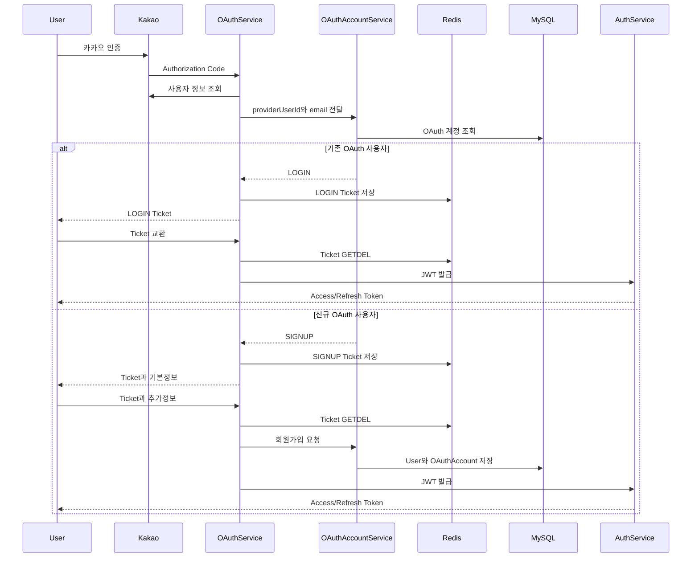

# OAuth2 인증 흐름 리펙터링

## 1. 개요

기존 카카오 로그인은 카카오 사용자 정보를 이메일로 식별하고, 신규 사용자를 기본값으로 즉시 생성한 뒤 `AccessToken`과 `RefreshToken`을 Callback 응답으로 반환

기능은 동작했지만 다음과 같은 문제가 발생한다.

- 이메일을 소셜 계정의 고유 식별자로 사용
- 신규 사용자에게 임시 개인정보를 저장
- OAuth Callback에서 서비스 JWT를 즉시 노출
- 기존 사용자 로그인과 신규 사용자 회원가입 흐름이 혼재
- OAuth 외부 API 흐름과 계정 처리 책임이 하나의 서비스에 집중
- OAuth 전용 계정 연결 정보가 존재하지않음.

---

## 2. 기존 문제

### 이메일 기반 소셜 계정 식별

기존 구조는 카카오가 제공하는 이메일을 이용해 사용자를 조회했다.

하지만 이메일은 다음과 같은 이유로 소셜 계정의 영구 식별자로 사용하기 어렵다.

- 사용자가 카카오 이메일 제공 동의를 철회할 수 있다.
- 이메일 변경 가능성
- 동일 이메일의 LOCAL 계정을 자동 연결하면 계정 탈취 위험.

### 신규 사용자의 즉시 생성

기존에는 카카오 로그인으로 처음 접근한 사용자에게 기본값으로 정보를 생성했다.

```text
생년월일: 현재 날짜
전화번호: 010-0000-0000
주소: DEFAULT_ADDRESS
포지션: NONE
성별: NONE
```

필수 도메인 정보를 임시 데이터로 저장하기 때문에 실제 사용자 정보와 구분하기 어렵고,
불완전한 사용자가 경기 기능에 접근이 가능하다.

### Callback에서 즉시 JWT 반환

기존 Callback은 카카오 인증 완료 후 서비스 `AccessToken` 과 `RefreshToken`을 바로 반환하였다.

이 구조에서는 브라우저 리다이렉트 구간에서 장기 인증정보가 직접 전달될 가능성이 있다.

추후 React 프론트엔드를 연동할 경우 URL, 브라우저 기록, 로그 등을 통한 노출 위험도 고려해야한다.

### OAuthService의 과도한 책임

기존 OAuthService는 다음과 같은 책임을 담당했다.

- 카카오 Authorization URL 생성
- 인가 코드로 카카오 Token 요청
- 카카오 사용자 정보 조회
- 사용자 조회 및 생성
- JWT 발급
- Redis Refresh Token 저장

---

## 3. 목표

- 카카오 고유ID 기반으로 소셜 계정 식별 기준 적용
- OAuth 계정과 서비스 사용자의 관계를 별도 엔티티로 관리
- 신규 사용자는 필수 추가정보 입력 후 가입 필수
- Callback에서 서비스 JWT를 직접 반환하지 않는다.
- 로그인과 회원가입 흐름 분기 분리
- OAuth Ticket은 짧은 만료시간과 일회성 사용 데이터
- 사용자의 OAuth 계정은 하나의 DB 트랜잭션으로 관리
- 외부 API 통신, 계정 정책, Ticket 관리 책임 분리
- 단위 테스트 및 통합테스트 재구성

---

## 4. 적용한 구조

### KakaoOAuthClient

담당 책임:

- 카카오 Authorization URL 생성
- 인가 코드를 카카오 Access Token으로 교환
- 카카오 사용자 정보 API 호출
- 외부 API 오류를 프로젝트 예외로 변환

### OAuthService

담당 책임:

- OAuth 전체 흐름 조정
- 카카오 사용자 정보와 계정 판별 결과 연결
- LOGIN/SIGNUP Ticket 발급
- LOGIN Ticket과 JWT 교환
- SIGNUP Ticket 기반 추가정보 회원가입 요청
- 가입 완료 후 서비스 JWT 발급

### OAuthAccountService

담당 책임:

- 카카오 고유 ID로 기존 OAuth 계정 조회
- 기존 사용자와 신규 사용자 판별
- LOCAL 계정 자동 연결 방지
- 탈퇴 사용자 접근 차단
- OAuth 추가 회원가입 중복 검증
- UserEntity와 OAuthAccountEntity 저장

### OAuthTicketStore

담당 책임:

- OAuth Ticket 생성
- Ticket Payload 직렬화
- Redis 저장 및 만료시간 설정
- Ticket 조회와 삭제
- LOGIN/SIGNUP 흐름 검증
- Ticket 재사용 차단

### OAuthAccountEntity

OAuth 제공자 계정과 서비스 사용자의 관계를 저장한다.

```text
OAuthAccountEntity
├─ oauthAccountId
├─ userEntity
├─ provider
└─ providerUserId
```

다음 복합 유일성을 보장한다.

```text
(provider, provider_user_id)
(user_id, provider)
```

하나의 카카오 계정이 여러 사용자에게 연결되는 것을 방지하고,
한 사용자가 동일 제공자의 계정을 중복 연결하는 것도 방지한다.

---

## 5. OAuth 계정 판별 정책

카카오 Callback에서 다음 순서로 계정을 판별

```text
1. 카카오 고유 ID로 OAuthAccount 조회
2. 연결된 계정이 있으면 LOGIN
3. 연결된 계정이 없으면 이메일 확인
4. 동일 이메일 사용자도 없으면 SIGNUP
5. 동일 이메일의 LOCAL 계정이 있으면 자동 연결 차단
6. 탈퇴 사용자라면 접근 차단
```

동일 이메일의 LOCAL 계정을 자동으로 연결하지 않고 다음 예외를 반환한다.

```text
OAUTH_ACCOUNT_LINK_REQUIRED
```

이는 이메일이 같다는 이유만으로 소셜 계정을 연결할 경우 발생할 수 있는 계정 탈취를 방지하기 위한 정책이다.

---

## 6. OAuth Ticket 정책

OAuth Ticket Payload는 다음 정보를 가진다.

```java
public record OAuthTicketPayload(
        OAuthFlowType flowType,
        OAuthProvider provider,
        String providerUserId,
        String email
) {
}
```
Ticket 자체는 UUID 기반 무작위 문자열로 구성되어 Redis에 저장한다.

```text
Key: oauth:ticket:{ticket}
TTL: 10분
```

Ticket 소비에는 Redis `GETDEL` 동작을 이용한다.

```java
String serializedPayload =
        redisService.getAndDeleteData(
                ticketKey(ticket)
        );
```

조회와 삭제를 하나의 Redis명령으로 실행하기 때문에 동시에 같은 Ticket요청이 들어오더라도 한 요청만 성공할 수 있다.

Ticket은 다음 경우 사용할 수 없다.

- 만료된 Ticket
- 이미 사용한 Ticket
- 존재하지 않는 Ticket
- JSON Payload가 손상된 Ticket
- LOGIN/SIGNUP 흐름이 일치하지 않는 Ticket

---

## 7. 로그인 및 회원가입 흐름



---

## 8. API 구조

```text
GET  /api/v1/auth/oauth2/kakao/authorization
GET  /api/v1/auth/oauth2/kakao/callback
POST /api/v1/auth/oauth2/token
POST /api/v1/auth/oauth2/signup
```

### 기존 사용자

Callback 응답:

```json
{
  "flowType": "LOGIN",
  "ticket": "일회용-ticket",
  "email": null,
  "nickname": null
}
```

로그인 Ticket을 `/token`으로 교환하면 서비스 JWT를 발급한다.

### 신규 사용자

Callback 응답:

```json
{
  "flowType": "SIGNUP",
  "ticket": "일회용-ticket",
  "email": "user@kakao.com",
  "nickname": "카카오닉네임"
}
```

사용자는 추가정보와 SIGNUP Ticket을 `/signup`으로 전달한다.

이메일과 카카오 고유 ID는 클라이언트 입력을 신뢰하지 않고
서버가 Redis Ticket에 저장한 값을 사용한다.

---

## 9. 트랜잭션과 일관성

`UserEntity`와 `OAuthAccountEntity`는 동일한 MySQL 트랜잭션에서 저장한다.

```text
User 저장 실패
→ OAuthAccount 저장 안 됨

OAuthAccount 저장 실패
→ User 저장 롤백
```

다만 Redis Ticket 소비와 MySQL 저장은 서로 다른 저장소이므로 하나의 로컬 트랜잭션으로 묶을 수 없다.

현재 정책은 Ticket 재사용 방지를 우선하여 DB 저장 전에 Ticket을 소비한다.

따라서 Ticket 소비 후 DB 장애가 발생하면 사용자는 카카오 인증부터 다시 진행해야 한다.


### 선택한 트레이드오프

장점:

- 동일 Ticket의 중복 회원가입 방지
- Ticket 재사용 공격 차단
- 구현 복잡도와 운영 부담 감소

단점:

- DB 장애 발생 시 기존 Ticket 복구 불가
- 사용자가 OAuth 인증을 다시 진행해야 함

현재 프로젝트 규모에서는 보안성과 단순성을 우선해 이 방식을 선택했다.

---

## 10. 테스트 전략

### 단위 테스트

Mockito를 사용해 분기와 협력 객체 호출을 검증한다.

#### OAuthTicketStoreUnitTest

- Ticket 발급과 Redis 저장
- Payload 직렬화
- Ticket 소비
- 만료 및 재사용 Ticket 차단
- LOGIN/SIGNUP 흐름 불일치 차단
- 빈 Ticket 검증

#### OAuthAccountServiceUnitTest

- 기존 OAuth 계정 로그인 판별
- 신규 OAuth 사용자 회원가입 판별
- LOCAL 계정 자동 연결 차단
- 사용자와 OAuth 계정 저장
- 이메일·닉네임·OAuth 계정 중복 차단

#### OAuthServiceUnitTest

- 기존 사용자 LOGIN Ticket 발급
- 신규 사용자 SIGNUP Ticket 발급
- LOGIN Ticket과 JWT 교환
- SIGNUP Ticket 기반 회원가입
- 인가 코드 누락 검증

### 통합 테스트

Testcontainers를 이용해 실제 MySQL과 Redis로 검증한다.

#### OAuthServiceIntegrationTest

- SIGNUP Ticket Redis 저장 및 소비
- UserEntity와 OAuthAccountEntity 실제 저장
- OAuth 계정 복합 유일성
- 실제 Access Token과 Refresh Token 발급
- Refresh Token Redis 저장
- OAuth Ticket 삭제
- 사용한 Ticket 재사용 차단
- 카카오 고유 ID 기반 기존 계정 조회

실제 카카오 서버는 테스트 대상에서 제외한다.

---

## 💡성과

- 이메일 대신 카카오 고유 ID 기반 계정 식별 구조를 추가했다.
- OAuth 계정과 서비스 사용자의 관계를 별도 엔티티로 분리했다.
- 임시 개인정보를 저장하는 신규 사용자 자동 생성을 제거했다.
- 기존 사용자 로그인과 신규 사용자 회원가입 흐름을 분리했다.
- Callback에서 서비스 JWT를 직접 반환하지 않도록 변경했다.
- Redis 기반의 10분 만료 일회용 Ticket을 적용했다.
- Redis GETDEL을 이용해 Ticket 재사용과 동시 소비를 방지했다.
- User와 OAuthAccount를 하나의 DB 트랜잭션으로 저장했다.
- 동일 이메일 LOCAL 계정의 자동 연결을 차단했다.
- 단위 테스트와 실제 MySQL·Redis 통합 테스트를 구성했다.