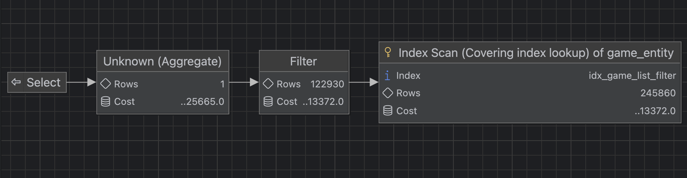
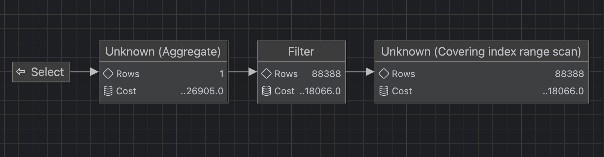
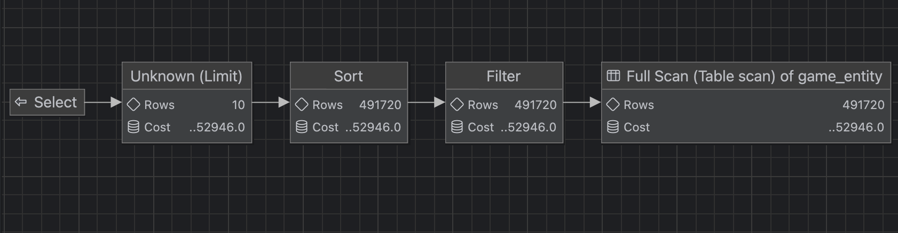

# 경기 목록 필터 API: 최종 인덱스 검증 결과

## 1. 결론

1차 후보의 최신순 회귀를 확인한 뒤 다음 인덱스를 최종 선택했다.

```text
(city_name, game_status, match_format,
 deleted_date_time, start_date_time, game_id)
```

이 인덱스는 지역 필터 전용으로 역할을 제한한다. 기본 및 날짜 조회는 기존 `(deleted_date_time, start_date_time)` 인덱스를 사용하고, 최신순은 별도 병목으로 분리한다.

## 2. DB 실행시간 비교

`EXPLAIN ANALYZE`를 각각 5회 실행한 중앙값이다.

| 시나리오 | 쿼리 | 적용 전 | 적용 후 | 변화 |
|---|---|---:|---:|---:|
| 기본 시작 시간순 | 목록 | 0.100ms | 0.476ms | 모두 1ms 미만 |
| 기본 시작 시간순 | COUNT | 70.6ms | 71.6ms | 유의미한 변화 없음 |
| 날짜 필터 | 목록 | 0.0943ms | 0.212ms | 모두 1ms 미만 |
| 날짜 필터 | COUNT | 1.01ms | 0.827ms | 18.1% 감소 |
| 서울 + 시작 시간순 | 목록 | 0.0845ms | 0.103ms | 모두 1ms 미만 |
| 서울 + 시작 시간순 | COUNT | 133ms | 44.3ms | **66.7% 감소** |
| 서울 + 모집 중 + 3대3 | 목록 | 0.164ms | 0.260ms | 모두 1ms 미만 |
| 서울 + 모집 중 + 3대3 | COUNT | 138ms | 22.0ms | **84.1% 감소** |
| 최신순 | 목록 | 244ms | 229ms | 같은 전체 스캔·filesort |
| 최신순 | COUNT | 73.1ms | 74.1ms | 유의미한 변화 없음 |

목록 첫 페이지는 `LIMIT 10` 덕분에 개선 전에도 빨랐다. 실제 병목은 전체 결과 개수를 계산하는 COUNT였다.

서울 COUNT는 `city_name` 접두사로 약 20만 개의 인덱스 엔트리를 읽은 뒤 논리 삭제 조건을 필터링한다. 복합 COUNT는 동등 조건을 연속해서 사용해 48,495건 범위만 읽는 Covering Index Range Scan으로 변경됐다.

## 3. API 부하 테스트 비교

동일하게 20 RPS, 3분, 3회 측정했으며 표는 회차별 결과의 중앙값이다.

| 시나리오 | 적용 전 평균 | 적용 후 평균 | 적용 전 p95 | 적용 후 p95 | p95 개선 |
|---|---:|---:|---:|---:|---:|
| 기본 시작 시간순 | 39.18ms | 41.20ms | 43.03ms | 43.19ms | 유의미한 변화 없음 |
| 날짜 필터 | 11.40ms | 11.48ms | 15.23ms | 16.27ms | 유의미한 변화 없음 |
| 서울 + 시작 시간순 | 96.54ms | 28.99ms | 101.68ms | 31.62ms | **68.9% 감소** |
| 서울 + 모집 중 + 3대3 | 124.23ms | 23.60ms | 133.88ms | 26.48ms | **80.2% 감소** |

위 네 시나리오는 HTTP 실패와 dropped iteration이 모두 0이었다. DB의 COUNT 개선이 API 지연시간 감소로 이어졌고, 기존 기본·날짜 조회에는 의미 있는 회귀가 발생하지 않았다.

각 회차의 원본 JSON은 [`k6/baseline/`](./k6/baseline/)에 보관한다.

## 4. 최신순은 별도 병목으로 분리

최신순은 개선 전부터 다음 문제가 있었다.

- `created_at DESC, game_id DESC`를 지원하는 인덱스가 없음
- 약 50만 건 전체 스캔
- 미래 경기 약 33만 건 필터링 후 filesort
- 개선 전 3회 중 2회에서 p95 1초 초과 및 총 22건 누락

최종 필터 인덱스 적용 후 SQL 중앙값은 `244ms → 229ms`였고 실행계획도 동일했다. 즉 지역 필터 인덱스가 최신순 SQL을 악화시켰다는 근거는 없다.

다만 적용 후 부하 측정 1회에서 p95 `2,404ms`, dropped iteration 43건이 발생해 안정적인 3회 비교가 불가능했다. 이미 기준선에서도 포화 징후가 있었으므로 억지로 인덱스 개선 성과에 포함하지 않고 최신순 전용 인덱스 및 페이지네이션 개선 실험으로 분리했다.

- 최신순 실행계획: [`plan-after-latest-list.png`](./plan-after-latest-list.png)
- 병목 시점 k6 화면: [`grafana/latest-run-01-bottleneck-k6-endpoint.png`](./grafana/latest-run-01-bottleneck-k6-endpoint.png)
- 병목 시점 부하 화면: [`grafana/latest-run-01-bottleneck-k6-load-profile.png`](./grafana/latest-run-01-bottleneck-k6-load-profile.png)
- 병목 시점 서버 자원: [`grafana/latest-run-01-bottleneck-spring-resources.png`](./grafana/latest-run-01-bottleneck-spring-resources.png)

## 5. 실행계획 증거

### 서울 COUNT



### 서울 + 모집 중 + 3대3 COUNT



### 최신순 목록



전체 `EXPLAIN`, `EXPLAIN ANALYZE` 결과는 [`raw/`](./raw/)에 보관한다.

## 6. 트레이드오프

### 얻은 점

- 자주 사용하는 지역 및 복합 필터 COUNT에서 전체 테이블 스캔 제거
- API p95 약 69~80% 감소
- 기본 및 날짜 조회는 기존 인덱스를 계속 사용해 회귀 방지
- `game_id`를 마지막 정렬 기준으로 포함해 동일 시작 시각의 정렬을 안정화

### 감수한 점

- 보조 인덱스 추가에 따른 저장공간 사용
- INSERT, UPDATE, DELETE 시 인덱스 유지 비용 증가
- 도시 조건이 없는 조회에는 새 인덱스를 직접 활용하기 어려움
- 모든 선택 가능한 필터 조합을 하나의 인덱스로 해결하지 않음

선택도가 낮은 조건을 무조건 선두에 두는 대신 실제 접근 패턴별로 인덱스 역할을 분리했다. 성능 향상 수치뿐 아니라 다른 조회의 회귀 여부까지 확인한 뒤 최종 후보를 결정했다.

## 7. 재현 자료

- 최종 적용 SQL: [`../../../sql/game-list-filter/32-add-candidate-02-city-first-index.sql`](../../../sql/game-list-filter/32-add-candidate-02-city-first-index.sql)
- 롤백 SQL: [`../../../sql/game-list-filter/31-drop-game-list-filter-index.sql`](../../../sql/game-list-filter/31-drop-game-list-filter-index.sql)
- k6 스크립트: [`../../../k6/game-list-filter-test.js`](../../../k6/game-list-filter-test.js)
- 실행 스크립트: [`../../../scripts/run-game-list-filter-test.sh`](../../../scripts/run-game-list-filter-test.sh)

## 8. 후속 과제

1. 최신순 전용 `(deleted_date_time, created_at DESC, game_id DESC)` 후보 검증
2. `Page`의 정확한 COUNT가 항상 필요한지 검토하고 `Slice` 또는 지연 COUNT 비교
3. 뒤 페이지에서 offset 비용이 커지는지 확인하고 커서 기반 페이지네이션 비교
4. 운영 규모와 쓰기 비율을 반영해 인덱스 저장공간 및 변경 비용 측정
