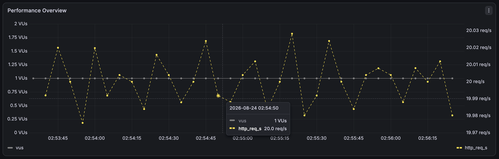
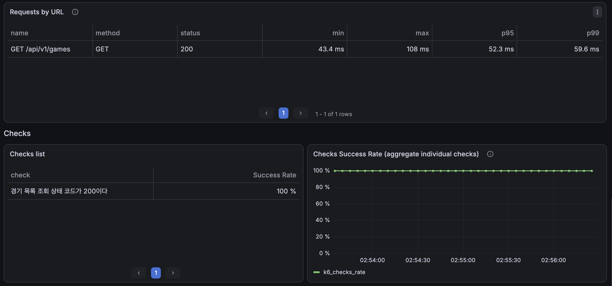
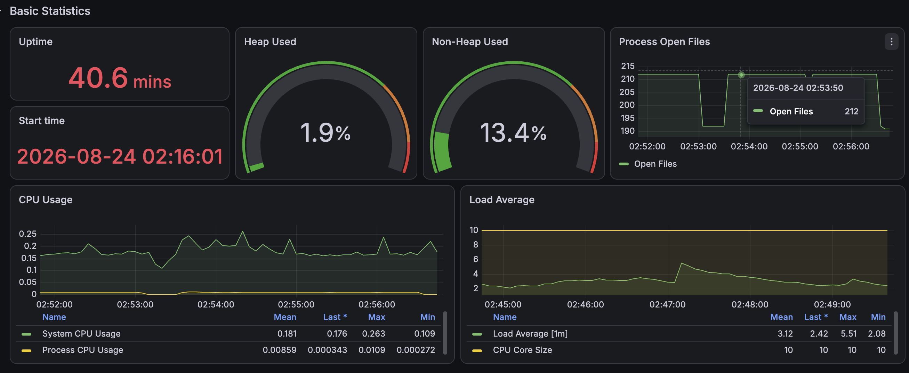

# 최신순 조회 최종 인덱스 검증 결과

## 1. 최종 인덱스

```text
(deleted_date_time, created_at DESC,
 game_id DESC, start_date_time)
```

- `deleted_date_time`: 논리 삭제되지 않은 경기 범위
- `created_at DESC, game_id DESC`: 최신순 정렬 및 동률 정렬 보장
- `start_date_time`: COUNT의 테이블 접근을 제거하기 위한 커버링 컬럼

## 2. DB 실행시간 비교

동일 SQL을 `EXPLAIN ANALYZE`로 5회 측정한 중앙값이다.

| 쿼리 | 적용 전 | 1차 후보 | 최종 후보 | 적용 전 대비 |
|---|---:|---:|---:|---:|
| Content | 228ms | 0.128ms | **0.103ms** | 99.95% 감소 |
| COUNT | 75.1ms | 1,195ms | **86.7ms** | 15.4% 증가 |
| 합계 | 303.1ms | 1,195.1ms | **86.8ms** | 71.4% 감소 |

Content는 Table Scan과 filesort가 제거됐다. COUNT는 새 인덱스를 선택하지만 `Using where; Using index`로 처리되어 1차 후보의 대량 테이블 접근을 제거했다.

COUNT만 보면 기존보다 11.6ms 증가했지만 Content 개선 폭이 더 커 두 쿼리의 합계는 약 71.4% 감소했다. `Page` 전체 비용과 API 결과를 기준으로 최종 후보를 선택했다.

- Content 실행계획: [`plan-after-latest-list.png`](./plan-after-latest-list.png)
- COUNT 실행계획: [`plan-after-latest-count.png`](./plan-after-latest-count.png)
- 원본 자료: [`raw/`](./raw/)

## 3. k6 적용 전후 비교

20 RPS, 3분, 3회 결과의 중앙값이다.

| 지표 | 적용 전 | 적용 후 | 개선 |
|---|---:|---:|---:|
| 평균 응답시간 | 1,231.68ms | 48.28ms | **96.1% 감소** |
| p95 | 5,461.72ms | 51.32ms | **99.1% 감소** |
| p99 | 5,916.06ms | 52.69ms | **99.1% 감소** |
| dropped iteration | 484건 | **0건** | 누락 제거 |
| HTTP 실패 | 1건 | **0건** | 실패 제거 |
| 목표 처리량 | 미달 | **20 RPS 유지** | 포화 해소 |

적용 후 세 회차 결과는 다음과 같다.

| 회차 | 평균 | p95 | p99 | 완료 요청 | dropped | 실행 중 최대 VU |
|---:|---:|---:|---:|---:|---:|---:|
| 1 | 48.00ms | 51.24ms | 52.69ms | 3,601 | 0 | 1 |
| 2 | 48.36ms | 51.44ms | 54.51ms | 3,601 | 0 | 1 |
| 3 | 48.28ms | 51.32ms | 52.63ms | 3,601 | 0 | 1 |

원본 JSON은 [`k6/baseline/`](./k6/baseline/)에 보관한다.

## 4. 회귀 확인

새 인덱스가 다른 목록 조회에 잘못 선택되는지 확인하기 위해 smoke 테스트를 수행했다.

| 시나리오 | 기존 p95 | 추가 후 p95 | HTTP 실패 | dropped |
|---|---:|---:|---:|---:|
| 기본 조회 | 137.20ms | 89.81ms | 0 | 0 |
| 날짜 필터 | 26.50ms | 20.42ms | 0 | 0 |
| 서울 필터 | 70.50ms | 60.63ms | 0 | 0 |
| 서울 + 모집 중 + 3대3 | 65.21ms | 49.96ms | 0 | 0 |

짧은 smoke 수치는 캐시와 실행 환경의 영향을 받으므로 추가 개선으로 주장하지 않는다. 모든 시나리오에서 실패와 요청 누락이 없었으므로 눈에 띄는 회귀가 발견되지 않았다는 확인 자료로만 사용한다.

## 5. Grafana 증거







## 6. 트레이드오프

### 얻은 점

- 전체 테이블 스캔과 filesort 제거
- 20 RPS에서 p95 약 99.1% 감소
- dropped iteration과 HTTP 실패 제거
- 최대 VU 포화 상태 해소

### 감수한 점

- `start_date_time`을 포함한 보조 인덱스의 저장공간 증가
- 경기 생성 및 변경 시 인덱스 유지 비용 증가
- COUNT는 기존 전용 인덱스보다 약 15.4% 느림
- 첫 페이지 중심 결과이므로 깊은 페이지의 Offset 비용은 별도 검증 필요

## 7. 재현 자료

- 기준선 SQL: [`../../../sql/game-list-filter/40-before-latest-index-baseline.sql`](../../../sql/game-list-filter/40-before-latest-index-baseline.sql)
- 1차 후보 SQL: [`../../../sql/game-list-filter/41-add-candidate-01-latest-order-index.sql`](../../../sql/game-list-filter/41-add-candidate-01-latest-order-index.sql)
- 롤백 SQL: [`../../../sql/game-list-filter/42-drop-latest-index.sql`](../../../sql/game-list-filter/42-drop-latest-index.sql)
- 최종 후보 SQL: [`../../../sql/game-list-filter/43-add-candidate-02-latest-covering-index.sql`](../../../sql/game-list-filter/43-add-candidate-02-latest-covering-index.sql)
- k6 스크립트: [`../../../k6/game-list-filter-test.js`](../../../k6/game-list-filter-test.js)

## 8. 후속 과제

1. 깊은 페이지의 Offset 비용 측정
2. 커서 기반 페이지네이션과 비교
3. 정확한 전체 개수가 항상 필요한지 검토하고 `Slice` 비교
4. 실제 쓰기 비율에서 추가 인덱스의 유지 비용 측정
