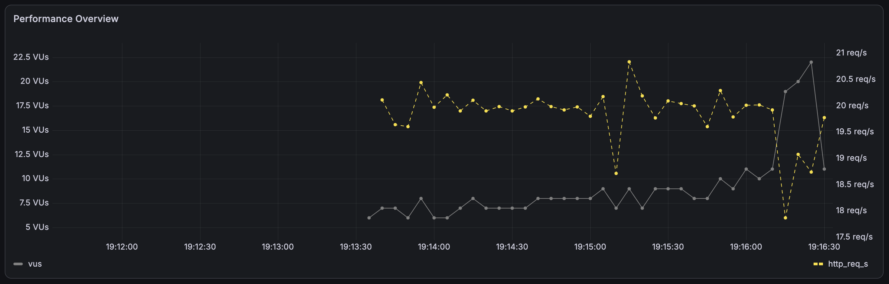
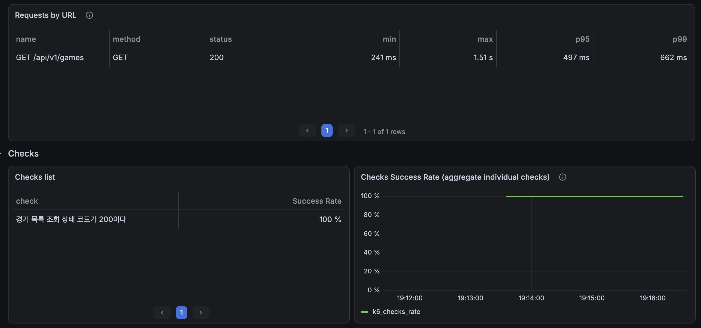
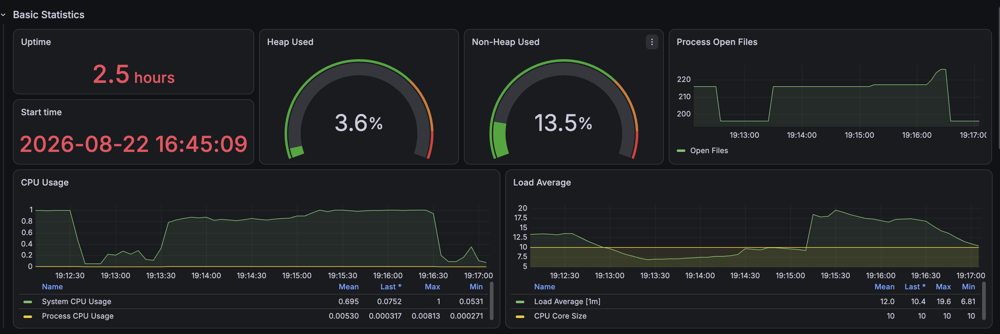

# 경기 목록 필터 API: 인덱스 개선 전 기준선

## 1. 측정 목적

기존 `(deleted_date_time, start_date_time)` 인덱스가 기본 조회에는 효과적이지만, 지역·상태·경기 형식 필터와 최신순 정렬에서도 충분한지 확인한다. 실행계획과 API 부하 테스트를 함께 사용해 실제 병목을 식별하고 다음 인덱스의 근거를 확보한다.

## 2. 측정 조건

| 항목 | 값 |
|---|---:|
| 전체 경기 | 500,000건 |
| 페이지 | 0 |
| 페이지 크기 | 10 |
| 현재 목록 인덱스 | `idx_game_list_active_start` |
| 인덱스 컬럼 | `deleted_date_time, start_date_time` |
| DB 반복 | 쿼리별 5회 |
| API 부하 | 20 RPS |
| API 측정시간 | 회차당 3분 |
| API 반복 | 시나리오별 3회 |
| 본 측정 총 완료 요청 | 53,987건 |
| SQL/Bind 로그 | 부하 테스트 중 비활성화 |

현재 인덱스 원본은 [`raw/indexes-before.csv`](./raw/indexes-before.csv)에 보관한다.

## 3. DB 실행계획 요약

| 시나리오 | Content Query | 목록 중앙값 | COUNT Query | COUNT 중앙값 |
|---|---|---:|---|---:|
| 기본 시작 시간순 | Index Range Scan, 10건 반환 | 0.100ms | Covering Index Range Scan, 331,745건 | 70.6ms |
| 날짜 필터 | Index Range Scan, 10건 반환 | 0.0943ms | Covering Index Range Scan, 2,778건 | 1.01ms |
| 서울 + 시작 시간순 | 인덱스 25건 탐색 후 10건 반환 | 0.0845ms | Table Scan 500,000건 | 133ms |
| 서울 + 모집 중 + 3대3 | 인덱스 50건 탐색 후 10건 반환 | 0.164ms | Table Scan 500,000건 | 138ms |
| 최신순 | Table Scan 500,000건 + filesort | 244ms | Covering Index Range Scan, 331,348건 | 73.1ms |

첫 페이지의 지역 및 복합 필터 목록은 기존 시작 시간 인덱스를 순서대로 읽다가 조건에 맞는 10건을 빠르게 발견했다. 반면 COUNT에는 `LIMIT`이 없어 지역 관련 인덱스가 없는 경우 50만 건 전체를 읽었다.

최신순 목록은 `created_at DESC, game_id DESC`를 지원하는 인덱스가 없어 50만 건을 읽고, 미래 경기 331,348건을 정렬한 뒤 10건을 반환했다.

## 4. 시나리오별 실행계획

### A. 기본 시작 시간순

- 목록: [`plan-before-default-list.png`](./plan-before-default-list.png)
- COUNT: [`plan-before-default-count.png`](./plan-before-default-count.png)
- 결론: 기존 인덱스가 정렬과 시간 범위에 적합하다.

### B. 날짜 필터

- 목록: [`plan-before-date-list.png`](./plan-before-date-list.png)
- COUNT: [`plan-before-date-count.png`](./plan-before-date-count.png)
- 결론: 하루 범위가 2,778건으로 좁아지며 기존 인덱스가 효율적으로 동작한다.

### C. 서울 + 시작 시간순

- 목록: [`plan-before-city-list.png`](./plan-before-city-list.png)
- COUNT: [`plan-before-city-count.png`](./plan-before-city-count.png)
- 결론: 목록 첫 페이지는 빠르지만 COUNT는 전체 테이블 스캔이다.

### D. 서울 + 모집 중 + 3대3

- 목록: [`plan-before-city-status-format-list.png`](./plan-before-city-status-format-list.png)
- COUNT: [`plan-before-city-status-format-count.png`](./plan-before-city-status-format-count.png)
- 결론: 필터가 구체적이어도 인덱스가 없어 COUNT는 전체 테이블 스캔이다.

### E. 최신순

- 목록: [`plan-before-latest-list.png`](./plan-before-latest-list.png)
- COUNT: [`plan-before-latest-count.png`](./plan-before-latest-count.png)
- 결론: 목록 쿼리에서 `ALL`과 `Using filesort`가 발생한다.

## 5. k6 기준선 결과

아래 값은 시나리오별 3회 측정값의 중앙값이다.

| 시나리오 | 평균 응답시간 | p95 | p99 | HTTP 실패 | dropped iterations |
|---|---:|---:|---:|---:|---:|
| 기본 시작 시간순 | 39.18ms | 43.03ms | 57.25ms | 0 | 0 |
| 날짜 필터 | 11.40ms | 15.23ms | 18.12ms | 0 | 0 |
| 서울 + 시작 시간순 | 96.54ms | 101.68ms | 117.78ms | 0 | 0 |
| 서울 + 모집 중 + 3대3 | 124.23ms | 133.88ms | 154.72ms | 0 | 0 |
| 최신순 | 497.89ms | 1,227.80ms | 1,416.49ms | 0 | 22건/3회 |

각 회차의 JSON은 [`k6/baseline/`](./k6/baseline/)에 보관한다.

## 6. 최신순 포화 징후

| 회차 | 평균 | p95 | p99 | 최대 | 완료 요청 | dropped | 최대 VU |
|---:|---:|---:|---:|---:|---:|---:|---:|
| 1 | 434.24ms | 601.00ms | 655.45ms | 787.58ms | 3,601 | 0 | 13 |
| 2 | 497.89ms | 1,227.80ms | 1,416.49ms | 1,509.89ms | 3,591 | 10 | 28 |
| 3 | 533.98ms | 1,332.54ms | 1,511.52ms | 1,603.77ms | 3,589 | 12 | 29 |

HTTP 오류는 없었지만 2·3회차에서 p95 1초 기준을 넘었고 총 22건의 iteration이 누락됐다. 응답이 느려지면서 동일한 20 RPS를 유지하기 위해 필요한 VU도 최대 29까지 증가했다. 최신순은 단순히 느린 쿼리가 아니라 현재 부하 조건에서 처리 여유가 부족한 병목이다.

## 7. Grafana 증거

각 시나리오의 2회차에서 다음 세 화면을 기록했다.

- k6 부하 프로파일: RPS와 VU
- k6 Endpoint 및 Checks: p95, p99, 상태 코드, 성공률
- Spring Boot Basic Statistics: CPU, Heap, Load Average

대표적인 최신순 결과:







Grafana 이미지는 추세를 설명하는 자료이며 최종 수치 비교는 JSON과 CSV 원본을 기준으로 한다.

## 8. 병목 판단

1. 기본 및 날짜 조회는 기존 인덱스가 정상적으로 동작한다.
2. 서울 및 복합 필터의 목록 첫 페이지는 빠르지만 COUNT가 50만 건 전체를 스캔한다.
3. 최신순 목록은 전체 스캔 후 약 33만 건을 정렬한다.
4. 최신순 COUNT는 기존 인덱스를 사용하므로 최신순의 핵심 병목은 Content Query다.
5. JVM 메모리보다는 DB 접근 및 정렬 비용이 우선 개선 대상이다.

## 9. 후보 인덱스 가설

서로 다른 접근 패턴을 하나의 과도한 인덱스로 해결하지 않고 두 후보로 분리한다.

### 필터 조회 후보

```text
(deleted_date_time, city_name, game_status, match_format, start_date_time, game_id)
```

- `deleted_date_time`, `city_name`을 공통 접두사로 사용한다.
- 복합 필터의 동등 조건 뒤에 시작 시각과 ID를 배치해 범위 및 정렬을 지원하는지 검증한다.
- 서울 단일 COUNT에서도 `(deleted_date_time, city_name)` 접두사 활용을 기대한다.

### 최신순 후보

```text
(deleted_date_time, created_at DESC, game_id DESC)
```

- 최신순 정렬과 인덱스 순서를 일치시켜 filesort 제거를 기대한다.
- `start_date_time >= now`는 인덱스 스캔 후 필터로 남을 수 있으므로 실제 탐색 행 수를 반드시 확인한다.

두 후보는 아직 해결책으로 확정하지 않는다. 적용 후 옵티마이저 선택, 탐색 행 수, 쓰기 비용과 저장공간 증가를 함께 검증한다.

## 10. 다음 단계

1. 후보 인덱스 생성 및 롤백 SQL을 작성한다.
2. 인덱스를 적용하고 `ANALYZE TABLE game_entity`를 실행한다.
3. 동일 SQL로 `EXPLAIN`과 `EXPLAIN ANALYZE`를 다시 측정한다.
4. 동일 k6 조건인 20 RPS, 3분, 3회를 반복한다.
5. 적용 전후의 실행계획, 탐색 행 수, p95, p99, dropped iteration을 비교한다.
6. 효과가 없거나 쓰기·저장 비용 대비 과도한 인덱스는 제거한다.
