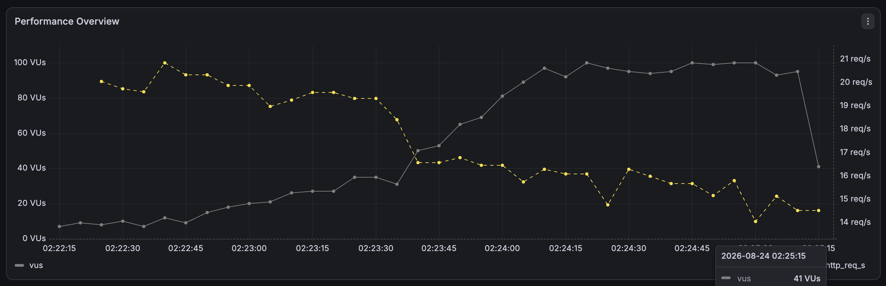
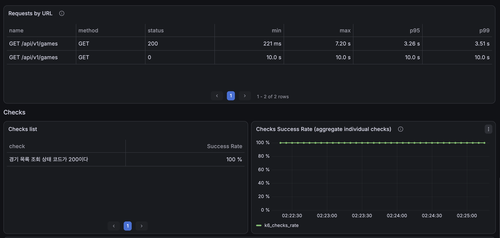
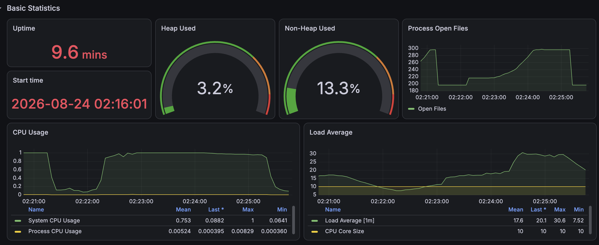

# 최신순 조회 인덱스 적용 전 기준선

## 1. 문제 상황

최신순 경기 목록은 다음 정렬을 사용한다.

```sql
ORDER BY created_at DESC, game_id DESC
LIMIT 0, 10
```

기존 인덱스는 `(deleted_date_time, start_date_time)`과 지역 필터 전용 인덱스뿐이어서 이 정렬을 지원하지 못했다.

## 2. DB 실행계획

50만 건을 전체 스캔하고 미래 경기 331,348건을 필터링한 다음 filesort로 10건을 반환했다.

| 쿼리 | 실행계획 | 5회 중앙값 |
|---|---|---:|
| Content | Table Scan → Filter → Sort → Limit | 228ms |
| COUNT | `idx_game_list_active_start` Covering Index Range Scan | 75.1ms |

- Content 실행계획: [`plan-before-latest-list.png`](./plan-before-latest-list.png)
- COUNT 실행계획: [`plan-before-latest-count.png`](./plan-before-latest-count.png)
- 원본 자료: [`raw/`](./raw/)

## 3. k6 기준선

20 RPS, 3분을 3회 측정했다.

| 회차 | 평균 | p95 | p99 | 완료 요청 | dropped | 최대 VU |
|---:|---:|---:|---:|---:|---:|---:|
| 1 | 1,231.68ms | 5,461.72ms | 5,916.06ms | 3,505 | 95 | 98 |
| 2 | 3,132.98ms | 6,693.62ms | 6,882.02ms | 3,230 | 371 | 100 |
| 3 | 603.99ms | 1,485.04ms | 1,752.00ms | 3,582 | 18 | 36 |
| 중앙값 | **1,231.68ms** | **5,461.72ms** | **5,916.06ms** | - | 총 484 | - |

2회차에는 HTTP 실패도 1건 발생했다. 요청 지연으로 VU가 증가했지만 최대 VU에 도달하고도 20 RPS를 유지하지 못했다. 따라서 단순한 지연이 아니라 처리 용량이 포화된 병목으로 판단했다.

## 4. Grafana 증거







각 회차 원본 JSON은 [`k6/baseline/`](./k6/baseline/)에 보관한다.
