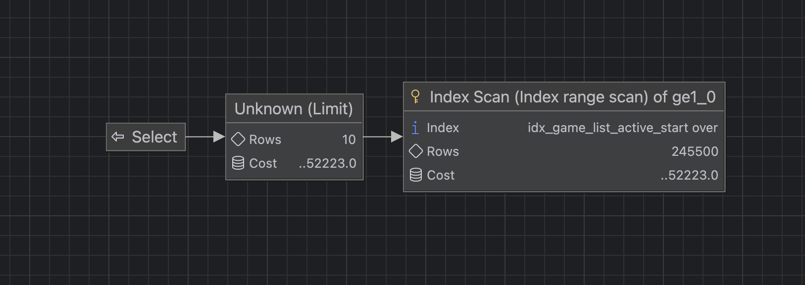
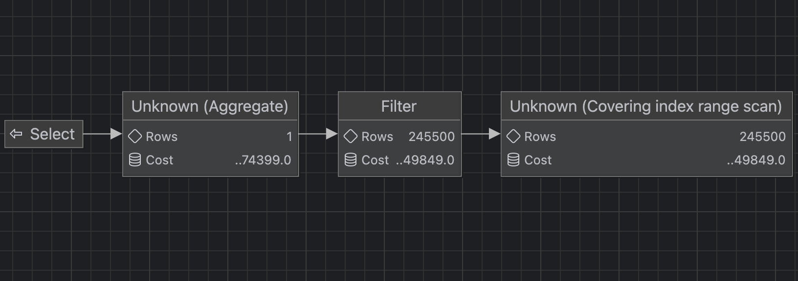
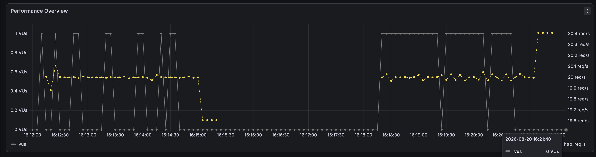
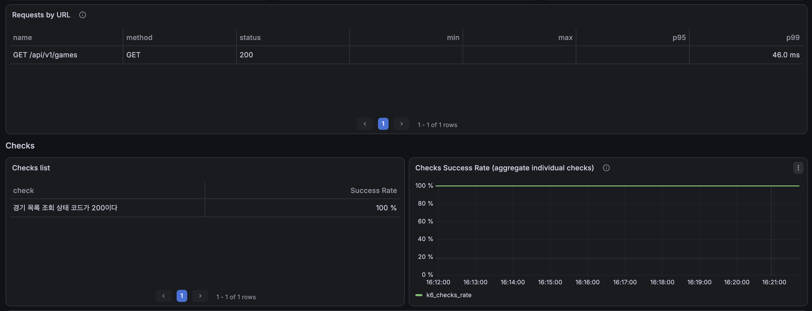
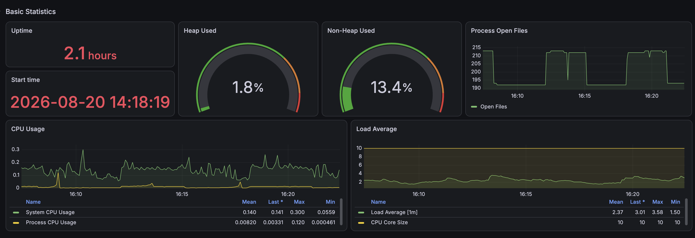

# 경기 목록 API: 복합 인덱스 적용 후 성능 검증

## 1. 측정 목적

50만 건의 경기 데이터에서 기본 경기 목록 API의 병목 후보였던 전체 테이블 스캔과 정렬을 복합 인덱스로 개선하고, DB 실행계획과 실제 API 부하 테스트 결과를 적용 전 기준선과 비교한다.

```http
GET /api/v1/games?page=0&size=10
```

## 2. 측정 조건

| 항목 | 값 |
|---|---:|
| 전체 경기 | 500,000건 |
| 조회 대상 경기 | 330,941건 |
| 페이지 | 0 |
| 페이지 크기 | 10 |
| 고정 기준 시각 | `2026-08-19 19:58:26.033731` |
| 측정 도구 | MySQL `EXPLAIN`, `EXPLAIN ANALYZE` |
| 반복 횟수 | 각 쿼리 5회 |

인덱스 적용 전과 같은 데이터, Hibernate SQL, 바인딩 시각을 사용했다. 따라서 실행계획과 실행시간의 차이를 인덱스 적용 효과로 비교할 수 있다.

## 3. 복합 인덱스 설계 및 적용

기본 경기 목록 쿼리의 조건과 정렬은 다음과 같다.

```sql
WHERE deleted_date_time IS NULL
  AND start_date_time >= ?
ORDER BY start_date_time ASC, game_id ASC
LIMIT 10
```

이에 맞춰 다음 인덱스 하나를 적용했다.

```sql
CREATE INDEX idx_game_list_active_start
    ON game_entity (
        deleted_date_time,
        start_date_time
    );
```

| 순서 | 컬럼 | 선정 이유 |
|---:|---|---|
| 1 | `deleted_date_time` | `IS NULL` 동등 조건을 인덱스 선두에 배치 |
| 2 | `start_date_time` | 범위 조건과 오름차순 정렬에 사용 |

`game_id`는 InnoDB 보조 인덱스 리프에 기본키가 자동으로 포함되므로 명시적으로 추가하지 않았다. 같은 `start_date_time` 안에서는 기본키 순서가 유지되어 `ORDER BY start_date_time, game_id`에 사용할 수 있다.

인덱스 생성 후 `ANALYZE TABLE game_entity`를 실행해 옵티마이저 통계를 갱신했다. 적용 스크립트는 다음 파일에 보관한다.

- [인덱스 적용 SQL](../../../sql/30-add-game-list-active-start-index.sql)
- [적용 후 인덱스 원본](./raw/indexes-after.csv)

## 4. 목록 쿼리 측정

| 회차 | 전체 실행시간 | 실제 인덱스 읽기 | 반환 |
|---:|---:|---:|---:|
| 1 | 0.0943ms | 10 | 10 |
| 2 | 1.0600ms | 10 | 10 |
| 3 | 0.2350ms | 10 | 10 |
| 4 | 0.4380ms | 10 | 10 |
| 5 | 0.1460ms | 10 | 10 |

- 최솟값: 0.0943ms
- 최댓값: 1.0600ms
- 평균: 0.3947ms
- 중앙값: **0.2350ms**

일반 `EXPLAIN` 결과:

```text
type     = range
key      = idx_game_list_active_start
key_len  = 17
rows     = 245500
filtered = 100
Extra    = Using index condition
```

`Using filesort`가 사라졌고, 목록 정렬과 `LIMIT 10`을 인덱스 순서로 처리한다. 일반 `EXPLAIN`의 `rows`는 범위 전체에 대한 예상값이며, 실제 실행에서는 필요한 첫 10건을 읽은 뒤 종료했다.

실제 실행 흐름:

```text
idx_game_list_active_start Index Range Scan
→ 인덱스 순서대로 10건 확인
→ 별도 정렬 없이 10건 반환
```

### 목록 쿼리 실행계획 다이어그램



적용 전의 `Full Scan → Filter → Sort → Limit` 흐름이 `Index Range Scan → Limit`으로 단순화됐다.

## 5. COUNT 쿼리 측정

| 회차 | 전체 실행시간 | 실제 인덱스 읽기 | 집계 반환 |
|---:|---:|---:|---:|
| 1 | 63.0ms | 330,941 | 1 |
| 2 | 62.0ms | 330,941 | 1 |
| 3 | 60.8ms | 330,941 | 1 |
| 4 | 59.3ms | 330,941 | 1 |
| 5 | 60.6ms | 330,941 | 1 |

- 최솟값: 59.3ms
- 최댓값: 63.0ms
- 평균: 61.14ms
- 중앙값: **60.8ms**

일반 `EXPLAIN` 결과:

```text
type     = range
key      = idx_game_list_active_start
key_len  = 17
rows     = 245500
filtered = 100
Extra    = Using where; Using index
```

실제 실행 흐름:

```text
idx_game_list_active_start Covering Index Range Scan
→ 조건에 맞는 인덱스 엔트리 330,941건 확인
→ COUNT 집계
```

COUNT는 정확한 전체 개수를 계산해야 하므로 조건에 맞는 330,941개의 인덱스 엔트리를 계속 읽는다. 다만 테이블 전체 행 대신 필요한 컬럼이 포함된 보조 인덱스만 읽는 커버링 인덱스 스캔으로 변경됐다.

### COUNT 쿼리 실행계획 다이어그램



## 6. DB 실행비용 비교

| 쿼리 | 적용 전 중앙값 | 적용 후 중앙값 | 감소율 |
|---|---:|---:|---:|
| 목록 | 254.0ms | 0.235ms | **99.91%** |
| COUNT | 123.0ms | 60.8ms | **50.57%** |
| 단순 합계 | 377.0ms | 61.035ms | **83.81%** |

목록 쿼리는 전체 스캔과 filesort가 모두 제거돼 실행시간이 사실상 1ms 미만으로 감소했다. COUNT 쿼리도 커버링 인덱스로 개선됐지만 정확한 전체 개수를 계산하는 특성상 목록 쿼리보다 개선 폭이 작다.

옵티마이저의 예상 행 수는 245,500건이고 실제 범위 행 수는 330,941건이다. 적용 전 약 20배였던 예상과 실제의 차이가 약 1.35배로 줄었다.

`EXPLAIN ANALYZE`에는 계측 오버헤드가 포함되므로 위 DB 실행시간을 API 응답시간으로 사용하지 않는다. API 성능은 별도의 k6 결과로 판단한다.

## 7. API 부하 테스트 조건

| 항목 | 값 |
|---|---:|
| 대상 API | `GET /api/v1/games?page=0&size=10` |
| executor | `constant-arrival-rate` |
| 요청률 | 20 RPS |
| 실행시간 | 회차당 3분 |
| 반복 횟수 | 3회 |
| 총 요청 | 10,803건 |
| 사전 할당 VU | 20 |
| 최대 VU | 100 |
| HTTP 타임아웃 | 10초 |
| SQL/Bind 로그 | 비활성화 |
| 측정 도구 | k6, Prometheus, Grafana |

스모크 테스트를 통과한 뒤 5 RPS로 30초간 워밍업했다. 본 측정은 적용 전과 동일하게 각 3분씩 수행했고 회차 사이에 약 2분의 유휴 구간을 뒀다. 애플리케이션과 MySQL은 세 회차 사이에 재시작하지 않았다.

## 8. k6 측정 결과

| 회차 | 평균 | 중앙값 | p90 | p95 | p99 | 최대 | 요청 | 실패 | 누락 | 실제 최대 VU |
|---:|---:|---:|---:|---:|---:|---:|---:|---:|---:|---:|
| 1 | 38.9ms | 37.6ms | 44.2ms | 44.7ms | 45.8ms | 81.3ms | 3,601 | 0 | 0 | 1 |
| 2 | 39.4ms | 37.7ms | 44.4ms | 44.8ms | 45.8ms | 101.5ms | 3,601 | 0 | 0 | 1 |
| 3 | 42.2ms | 43.7ms | 44.8ms | 45.2ms | 46.3ms | 77.5ms | 3,601 | 0 | 0 | 1 |

3회 요약:

- 실제 평균 처리량: **20.00 RPS**
- 평균 응답시간의 3회 평균: **40.14ms**
- p95의 3회 평균: **44.93ms**
- p99의 3회 평균: **45.97ms**
- 회차별 중앙값 기준: 평균 **39.37ms**, p95 **44.83ms**, p99 **45.83ms**
- HTTP 오류율: **0%**
- Check 성공률: **100%**
- `dropped_iterations`: **0건**
- 실제 최대 VU: **1**

회차별 JSON 원본:

- [Run 1](./k6/run-01-summary.json)
- [Run 2](./k6/run-02-summary.json)
- [Run 3](./k6/run-03-summary.json)

세 회차의 p95 편차는 0.5ms 이내이고 p99 편차도 0.5ms 이내다. 2회차 최대 응답시간이 101.5ms까지 상승했지만 p95와 p99에는 유의미한 변화가 없어 소수의 일시적인 지연으로 판단한다.

### 부하 프로파일



세 번의 본 측정에서 약 20 RPS를 유지했다. 응답시간이 약 40ms로 줄어 평균 동시 처리량이 약 0.8개(`20 RPS × 0.04초`)에 불과했으므로 실제 활성 VU도 최대 1이었다.

### API latency



`/api/v1/games`는 모든 요청에 HTTP 200을 반환했고 Grafana 선택 구간에서 p99 약 46ms를 기록했다. 사용한 k6 대시보드 일부 latency 패널은 현재 Prometheus trend 메트릭 형식과 맞지 않아 값을 표시하지 못했으므로, 최종 정량 비교에는 각 회차 JSON을 사용한다.

## 9. API 적용 전후 비교

다음 값은 각 단계에서 3회 측정한 결과의 회차별 중앙값이다.

| 지표 | 적용 전 | 적용 후 | 감소율 |
|---|---:|---:|---:|
| 평균 응답시간 | 409.04ms | 39.37ms | **90.38%** |
| 중앙값 응답시간 | 410.46ms | 37.66ms | **90.83%** |
| p90 | 464.86ms | 44.41ms | **90.45%** |
| p95 | 491.09ms | 44.83ms | **90.87%** |
| p99 | 568.99ms | 45.83ms | **91.95%** |
| 최대 응답시간 | 715.21ms | 81.28ms | **88.64%** |
| 처리량 | 19.96 RPS | 20.00 RPS | 동일 수준 |
| 실패율 | 0% | 0% | 동일 |
| dropped iterations | 0건 | 0건 | 동일 |
| 실제 최대 VU | 12 | 1 | 91.67% 감소 |

동일한 20 RPS에서 p95가 약 491ms에서 45ms로 감소했다. 처리량, 요청 수, 오류율이 동일하므로 부하를 낮춰 얻은 결과가 아니다.

## 10. 요청 시간 구성

| 회차 | 전체 평균 | 서버 응답 대기 | 요청 전송 | 응답 수신 |
|---:|---:|---:|---:|---:|
| 1 | 38.912ms | 38.529ms | 0.032ms | 0.351ms |
| 2 | 39.367ms | 38.985ms | 0.032ms | 0.351ms |
| 3 | 42.153ms | 41.761ms | 0.032ms | 0.359ms |

적용 후에도 전체 응답시간의 대부분은 `http_req_waiting`이지만, 그 절대값이 적용 전 약 409ms에서 약 39ms 수준으로 줄었다. 로컬 네트워크 전송·수신 비용은 1ms 미만으로 전체 결과에 미치는 영향이 작다.

## 11. Grafana 서버 지표



| 지표 | 적용 후 관측값 | 해석 |
|---|---:|---|
| System CPU | 평균 약 14.0%, 최대 약 30.0% | 적용 전 부하 구간의 80~100% 포화 양상이 사라짐 |
| Process CPU | 평균 약 0.82%, 최대 약 12.0% | Spring Boot CPU 병목 없음 |
| Load Average | 평균 2.37, 최대 3.58 | 10개 CPU 코어보다 낮게 유지 |
| Heap Used | 약 1.8% | 메모리 압박 없음 |
| Non-Heap Used | 약 13.4% | 안정적인 수준 |
| HikariCP Active | 최대 1 | 커넥션 풀 포화 없음 |
| HikariCP Pending | 0 | 커넥션 대기 없음 |
| Connection Timeout | 0 | 커넥션 타임아웃 없음 |

System CPU는 로컬 호스트 전체 지표이므로 MySQL 서버 CPU로 단정하지 않는다. 다만 동일한 20 RPS에서 적용 전과 함께 나타났던 높은 System CPU, Load Average, HikariCP 포화와 Pending이 적용 후에는 관찰되지 않았다.

## 12. 종합 결론

기본 경기 목록 쿼리에 `(deleted_date_time, start_date_time)` 복합 인덱스를 적용해 목록 조회의 전체 테이블 스캔과 filesort를 제거했다. COUNT 쿼리는 정확한 전체 개수 계산 때문에 330,941개의 인덱스 엔트리를 읽지만, 커버링 인덱스 스캔으로 변경되어 중앙값이 약 절반으로 줄었다.

그 결과 동일한 `20 RPS × 3분 × 3회`, 총 10,803건 조건에서 다음 성과를 확인했다.

- 목록 SQL 중앙값: **254ms → 0.235ms**, 99.91% 감소
- COUNT SQL 중앙값: **123ms → 60.8ms**, 50.57% 감소
- API 평균 응답시간 중앙값: **409.0ms → 39.4ms**, 90.38% 감소
- API p95 중앙값: **491.1ms → 44.8ms**, 90.87% 감소
- API p99 중앙값: **569.0ms → 45.8ms**, 91.95% 감소
- HTTP 오류 및 dropped iteration: **0건 유지**
- HikariCP 최대 활성 연결: **10 → 1**, Pending **2 → 0**

실행계획 변화와 DB 단독 측정, 실제 API 부하 테스트가 같은 방향의 개선을 보여 복합 인덱스가 해당 API 병목을 해결했다고 판단한다.

## 13. 한계 및 후속 과제

1. 현재 결과는 로컬 단일 인스턴스 환경에서 측정한 값이므로 운영 환경의 절대 성능으로 일반화하지 않는다.
2. `deleted_date_time IS NULL`의 선택도가 높아 COUNT는 여전히 330,941개의 인덱스 엔트리를 읽는다.
3. 전체 개수가 반드시 필요하지 않다면 `Page` 대신 `Slice` 또는 커서 기반 페이지네이션을 검토할 수 있다.
4. 인덱스 추가에 따른 저장공간과 INSERT·UPDATE 비용은 별도로 측정하지 않았다.
5. 검증이 끝난 인덱스 정의는 애플리케이션의 스키마 관리 방식에 맞춰 마이그레이션 또는 엔티티 메타데이터에 반영해야 한다.
6. 인덱스가 불필요해지거나 쓰기 비용이 더 커지면 제거할 수 있도록 적용·롤백 SQL을 함께 관리한다.

## 14. 측정 자료

- 적용 SQL: [`performance/sql/30-add-game-list-active-start-index.sql`](../../../sql/30-add-game-list-active-start-index.sql)
- 인덱스 확인: [`raw/indexes-after.csv`](./raw/indexes-after.csv)
- 목록 일반 EXPLAIN: [`raw/list-explain.csv`](./raw/list-explain.csv)
- COUNT 일반 EXPLAIN: [`raw/count-explain.csv`](./raw/count-explain.csv)
- 목록 EXPLAIN ANALYZE 5회: [`raw/`](./raw/)
- COUNT EXPLAIN ANALYZE 5회: [`raw/`](./raw/)
- k6 요약 JSON 3회: [`k6/`](./k6/)
- 적용 전 기준선: [`../before-index/summary.md`](../before-index/summary.md)

정량 비교의 원본은 k6 JSON과 `EXPLAIN ANALYZE` CSV다. Grafana 이미지는 부하 프로파일과 자원 추세를 설명하는 시각 자료로 사용한다.
