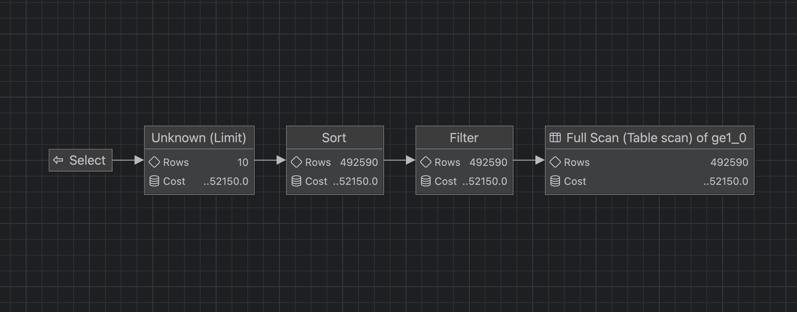
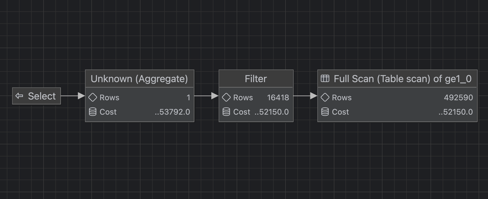
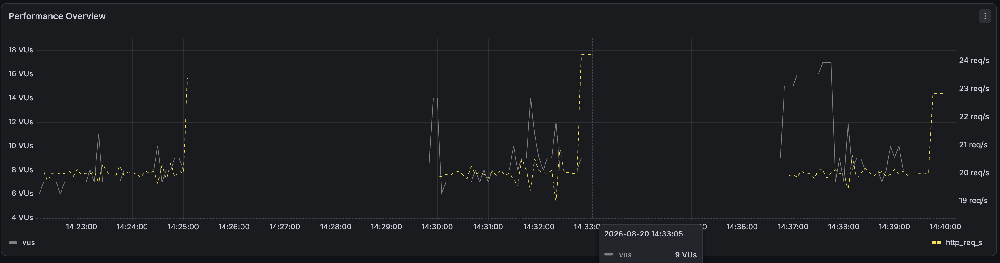
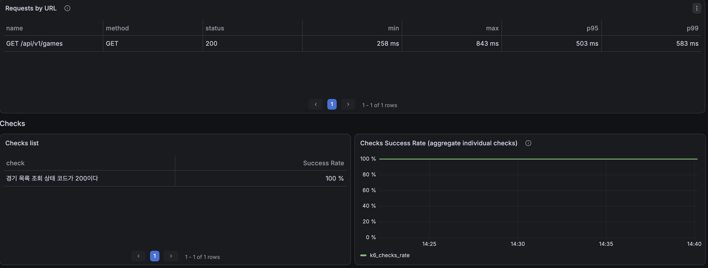
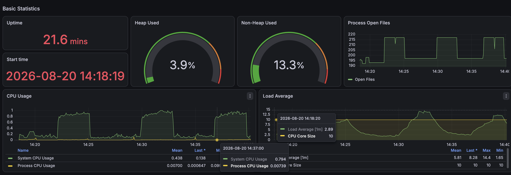

# 경기 목록 API: 인덱스 적용 전 성능 기준선

## 1. 측정 목적

50만 건의 경기 데이터에서 기본 경기 목록 API가 수행하는 목록 SQL과 COUNT SQL의 실행 비용을 확인하고, 인덱스 적용 전 API 응답시간과 서버 자원 사용량을 기준선으로 확보한다.

```http
GET /api/v1/games?page=0&size=10
```

## 2. 측정 조건

| 항목 | 값 |
|---|---:|
| 전체 경기 | 500,000건 |
| 조회 대상 경기 | 330,941건 |
| 페이지 | 0 |
| 페이지 크기 | 10 |
| 고정 기준 시각 | `2026-08-19 19:58:26.033731` |
| 측정 도구 | MySQL `EXPLAIN`, `EXPLAIN ANALYZE` |
| 반복 횟수 | 각 쿼리 5회 |

기준 시각은 실제 Hibernate 바인딩 로그에서 가져왔다. 인덱스 적용 후에도 같은 값을 사용한다.

## 3. 초기 인덱스

| 인덱스 | 컬럼 | 용도 |
|---|---|---|
| `PRIMARY` | `game_id` | 기본키 |
| `uq_game_place_time` | `place_name, address, start_date_time, end_date_time` | 장소·시간 중복 방지 |
| `FK5w99jeemscmsr3qh6tfrk6pff` | `user_entity_user_id` | 사용자 외래키 |

목록 조건은 `deleted_date_time`, `start_date_time`을 사용한다. 기존 복합 인덱스에서는 `start_date_time` 앞에 `place_name`, `address`가 있으므로 왼쪽 접두사 규칙상 목록 조회에 사용할 수 없다.

## 4. 목록 쿼리 측정

| 회차 | 전체 실행시간 | 테이블 스캔 | 조건 통과 | 반환 |
|---:|---:|---:|---:|---:|
| 1 | 300ms | 500,000 | 330,941 | 10 |
| 2 | 256ms | 500,000 | 330,941 | 10 |
| 3 | 254ms | 500,000 | 330,941 | 10 |
| 4 | 239ms | 500,000 | 330,941 | 10 |
| 5 | 241ms | 500,000 | 330,941 | 10 |

- 최솟값: 239ms
- 최댓값: 300ms
- 평균: 258ms
- 중앙값: **254ms**

일반 `EXPLAIN` 결과:

```text
type     = ALL
key      = NULL
rows     = 492590
filtered = 3.33
Extra    = Using where; Using filesort
```

실제 실행 흐름:

```text
Table scan 500,000건
→ 조건 필터링 330,941건
→ start_date_time, game_id 정렬
→ 10건 반환
```

### 목록 쿼리 실행계획 다이어그램



다이어그램은 오른쪽에서 왼쪽으로 읽는다. 옵티마이저는 `Full Scan → Filter → Sort → Limit` 순서로 실행할 계획을 세웠다. 그림의 행 수와 비용은 일반 `EXPLAIN`의 예상값이며, 실제 행 수와 시간은 위의 `EXPLAIN ANALYZE` 측정값을 기준으로 한다.

## 5. COUNT 쿼리 측정

| 회차 | 전체 실행시간 | 테이블 스캔 | 조건 통과 | 집계 반환 |
|---:|---:|---:|---:|---:|
| 1 | 139ms | 500,000 | 330,941 | 1 |
| 2 | 143ms | 500,000 | 330,941 | 1 |
| 3 | 120ms | 500,000 | 330,941 | 1 |
| 4 | 123ms | 500,000 | 330,941 | 1 |
| 5 | 122ms | 500,000 | 330,941 | 1 |

- 최솟값: 120ms
- 최댓값: 143ms
- 평균: 129.4ms
- 중앙값: **123ms**

일반 `EXPLAIN` 결과:

```text
type     = ALL
key      = NULL
rows     = 492590
filtered = 3.33
Extra    = Using where
```

실제 실행 흐름:

```text
Table scan 500,000건
→ 조건 필터링 330,941건
→ COUNT 집계
```

### COUNT 쿼리 실행계획 다이어그램



COUNT 쿼리도 `Full Scan → Filter → Aggregate` 순서다. 옵티마이저는 필터 통과 행을 16,418건으로 예상했지만, 실제로는 330,941건이 통과했다.

## 6. 분석

현재 `Page` 조회는 API 요청 한 번에 목록 SQL과 COUNT SQL을 모두 실행한다. 두 실행계획을 합치면 요청 한 번당 테이블 스캔 단계에서 총 1,000,000개의 행을 읽는다.

`EXPLAIN ANALYZE` 중앙값의 단순 합은 377ms이지만, 계측 오버헤드가 포함되므로 API 응답시간으로 사용하지 않는다. 이 값은 인덱스 적용 전후 DB 실행비용을 비교하는 기준선이다.

옵티마이저는 조건 통과 비율을 3.33%, 약 16,418건으로 추정했지만 실제 통과 행은 330,941건이다. 실제 선택도는 약 66.2%이며 예상과 실제가 약 20배 차이 난다.

## 7. API 부하 테스트 조건

DB 단독 측정 후, 실제 Spring Boot API에 k6로 고정된 요청률을 부과했다. 서버 응답속도와 관계없이 인덱스 적용 전·후에 동일한 입력 부하를 보장하기 위해 `constant-arrival-rate` executor를 사용했다.

| 항목 | 값 |
|---|---:|
| 대상 API | `GET /api/v1/games?page=0&size=10` |
| executor | `constant-arrival-rate` |
| 요청률 | 20 RPS |
| 실행시간 | 회차당 3분 |
| 반복 횟수 | 3회 |
| 총 요청 | 10,803건 |
| 사전 할당 VU | 20 |
| 최대 VU | 100 |
| HTTP 타임아웃 | 10초 |
| SQL/Bind 로그 | 비활성화 |
| 측정 도구 | k6, Prometheus, Grafana |

스모크 테스트 후 5 RPS로 30초간 워밍업했다. 본 측정은 각 3분씩 수행했고 회차 사이에 약 2분의 유휴 구간을 두었다.

## 8. k6 측정 결과

| 회차 | 평균 | 중앙값 | p90 | p95 | p99 | 최대 | 요청 | 실패 | 누락 | 최대 VU |
|---:|---:|---:|---:|---:|---:|---:|---:|---:|---:|---:|
| 1 | 402.6ms | 404.8ms | 445.2ms | 464.0ms | 544.1ms | 651.5ms | 3,601 | 0 | 0 | 11 |
| 2 | 437.4ms | 421.4ms | 556.9ms | 615.5ms | 700.9ms | 843.4ms | 3,601 | 0 | 0 | 14 |
| 3 | 409.0ms | 410.5ms | 464.9ms | 491.1ms | 569.0ms | 715.2ms | 3,601 | 0 | 0 | 12 |

3회 요약:

- 실제 평균 처리량: **19.96 RPS**
- 평균 응답시간의 3회 평균: **416.3ms**
- p95의 3회 평균: **523.5ms**
- p99의 3회 평균: **604.7ms**
- 회차별 중앙값 기준: 평균 **409.0ms**, p95 **491.1ms**, p99 **569.0ms**
- Grafana 선택 구간 통합 지표: p95 **503ms**, p99 **583ms**, 최대 **843ms**
- HTTP 오류율: **0%**
- Check 성공률: **100%**
- `dropped_iterations`: **0건**

회차별 JSON 원본:

- [Run 1](./k6/run-01-summary.json)
- [Run 2](./k6/run-02-summary.json)
- [Run 3](./k6/run-03-summary.json)

2회차에서 p95가 615.5ms로 상승했지만, 요청 실패나 누락은 발생하지 않았다. 적용 후에도 동일하게 3회 측정하고 평균과 회차별 중앙값을 함께 비교한다.

### 부하 프로파일



세 번의 본 측정 구간에서 요청률은 약 20 RPS로 유지됐다. 응답이 느려질수록 k6가 더 많은 VU를 사용했으며 2회차의 실제 최대 VU가 14로 가장 높았다.

### API latency



선택된 전체 측정 구간에서 `/api/v1/games`는 HTTP 200을 반환했고 p95 503ms, p99 583ms, 최대 843ms를 기록했다.

## 9. 요청 시간 구성

k6의 요청 단계별 측정값은 다음과 같다.

| 회차 | 전체 평균 | 서버 응답 대기 | 요청 전송 | 응답 수신 |
|---:|---:|---:|---:|---:|
| 1 | 402.6ms | 402.4ms | 0.014ms | 0.162ms |
| 2 | 437.4ms | 437.2ms | 0.015ms | 0.161ms |
| 3 | 409.0ms | 408.9ms | 0.015ms | 0.159ms |

전체 응답시간의 거의 전부가 `http_req_waiting`에서 발생했다. 로컬 네트워크 전송·수신 시간은 지연 원인으로 보기 어렵고, 서버 내부 처리시간이 지연을 지배했다.

## 10. Grafana 서버 지표



| 지표 | 관측값 | 해석 |
|---|---:|---|
| System CPU | 부하 구간 약 80~100%, 최대 100% | 부하 구간과 CPU 상승 구간이 일치 |
| Process CPU | 최대 약 9.94% | Spring Boot 프로세스 단독 CPU는 상대적으로 낮음 |
| Load Average | 최대 14.4 | 10개 CPU 코어 수보다 높은 구간 발생 |
| Heap Used | 약 3.9% | 메모리 압박은 낮음 |
| HikariCP Active | 최대 10/10 | 순간적으로 커넥션 풀 전체 사용 |
| HikariCP Pending | 최대 2 | 일부 요청의 커넥션 대기 발생 |
| Connection Timeout | 0 | 커넥션 타임아웃은 없음 |
| GC STW | 평균 120μs, 최대 3.2ms | 약 400ms의 API 지연을 설명할 수 없음 |

System CPU는 로컬 호스트 전체 지표이므로 MySQL CPU라고 단정하지 않는다. 다만 Spring Boot Process CPU보다 System CPU가 크게 상승했고 요청시간 대부분이 서버 대기에서 발생했으므로, 기존 `EXPLAIN ANALYZE`의 대량 스캔 결과와 함께 DB 쿼리를 주요 병목 후보로 판단한다.

## 11. 종합 결론

20 RPS의 요청을 오류와 누락 없이 처리했지만 p95 약 0.5초, p99 약 0.6초가 필요했다. 부하 구간에 HikariCP Active가 최대 크기 10에 도달하고 일부 Pending이 발생했으며, System CPU와 Load Average도 함께 상승했다.

JVM Heap과 GC, 로컬 네트워크는 주요 병목으로 보기 어렵다. DB 단독 측정에서 목록 SQL과 COUNT SQL이 각각 50만 행을 전체 스캔한 것을 확인했으므로, 다음 복합 인덱스를 해결책이 아닌 **검증 대상 후보**로 선정한다.

```text
(deleted_date_time, start_date_time, game_id)
```

## 12. 다음 단계 및 주의사항

1. 후보 복합 인덱스 하나만 적용한다.
2. `ANALYZE TABLE game_entity`로 통계를 갱신한다.
3. 같은 기준 시각과 SQL로 `EXPLAIN`, `EXPLAIN ANALYZE`를 다시 5회 측정한다.
4. 같은 k6 스크립트로 20 RPS, 3분, 3회 측정한다.
5. 적용 전·후의 실행계획, 검사 행 수, p95, p99, HikariCP, CPU를 비교한다.
6. 새 인덱스가 사용되지 않거나 성능이 개선되지 않으면 제거하고 다음 후보를 검토한다.

- Hibernate SQL 및 바인딩 TRACE 로그는 SQL 캡처 용도로만 사용했다.
- API 부하 측정 중에는 SQL과 바인딩 TRACE 로그를 비활성화했다.
- k6 JSON을 정량 비교의 원본으로 사용하고 Grafana는 시각적 증거와 자원 추세 확인에 사용한다.
