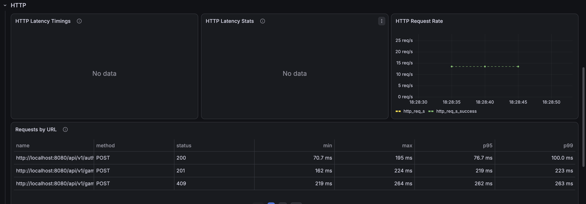
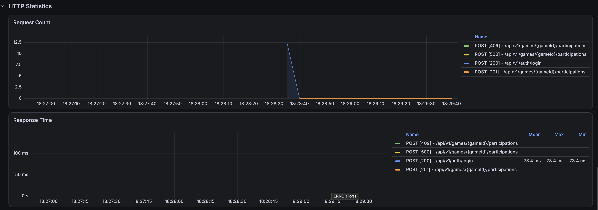
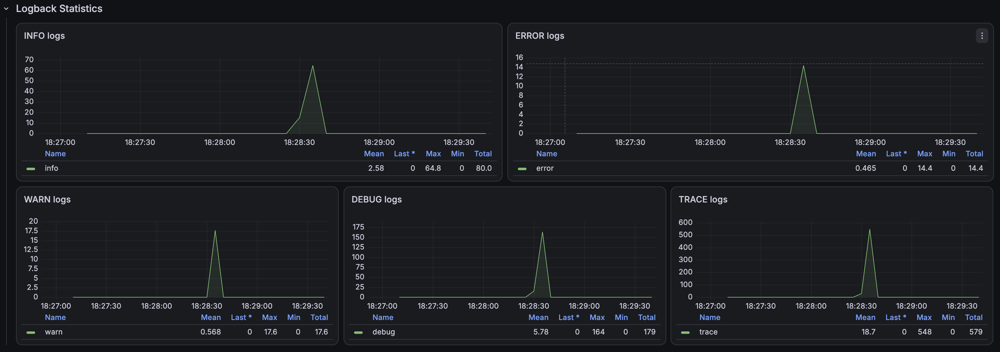
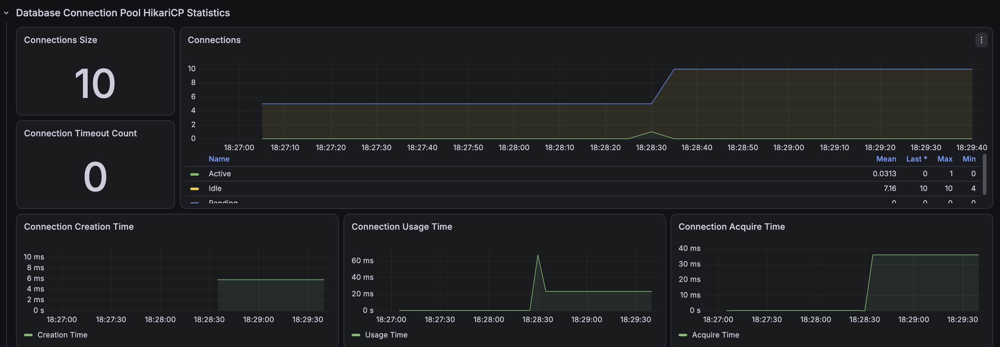
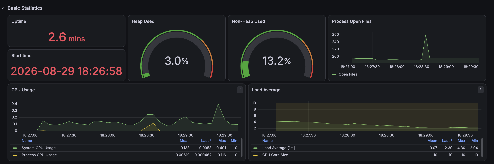

# 경기 참가 동시성: 락 적용 전 기준선

## 1. 측정 목적

정원 제한이 있는 경기 참가 API에 여러 사용자가 동시에 요청했을 때 다음 불변식이 유지되는지 확인한다.

```http
POST /api/v1/games/{gameId}/participations
Authorization: Bearer {accessToken}
```

이번 측정은 처리속도만 비교하는 일반적인 부하 테스트가 아니다. 선착순 참가에서 가장 중요한 **정원 초과 방지**, **경기 집계값과 실제 참가 데이터의 일치**, **서버 오류 없는 정상 거절**을 락 적용 전 기준선으로 확보하는 것이 목적이다.

## 2. 정상 동작 기준

테스트 경기는 생성자가 이미 참가한 정원 6명의 경기다. 따라서 일반 사용자가 참가할 수 있는 자리는 5개다.

100명이 동시에 참가해도 다음 결과를 만족해야 한다.

| 불변식 | 기대값 |
|---|---:|
| 일반 사용자 참가 성공 | 5건 |
| 정원 초과 정상 거절 | 95건 |
| 시스템 오류 | 0건 |
| 생성자 포함 실제 `ACCEPT` | 6명 |
| `game_entity.participant_count` | 6명 |
| 초과 승인 | 0명 |
| 경기 상태 | `CLOSED` |
| 동일 사용자의 중복 참가 | 0건 |

HTTP 409 자체를 시스템 장애로 취급하지 않는다. 응답 본문의 에러 코드가 `FULL_HEADCOUNT_GAME`인 409는 선착순 마감에 따른 정상적인 비즈니스 거절이다. HTTP 500, 타임아웃, 인증 오류와 예상하지 못한 4xx만 시스템 또는 비정상 응답으로 분리한다.

## 3. 측정 조건

| 항목 | 값 |
|---|---:|
| 테스트 단계 | `before-lock` |
| 측정 회차 | `run-01` |
| 경기 ID | 1 |
| 경기 정원 | 6명 |
| 초기 참가 인원 | 생성자 1명 |
| 남은 자리 | 5명 |
| 동시 요청 사용자 | 100명 |
| 사용자 인증 | 서로 다른 사용자 JWT 100개 |
| k6 executor | `per-vu-iterations` |
| VU | 100 |
| VU별 반복 | 1회 |
| 참가 요청 | 총 100건 |
| HikariCP 최대 크기 | 10 |
| Spring Profile | `local,performance` |
| Prometheus scrape interval | 5초 |

k6 `setup()`에서 로컬 로그인 API를 순차 호출해 JWT 100개를 발급하고, 각 VU에 서로 다른 토큰을 할당했다. 따라서 전체 HTTP 요청은 로그인 100건과 참가 100건을 합한 200건이다. 참가 시나리오 자체는 약 0.3초에 완료됐고, 로그인 준비를 포함한 전체 k6 실행은 약 7.8초가 걸렸다.

## 4. 응답 분류와 측정 원칙

참가 API 응답은 다음과 같이 분류했다.

| 분류 | 조건 | 의미 |
|---|---|---|
| 참가 성공 | HTTP 201 | 참가 데이터 생성 완료 |
| 정상 정원 초과 | HTTP 409 + `FULL_HEADCOUNT_GAME` | 남은 자리가 없어 정상 거절 |
| 시스템 오류 | HTTP 500 이상 또는 네트워크 오류 | 정상적인 비즈니스 응답이 아님 |
| 예상하지 못한 응답 | 위 세 조건 이외 | 인증·권한·요청 구성 등을 추가 확인해야 함 |

정량 비교의 우선순위는 다음과 같다.

1. DB 검증 CSV: 최종 데이터 정합성
2. k6 JSON: 응답 개수, 오류율, p95, p99
3. Grafana: 요청 시점의 상태 코드와 자원 변화 추세

Grafana는 시각적인 보조 근거다. 이번 부하는 약 0.3초의 순간 부하인 반면 Prometheus 수집 주기는 5초이므로, VU·Active Connection·CPU의 실제 순간 최댓값을 놓칠 수 있다.

## 5. k6 측정 결과

### 응답 결과

| 항목 | 기대 | 실제 | 판정 |
|---|---:|---:|---|
| 참가 성공 | 5건 | 12건 | 실패 |
| 정상 정원 초과 | 95건 | 52건 | 실패 |
| 시스템 오류 | 0건 | 36건 | 실패 |
| 예상하지 못한 응답 | 0건 | 0건 | 통과 |
| 기대 응답 비율 | 100% | 64% | 실패 |

100건의 참가 요청은 다음과 같이 나뉘었다.

```text
HTTP 201 참가 성공             12건
HTTP 409 정상 정원 초과        52건
HTTP 500 계열 시스템 오류      36건
합계                          100건
```

정상적으로는 5명만 성공해야 하지만 12명이 참가에 성공했다. 또한 95건이어야 할 정원 초과 거절 중 52건만 정상 응답으로 처리됐고, 36건은 서버 오류가 됐다.

### 참가 API 응답시간

| 평균 | 중앙값 | p90 | p95 | p99 | 최대 |
|---:|---:|---:|---:|---:|---:|
| 216.79ms | 220.72ms | 253.76ms | 258.99ms | 262.55ms | 263.94ms |

참가 API의 HTTP 실패율은 **36%**다. 로그인까지 포함한 전체 200건을 분모로 계산하면 실패율이 18%로 보이므로, 동시성 개선 전후 비교에는 반드시 `endpoint:game-participation` 태그가 적용된 36%를 사용한다.

응답시간이 300ms 미만이어도 36%의 시스템 오류와 초과 승인이 발생했으므로 현재 결과를 빠르고 정상적인 처리라고 평가할 수 없다.

- [k6 Run 1 JSON](./k6/game-participation-run-01-summary.json)

## 6. DB 정합성 검증

| 항목 | 기대 | 실제 |
|---|---:|---:|
| 경기 정원 | 6명 | 6명 |
| `game_entity.participant_count` | 6명 | 6명 |
| 실제 `ACCEPT` 참가자 | 6명 | 13명 |
| 생성자 제외 참가 성공 | 5명 | 12명 |
| 집계값과 실제 데이터 차이 | 0명 | -7명 |
| 초과 승인 | 0명 | 7명 |
| 경기 상태 | `CLOSED` | `CLOSED` |
| 최종 판정 | `PASS` | `FAIL` |

`participant_count=6`, `game_status=CLOSED`만 조회하면 정상처럼 보인다. 하지만 참가 테이블에는 생성자를 포함해 13명이 `ACCEPT` 상태로 저장됐다. 경기 집계값보다 실제 참가자가 7명 많고, 정원도 7명 초과했다.

동일 사용자의 중복 참가 레코드는 없었다.

```text
전체 참가 레코드       13건
고유 참가 사용자       13명
중복 참가 레코드        0건
```

따라서 문제는 동일 사용자의 중복 요청이 아니라 **서로 다른 사용자가 같은 경기의 남은 자리를 동시에 점유한 것**이다.

DB 원본 자료:

- [참가 상태별 개수](./raw/participant-status-count.csv)
- [핵심 정합성 결과](./raw/consistency-detail.csv)
- [참가 사용자 고유성](./raw/participation-uniqueness.csv)
- [ACCEPT 참가자 목록](./raw/accepted-participants.csv)
- [최종 판정](./raw/final-verdict.csv)

## 7. Grafana 관측 결과

### k6 Endpoint



로그인 HTTP 200과 참가 HTTP 201·409 응답을 확인할 수 있다. k6 JSON에는 참가 요청에서 발생한 36건의 시스템 오류도 별도로 기록돼 있다. 상태 코드별 정확한 개수와 백분위 응답시간은 Grafana 그래프보다 JSON을 기준으로 한다.

### Spring HTTP 상태



Spring Boot 관측에서도 참가 API의 HTTP 201, 409, 500이 같은 시간대에 발생했다. 정원 초과를 409로 정상 처리한 요청과 서버 내부 오류가 된 요청이 함께 존재한다.

### 오류 로그 추세



참가 요청 시점에 WARN과 ERROR 로그가 동시에 증가했다. 이 그래프는 오류 발생 시점이 동시 참가 요청 구간과 일치한다는 보조 근거이며, 정확한 오류 건수나 예외 종류는 애플리케이션 로그를 기준으로 판단해야 한다.

### HikariCP



HikariCP 최대 크기는 10이고 Connection Timeout은 발생하지 않았다. 화면에 표시된 Active 최대값은 1이지만, 0.3초 부하를 5초 간격으로 수집했기 때문에 실제 순간 동시 사용량의 최댓값으로 해석하지 않는다.

### JVM과 시스템 자원



Heap 사용률과 Process CPU에는 지속적인 포화가 관측되지 않았다. 하지만 테스트 구간이 매우 짧아 자원 지표만으로 병목을 배제하거나 확정하지 않는다. 이번 단계의 핵심 근거는 자원 사용률보다 초과 승인, 집계 불일치, HTTP 500이다.

## 8. 원인 가설

현재 참가 서비스는 같은 경기 행을 일반 조회한 뒤 각 트랜잭션 안에서 다음 작업을 수행한다.

```text
경기 조회
→ 현재 participant_count와 모집 상태 검증
→ 참가 엔티티를 ACCEPT로 변경
→ game.participant_count 증가
→ 트랜잭션 커밋
```

동시에 시작한 여러 트랜잭션은 다른 트랜잭션의 커밋 전 값을 읽을 수 있다. 여러 요청이 모두 남은 자리가 있다고 판단해 참가 엔티티를 생성하고, 동일한 경기 엔티티의 참가 인원 값을 갱신한다.

그 결과 다음 문제가 발생한 것으로 판단한다.

1. 여러 요청이 같은 이전 참가 인원 값을 기준으로 검증한다.
2. 5명보다 많은 사용자가 참가 검증을 통과한다.
3. 참가 레코드는 각 사용자별로 저장된다.
4. 경기 집계값 갱신 일부는 서로 덮어써져 최종 값이 6으로 남는다.
5. 실제 `ACCEPT`는 13명이 되어 집계값과 불일치한다.

앞서 수행한 CountDownLatch 통합 테스트에서는 같은 상황에서 MySQL `SQLState 40001`, 오류 코드 1213 데드락이 재현됐다. 이번 HTTP 테스트에서도 36건의 HTTP 500이 발생했으므로 동일 문제가 주요 후보지만, HTTP 500 전체의 정확한 예외 종류는 서버 로그 원본으로 다시 확인한다.

## 9. 기준선 결론

락이 없는 현재 구현은 선착순 참가 정책의 핵심 불변식을 지키지 못한다.

```text
허용 가능한 일반 참가자 5명
→ 실제 참가 성공 12명
→ 7명 초과 승인
→ GameEntity 집계값 6명
→ 실제 ACCEPT 13명
→ 시스템 오류 36건
```

이 문제는 단순히 응답시간을 줄이는 성능 문제가 아니다. 락 적용 후 응답시간이 일부 증가하더라도 정원 초과 승인과 서버 오류를 제거하고 데이터 정합성을 보장하는 것이 우선이다.

개선 방식은 다음 조건을 모두 만족해야 한다.

- 성공 요청 정확히 5건
- `FULL_HEADCOUNT_GAME` 정확히 95건
- HTTP 500과 타임아웃 0건
- `participant_count=6`
- 실제 `ACCEPT=6`
- 초과 승인 0건
- 중복 참가 0건
- 경기 상태 `CLOSED`

## 10. 다음 단계와 반복 측정 원칙

1. 로그인 체크 이름을 사용자별 이메일이 아닌 고정 이름으로 변경해 Prometheus 시계열 증가를 방지한다.
2. 매 회차 전에 테스트 경기를 삭제하고 동일 조건의 새 경기를 생성한다.
3. 락 적용 전 `run-02`, `run-03`을 반복한다.
4. JSON의 성공·정원 초과·시스템 오류·p95·p99를 기록한다.
5. DB 검증 SQL로 실제 `ACCEPT`와 `participant_count`를 매번 비교한다.
6. 비관적 락을 적용하고 같은 조건으로 CountDownLatch와 k6 테스트를 반복한다.
7. 낙관적 락과 제한된 재시도도 같은 조건으로 검증한다.
8. 각 방식에서 정합성을 먼저 판정하고, 정합성을 만족한 방식끼리 응답시간과 오류율을 비교한다.

3회 결과를 모두 확보한 뒤 평균만 사용하지 않고 회차별 값과 중앙값을 함께 기록한다. k6 JSON과 DB CSV를 정량 비교 원본으로 사용하며 Grafana 캡처는 대표 회차의 추세 설명에만 사용한다.
