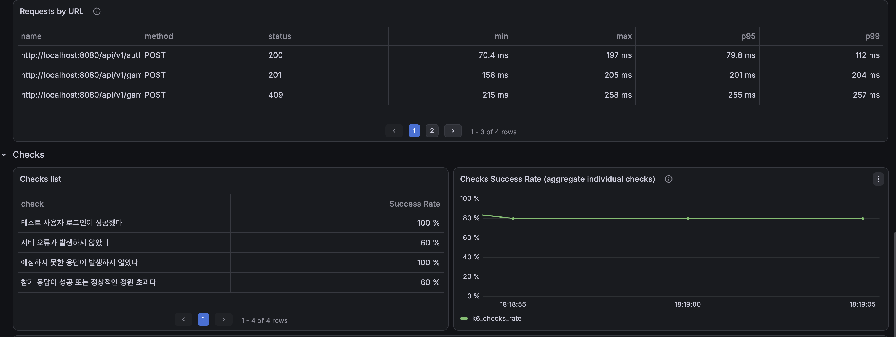
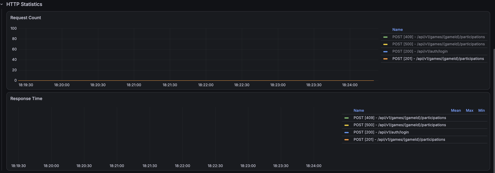
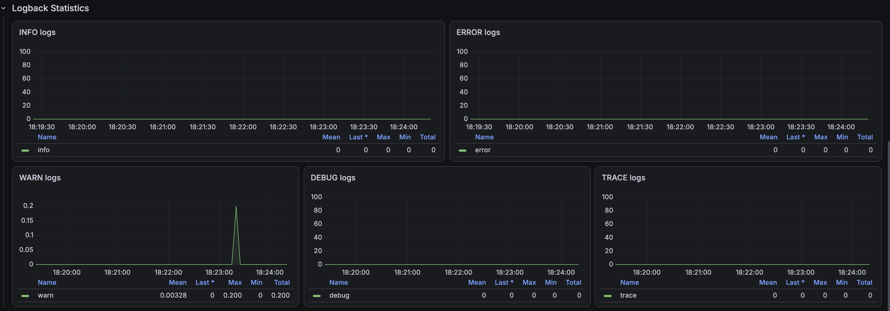

# 경기 참가 동시성: 낙관적 락 무재시도 비교 실험

## 1. 실험 목적

비관적 락으로 경기 참가의 데이터 정합성을 회복한 뒤, 같은 문제를 낙관적 락으로도 해결할 수 있는지 비교했다. 비교 대상은 재시도 로직이 없는 가장 단순한 낙관적 락 구현이다.

```text
GameEntity에 @Version 추가
→ 일반 조회 후 참가 가능 여부 검증
→ 커밋 시 version 비교
→ 다른 트랜잭션이 먼저 변경했다면 충돌 감지
```

이 실험의 목적은 낙관적 락이 동작하는지만 확인하는 것이 아니다. 다음 두 조건을 모두 만족하는지 검증해 최종 방식을 선택하는 것이다.

1. 정원 초과 승인과 집계 불일치를 방지한다.
2. 충돌한 요청을 HTTP 500이 아닌 정상적인 비즈니스 응답으로 처리한다.

- [락 적용 전 기준선](../before-lock/summary.md)
- [비관적 락 적용 후 검증](../pessimistic-lock/summary.md)

## 2. 낙관적 락의 동작 원리

낙관적 락은 데이터를 읽을 때 DB 행을 잠그지 않는다. 엔티티의 버전 값을 함께 읽고, 변경 쿼리의 조건에 읽었던 버전을 포함해 커밋 시점에 충돌을 확인한다.

```sql
UPDATE game_entity
SET participant_count = ?, game_status = ?, version = version + 1
WHERE game_id = ?
  AND version = ?;
```

먼저 커밋한 트랜잭션만 현재 버전과 일치해 갱신에 성공한다. 같은 버전을 읽은 나머지 트랜잭션은 갱신 건수가 0이 되어 충돌 예외가 발생한다. 따라서 유실 갱신과 초과 승인은 막을 수 있지만, 충돌한 요청을 성공시키거나 정원 초과 응답으로 바꾸지는 않는다.

낙관적 락의 핵심은 **충돌 방지**가 아니라 **충돌 감지**다. 충돌 이후의 재시도나 사용자 응답 정책은 애플리케이션이 별도로 결정해야 한다.

## 3. 측정 조건과 정상 기준

비관적 락 실험과 같은 조건을 사용했다.

| 항목 | 값 |
|---|---:|
| 테스트 단계 | `optimistic-lock-no-retry` |
| 측정 회차 | `run-01` |
| 경기 ID | 5 |
| 경기 정원 | 6명 |
| 초기 참가 인원 | 생성자 1명 |
| 남은 자리 | 5명 |
| 동시 요청 사용자 | 100명 |
| 사용자 인증 | 서로 다른 사용자 JWT 100개 |
| k6 executor | `per-vu-iterations` |
| VU | 100 |
| VU별 참가 요청 | 1회 |
| 참가 요청 | 총 100건 |
| 재시도 | 없음 |

정상 결과는 참가 성공 5건, `FULL_HEADCOUNT_GAME` 95건, 시스템 오류 0건이다. HTTP 409와 본문의 `FULL_HEADCOUNT_GAME` 조합은 정상적인 정원 초과 거절로 분류하고, HTTP 500 이상과 네트워크 오류는 시스템 오류로 분류했다.

## 4. CountDownLatch 통합 테스트 결과

100개 요청을 동시에 시작한 서비스·DB 통합 테스트에서는 최종 데이터 정합성이 유지됐지만 충돌 요청이 정상적인 도메인 응답으로 수렴하지 않았다.

| 항목 | 기대 | 실제 |
|---|---:|---:|
| 전체 요청 | 100건 | 100건 |
| 참가 성공 | 5건 | 5건 |
| `FULL_HEADCOUNT_GAME` | 95건 | 53건 |
| `CannotAcquireLockException` | 0건 | 35건 |
| `ObjectOptimisticLockingFailureException` | 0건 | 7건 |
| 실행 시간 | - | 217ms |
| `participant_count` | 6명 | 6명 |
| 실제 `ACCEPT` | 6명 | 6명 |
| 경기 상태 | `CLOSED` | `CLOSED` |

성공 5건만 커밋됐으므로 초과 승인은 발생하지 않았다. 그러나 42건이 락 충돌 관련 예외로 종료됐고, 정원 초과 도메인 예외로 처리된 요청은 53건뿐이었다. 예외 클래스별 개수는 당시 통합 테스트가 수집한 관측값이며, 환경과 예외 변환 계층에 따라 분류는 달라질 수 있다.

따라서 이 결과는 **DB 불변식은 통과했지만 요청 처리 계약은 실패한 상태**다.

## 5. k6 HTTP 측정 결과

실제 인증, Spring MVC, 트랜잭션과 예외 응답 변환을 포함한 HTTP 테스트에서도 같은 문제가 재현됐다.

| 항목 | 기대 | 실제 | 판정 |
|---|---:|---:|---|
| 참가 성공 | 5건 | 5건 | 통과 |
| 정원 초과 정상 거절 | 95건 | 56건 | 실패 |
| 시스템 오류 | 0건 | 39건 | 실패 |
| 예상하지 못한 응답 | 0건 | 0건 | 통과 |
| 기대 응답 비율 | 100% | 61% | 실패 |
| 참가 API HTTP 실패율 | 0% | 39% | 실패 |

```text
HTTP 201 참가 성공              5건
HTTP 409 정상 정원 초과         56건
HTTP 500 계열 시스템 오류       39건
합계                           100건
```

100건 중 정확히 5건만 참가에 성공했지만, 충돌 요청 39건이 사용자에게 HTTP 500 계열 응답으로 노출됐다. k6 임계값을 충족하지 못해 프로세스 종료 코드는 `99`였다.

- [k6 Run 1 JSON](./k6/game-participation-run-01-summary.json)

## 6. 응답시간 해석

참가 API의 응답시간은 다음과 같다.

| 평균 | 중앙값 | p90 | p95 | p99 | 최대 |
|---:|---:|---:|---:|---:|---:|
| 220.01ms | 221.65ms | 250.43ms | 254.54ms | 257.08ms | 257.50ms |

p95 254.54ms는 설정한 5초 임계값보다 낮다. 그러나 전체 참가 요청의 39%가 시스템 오류이므로 이 수치만으로 성능이 양호하다고 평가할 수 없다.

빠르게 실패한 요청이 백분위 응답시간에 포함될 수도 있다. 성능 방식의 채택 여부는 반드시 다음 순서로 판단한다.

1. DB 정합성
2. 비즈니스 응답의 정확성
3. 시스템 오류율
4. 위 조건을 통과한 방식끼리 p95·p99 비교

## 7. DB 정합성 검증

k6 실행 후 DB를 직접 조회한 결과는 `PASS`였다.

| 항목 | 기대 | 실제 |
|---|---:|---:|
| 경기 정원 | 6명 | 6명 |
| `game_entity.participant_count` | 6명 | 6명 |
| 실제 `ACCEPT` | 6명 | 6명 |
| 성공한 일반 참가자 | 5명 | 5명 |
| 집계값과 실제 데이터 차이 | 0명 | 0명 |
| 초과 승인 | 0명 | 0명 |
| 경기 상태 | `CLOSED` | `CLOSED` |
| 최종 판정 | `PASS` | `PASS` |

즉, 낙관적 락은 `participant_count`와 실제 참가 데이터의 불일치를 막았다. 하지만 DB가 `PASS`라는 사실만으로 API 실험도 성공했다고 결론 내릴 수 없다. 사용자가 받은 39건의 시스템 오류는 별도의 실패 조건이다.

DB 원본 자료:

- [핵심 정합성 결과](./raw/consistency-detail.csv)
- [최종 판정](./raw/final-verdict.csv)

## 8. Grafana 관측 결과

### k6 Endpoint



k6 관측에서도 참가 성공과 정상적인 정원 초과 응답 외에 시스템 오류가 함께 발생했다. 정확한 상태별 개수와 백분위 응답시간은 JSON을 기준으로 사용한다.

### Spring HTTP 상태



Spring Boot 지표에서 참가 API의 HTTP 201·409·500 계열 응답이 같은 부하 구간에 관측됐다. DB 정합성은 보장됐지만 예외 변환 이전에 충돌이 정상적인 비즈니스 거절로 처리되지 않았음을 보여준다.

### 오류 로그



동시 참가 시점에 오류 로그가 증가했다. 그래프는 오류 시점을 확인하는 보조 근거이며, 정확한 오류 건수는 k6 JSON, 예외 종류는 애플리케이션 및 통합 테스트 로그를 기준으로 판단한다.

이번 비교에서는 낙관적 락의 채택 여부를 결정하는 데 필요한 HTTP·오류·DB 자료를 우선 보관했다. HikariCP와 JVM 자원은 대표 비교 자료가 없으므로 비관적 락과의 자원 사용량 차이를 단정하지 않는다.

## 9. 비관적 락과의 비교 및 결정

| 항목 | 낙관적 락 무재시도 | 비관적 락 |
|---|---:|---:|
| 참가 성공 | 5건 | 5건 |
| 정원 초과 정상 거절 | 56건 | 95건 |
| 시스템 오류 | 39건 | 0건 |
| 기대 응답 비율 | 61% | 100% |
| DB 정합성 | `PASS` | `PASS` |
| 참가 API p95 | 254.54ms | 227.78ms¹ |
| 애플리케이션 재시도 | 필요 | 불필요 |
| 반복 검증 | 1회 | 3회 모두 통과 |

¹ 비관적 락 3회 측정의 중앙값이다. 낙관적 락은 1회 측정이므로 응답시간 차이는 참고값이며, 최종 선택의 핵심 근거는 시스템 오류와 정상 응답 비율이다.

경기 참가 시나리오는 5개의 남은 자리에 100명이 동시에 요청해 충돌 가능성이 매우 높다. 낙관적 락에 재시도를 추가하면 일부 충돌을 처리할 수 있지만, 최대 재시도 횟수·백오프·트랜잭션 경계·멱등성·재시도 소진 응답을 추가로 설계해야 한다. 또한 대부분의 요청은 결국 정원 초과로 거절되므로 충돌이 드문 환경에 적합한 낙관적 락의 장점이 작다.

따라서 현재 요구사항에서는 한 경기 행에 대한 변경을 DB에서 순서화하고 모든 초과 요청을 도메인 예외로 처리한 **비관적 쓰기 락을 최종 선택**한다.

## 10. 결론과 학습 포인트

낙관적 락 무재시도 실험의 결론은 다음과 같다.

```text
100명이 5개의 남은 자리에 동시 신청
→ 참가 성공 5건
→ participant_count = 실제 ACCEPT = 6
→ 초과 승인 0건
→ DB 정합성 PASS
→ 그러나 시스템 오류 39건
→ 기대 응답 비율 61%
→ 운영 방식으로 기각
```

이 실험으로 얻은 핵심 학습은 다음과 같다.

- 낙관적 락은 충돌을 자동 해결하지 않고 충돌을 감지한다.
- DB 정합성과 API 성공 여부는 별개의 검증 대상이다.
- HTTP 500이 포함된 낮은 p95는 최적화 성과가 아니다.
- 재시도는 단순 반복문이 아니라 트랜잭션을 새로 시작하도록 경계를 설계해야 한다.
- 충돌이 빈번하고 즉시 일관성이 중요한 선착순 참가에는 비관적 락이 더 단순하고 예측 가능했다.
- 선택하지 않은 방식의 결과도 기각 근거와 트레이드오프를 설명하는 중요한 포트폴리오 자료가 된다.

실험용 `@Version` 컬럼과 낙관적 락 조회 코드는 최종 운영 코드에서 제거했다. 원본 JSON·CSV·Grafana 캡처는 의사결정의 재현 근거로 보관한다.
