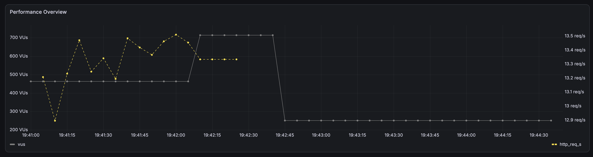
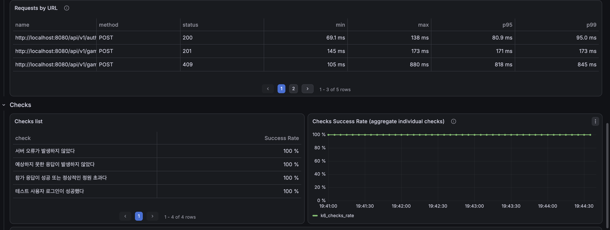
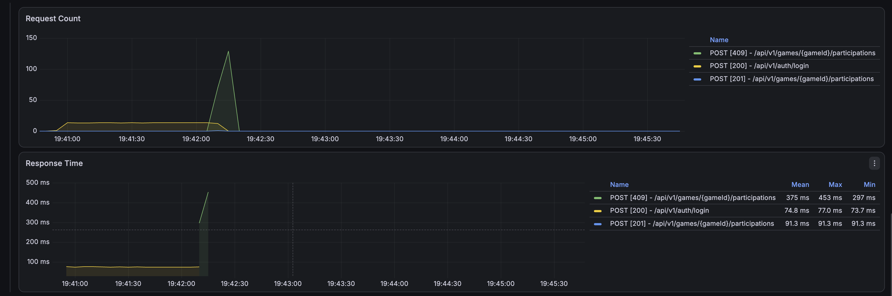
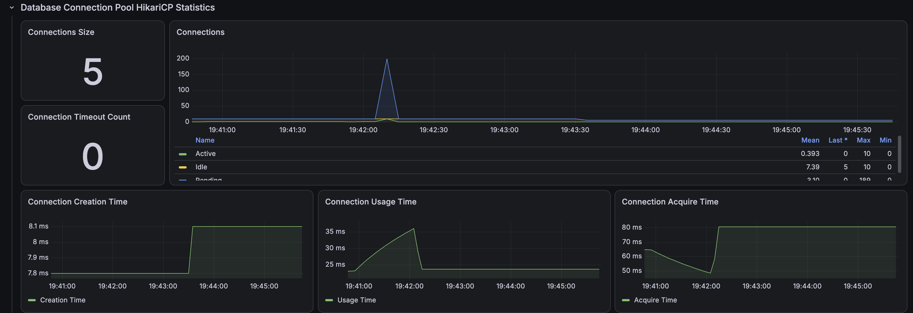
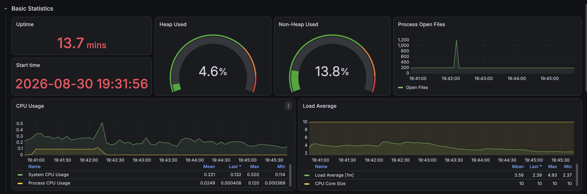
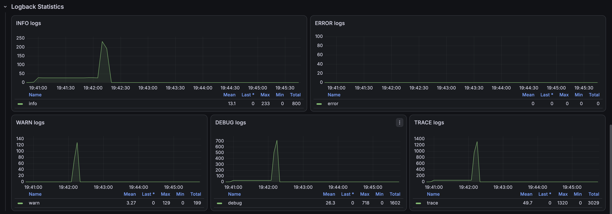

# 경기 참가 동시성: 비관적 락 단계별 부하 한계 탐색

## 1. 측정 목적

100명 동시 참가에서 비관적 락이 정합성을 보장한다는 사실을 확인한 뒤, 동일한 로컬 환경에서 요청 규모를 200명, 500명, 1,000명으로 높였을 때도 다음 조건이 유지되는지 검증했다.

```text
DB 정합성
→ 정상적인 HTTP 응답
→ 응답시간 증가 추세
→ HikariCP·JVM·시스템 자원 상태
```

이 실험은 운영 환경의 최대 수용량을 인증하는 테스트가 아니다. 단일 로컬 애플리케이션과 MySQL에서 순간적으로 같은 경기의 남은 5자리에 요청이 집중되는 극단적인 경합 상황을 만들고, **검증한 범위 안에서의 상한과 병목 징후**를 찾는 것이 목적이다.

- [비관적 락 적용 후 100명 검증](../pessimistic-lock/summary.md)
- [동시성 제어 방식 결정 기록](../../../../docs/adr/game/game-participation-concurrency-lock.md)

## 2. 시나리오와 불변식

테스트 경기는 정원 6명이며 생성자 1명이 이미 `ACCEPT` 상태다. 따라서 일반 사용자가 참가할 수 있는 자리는 5개다.

각 단계에서 서로 다른 사용자 JWT를 가진 VU가 참가 요청을 한 번씩 전송했다.

```http
POST /api/v1/games/{gameId}/participations
Authorization: Bearer {accessToken}
```

요청 수와 무관하게 다음 불변식을 만족해야 한다.

| 불변식 | 기대값 |
|---|---:|
| 일반 사용자 참가 성공 | 5건 |
| 정원 초과 정상 거절 | `USER_COUNT - 5`건 |
| 시스템 오류 | 0건 |
| 예상하지 못한 응답 | 0건 |
| 생성자 포함 실제 `ACCEPT` | 6명 |
| `game_entity.participant_count` | 6명 |
| 초과 승인 | 0명 |
| 경기 상태 | `CLOSED` |

HTTP 409와 응답 본문의 `FULL_HEADCOUNT_GAME` 조합은 시스템 실패가 아니라 정상적인 비즈니스 거절로 분류했다.

## 3. 실행 환경과 측정 설계

| 항목 | 값 |
|---|---:|
| 테스트 단계 | `pessimistic-lock-load-limit` |
| 요청 단계 | 200 → 500 → 1,000명 |
| k6 executor | `per-vu-iterations` |
| VU별 반복 | 1회 |
| 참가 API timeout | 10초 |
| 시나리오 `maxDuration` | 30초 |
| k6 `setupTimeout` | 5분 |
| HikariCP 최대 크기 | 10 |
| HikariCP 최소 유휴 | 5 |
| HikariCP connection timeout | 30초 |
| Spring Profile | `local,performance` |
| Prometheus scrape interval | 5초 |

각 단계 전에 기존 테스트 경기와 참가 데이터를 삭제하고 생성자 1명만 참가한 새 경기를 만들었다. 같은 경기 ID를 재사용하지 않아 이전 단계의 `CLOSED` 상태와 참가 데이터가 다음 측정에 영향을 주지 않도록 했다.

`setup()`에서 사용자를 순차 로그인한 뒤 참가 요청을 실행했다. 따라서 전체 HTTP 요청 수는 로그인과 참가 요청의 합이다.

| VU | 로그인 | 참가 | 전체 HTTP 요청 |
|---:|---:|---:|---:|
| 200 | 200 | 200 | 400 |
| 500 | 500 | 500 | 1,000 |
| 1,000 | 1,000 | 1,000 | 2,000 |

1,000명 준비가 k6의 기본 `setupTimeout` 60초를 넘을 수 있어 5분으로 확장했다. 로그인 부하는 `endpoint=game-participation-login`, 참가 부하는 `endpoint=game-participation` 태그로 분리했다.

## 4. 테스트 데이터와 보안 처리

로컬 DB에 `@example.test` 도메인의 성능 테스트 사용자 1,000명을 생성했다. 기존 1~100번 사용자는 `ON DUPLICATE KEY UPDATE`로 갱신하고 101~1,000번만 추가하므로 다른 사용자 데이터나 전체 테이블을 초기화하지 않는다.

```text
perf-concurrency-user-001@example.test
...
perf-concurrency-user-1000@example.test
```

모든 VU는 서로 다른 계정으로 로그인해 동일 사용자의 중복 참가 검증이 부하 결과를 왜곡하지 않도록 했다. 공통 비밀번호는 로컬 성능 테스트 전용이며 DB에는 BCrypt 해시로 저장된다.

k6의 `setup()` 반환값에는 실행 중 발급한 JWT가 포함되므로 `--summary-export` 직후 `jq 'del(.setup_data)'`로 제거했다. 세 JSON 모두 다음 조건을 확인했다.

```text
setup_data 필드 없음
Bearer 문자열 없음
JWT 패턴 없음
```

따라서 저장한 JSON·CSV·Grafana 자료에는 실제 액세스 토큰이 포함되지 않는다.

## 5. k6 응답 정확성 결과

세 단계 모두 응답 개수와 오류율 임계값을 통과했다.

| VU | 성공 | 정상 정원 초과 | 시스템 오류 | 비정상 응답 | 기대 응답률 | 참가 API 실패율 |
|---:|---:|---:|---:|---:|---:|---:|
| 200 | 5 | 195 | 0 | 0 | 100% | 0% |
| 500 | 5 | 495 | 0 | 0 | 100% | 0% |
| 1,000 | 5 | 995 | 0 | 0 | 100% | 0% |

정원 초과 요청이 증가해도 HTTP 500, 네트워크 오류, 인증 실패와 예상하지 못한 응답은 발생하지 않았다.

- [200명 JSON](./k6/game-participation-users-0200-run-01-summary.json)
- [500명 JSON](./k6/game-participation-users-0500-run-01-summary.json)
- [1,000명 JSON](./k6/game-participation-users-1000-run-01-summary.json)

터미널에 표시된 전체 실행시간은 순차 로그인을 포함한다. 1,000명 실행의 약 77.3초를 참가 API 처리시간으로 해석하지 않는다. 참가 시나리오의 개별 응답시간과 백분위는 `endpoint=game-participation` 태그가 적용된 지표를 사용한다.

## 6. 응답시간 증가 추세

### 참가 API 측정값

| VU | 평균 | 중앙값 | p90 | p95 | p99 | 최대 |
|---:|---:|---:|---:|---:|---:|---:|
| 200 | 383.83ms | 388.52ms | 481.87ms | 502.17ms | 511.01ms | 516.79ms |
| 500 | 565.47ms | 598.66ms | 803.53ms | 817.57ms | 843.79ms | 879.84ms |
| 1,000 | 1,053.17ms | 968.28ms | 1,756.79ms | 2,024.20ms | 2,212.44ms | 2,230.79ms |

200명에서 1,000명으로 요청 규모가 5배 증가하는 동안 평균은 약 2.74배, p95는 약 4.03배가 됐다. 모든 요청은 5초 p95 임계값을 통과했지만, 부하가 커질수록 꼬리 지연시간이 빠르게 증가했다.

비관적 락은 같은 경기 행의 변경을 순서화한다. 앞선 요청이 락을 보유하는 동안 뒤의 요청은 대기하고, 락을 얻은 후 최신 `CLOSED` 상태를 확인해 정상 거절된다. 따라서 초과 승인은 방지되지만 한 경기에 요청이 몰리면 대기시간이 누적되는 트레이드오프가 수치로 나타난다.

이 결과는 각 단계 1회 측정이다. 절대적인 성능 수치나 미세한 단계 간 차이를 일반화하지 않고, 정합성 유지와 지연시간 증가 경향을 확인하는 탐색 결과로 사용한다.

## 7. DB 정합성 결과

각 단계 종료 직후 MySQL을 직접 조회했다.

| VU | `participant_count` | 실제 `ACCEPT` | 일반 참가 성공 | 집계 차이 | 초과 승인 | 상태 | 판정 |
|---:|---:|---:|---:|---:|---:|---|---|
| 200 | 6 | 6 | 5 | 0 | 0 | `CLOSED` | `PASS` |
| 500 | 6 | 6 | 5 | 0 | 0 | `CLOSED` | `PASS` |
| 1,000 | 6 | 6 | 5 | 0 | 0 | `CLOSED` | `PASS` |

HTTP 응답 개수가 기대값과 일치했을 뿐 아니라, 경기 집계값과 실제 참가 테이블도 일치했다. 검증한 1,000 VU 범위에서 초과 승인과 유실 갱신은 재현되지 않았다.

DB 원본 자료:

- [200명 핵심 정합성](./raw/users-0200/consistency-detail.csv)
- [200명 최종 판정](./raw/users-0200/final-verdict.csv)
- [500명 핵심 정합성](./raw/users-0500/consistency-detail.csv)
- [500명 최종 판정](./raw/users-0500/final-verdict.csv)
- [1,000명 핵심 정합성](./raw/users-1000/consistency-detail.csv)
- [1,000명 최종 판정](./raw/users-1000/final-verdict.csv)

## 8. Grafana 관측 결과

### k6 부하 프로파일



1,000 VU가 각각 한 번씩 실행되어 최종 `iterations=1000`, 중단된 iteration은 0건이었다. 부하 구간이 약 2.3초이고 Prometheus 수집 간격이 5초이므로 Grafana의 VU 최댓값은 실제 설정값 1,000을 놓칠 수 있다. 정확한 실행 수는 k6 JSON과 종료 결과를 기준으로 한다.

### k6 응답 및 체크



모든 개별 check 성공률은 100%였다. Grafana 패널의 백분위는 수집·집계 방식의 영향을 받을 수 있으므로 정확한 1,000명 p95 2,024.20ms와 p99 2,212.44ms는 k6 JSON을 기준으로 한다.

### Spring HTTP 상태



로그인 HTTP 200, 참가 성공 HTTP 201, 정원 초과 HTTP 409가 관측됐다. 참가 API의 HTTP 500은 관측되지 않았다.

### HikariCP



Active Connection은 설정 최대값인 10까지 사용됐고 Pending Connection은 최대 198까지 증가했다. 요청은 커넥션 풀 앞에서 대기했지만 Connection Timeout Count는 0건이었다. 캡처 시점의 Connections Size 5는 부하 종료 후 최소 유휴 설정으로 돌아간 값이며 최대 풀 크기가 5라는 뜻이 아니다.

### 서버 자원



캡처 기준 Heap Used 4.6%, Non-Heap Used 13.8%였고 System CPU Usage는 평균 0.221, 최대 0.520이었다. 10개 CPU 코어에서 Load Average 최대값은 4.93으로 관측됐다. Process Open Files는 순간적으로 약 1,200까지 증가했지만 테스트 종료 후 기존 수준으로 돌아왔다.

### 오류 로그



ERROR 로그는 0건이었다. WARN 로그는 증가했지만 k6 시스템 오류 0건, HTTP 500 0건, DB 정합성 `PASS`를 함께 확인했으므로 장애 건수로 해석하지 않는다. WARN의 정확한 의미는 로그 원문과 예외 종류를 기준으로 판단한다.

## 9. CountDownLatch 1,000 스레드 오류와의 차이

앞선 통합 테스트에서 플랫폼 스레드 1,000개를 애플리케이션 내부에 직접 생성했을 때는 DB 커넥션 관련 오류가 발생했다. 반면 이번 k6 HTTP 테스트에서는 1,000 VU 요청이 모두 정상 완료됐다. 두 결과는 서로 모순되지 않는다.

```text
CountDownLatch 통합 테스트
→ 한 JVM 안에 플랫폼 스레드 1,000개 생성
→ 테스트 스레드가 서비스와 트랜잭션을 직접 호출
→ 로컬 JVM·OS·테스트 실행기 자원까지 함께 압박

k6 HTTP 테스트
→ 외부 클라이언트가 네트워크 요청 1,000건 전송
→ Tomcat 요청 처리 스레드와 HikariCP가 동시 작업 수를 제한
→ 초과 요청은 큐에서 대기한 뒤 처리
```

HikariCP Active 최대 10, Pending 최대 198, Connection Timeout 0이라는 관측값은 이 차이를 뒷받침한다. HTTP 계층에서는 모든 요청이 동시에 DB 커넥션을 소유하지 않고 제한된 커넥션을 기다리며 처리됐다.

따라서 CountDownLatch의 1,000 스레드 실패를 곧바로 “서비스가 사용자 1,000명을 처리하지 못한다”라고 표현하면 안 된다. 통합 테스트는 정합성 회귀를 위한 100개 스레드로 유지하고, 외부 부하와 시스템 대기 특성은 k6로 별도 검증한다.

## 10. 결론과 다음 검증 범위

비관적 락을 적용한 경기 참가 API는 로컬 단일 서버 환경에서 200, 500, 1,000 VU의 순간 참가 요청을 모두 처리했다.

```text
1,000건 참가 요청
→ 성공 5건
→ FULL_HEADCOUNT_GAME 995건
→ 시스템 오류 0건
→ p95 2.02초, p99 2.21초
→ participant_count = actual ACCEPT = 6
→ 초과 승인 0건
→ DB 판정 PASS
```

이번 실험에서 확인한 것은 “1,000 VU까지 임계값을 통과했다”는 사실이지 시스템의 절대 한계가 1,000명이라는 사실이 아니다. 1,000명에서도 실패 지점을 만나지 않았으므로 **검증한 상한은 1,000 VU이며 실제 파괴 지점은 미확인**으로 기록한다.

Pending Connection이 최대 198까지 증가하고 p95가 2초를 넘었지만 Connection Timeout과 시스템 오류는 없었다. 이 결과만으로 HikariCP를 10에서 32로 늘리지 않는다. 커넥션 수 증가는 DB 동시 작업과 경합을 높일 수 있으므로, 풀 크기 변경은 동일한 반복 부하에서 DB 자원과 처리량이 실제로 개선되는지 별도 비교해야 한다.

후속 검증은 목적별로 분리한다.

1. 현재 결과는 단계별 순간 부하 탐색 자료로 확정한다.
2. 실제 운영 트래픽과 가까운 도착률 기반 지속 부하 테스트를 별도로 설계한다.
3. 특정 인기 경기의 p95 목표가 2초보다 엄격해질 때 락 대기와 트랜잭션 범위를 다시 분석한다.
4. HikariCP timeout 또는 HTTP timeout이 재현될 때 마지막 정상 단계와 최초 실패 단계를 반복 측정한다.
5. 배포 환경 측정은 비용과 인스턴스 사양을 고정한 뒤 1~2개의 대표 개선만 선별해 수행한다.

현재 요구사항에서는 정합성과 정상 응답을 모두 보장한 비관적 락 결정을 유지한다.
