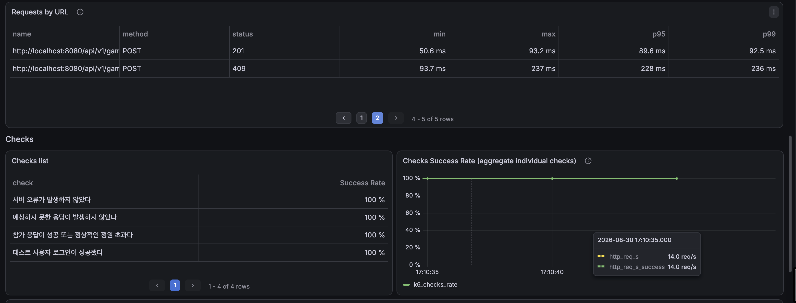
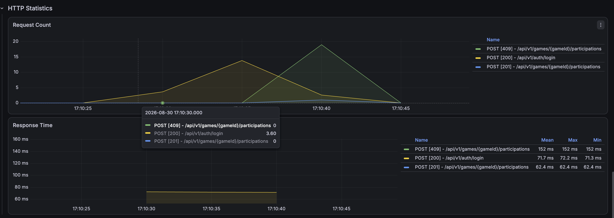
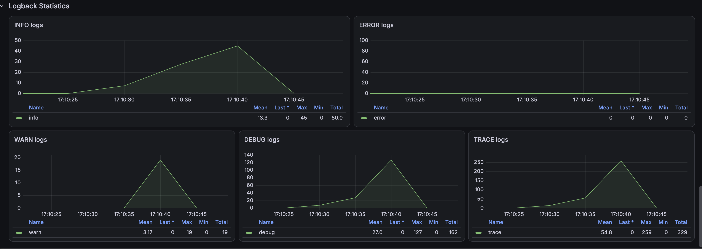
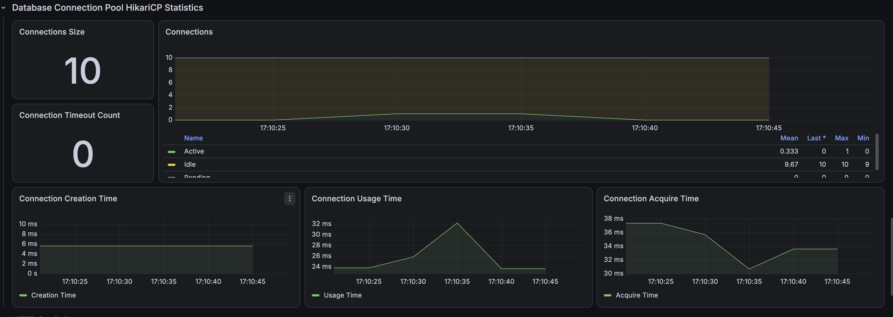
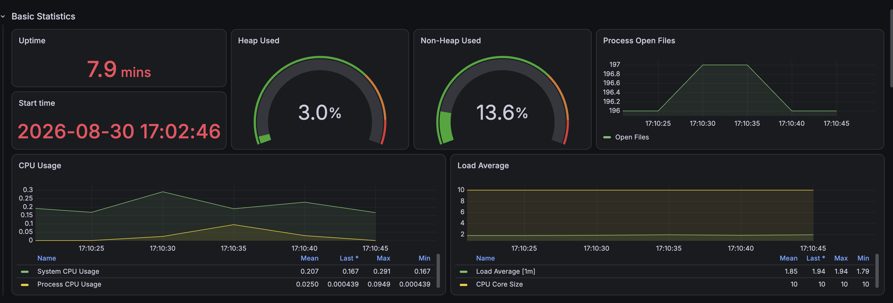

# 경기 참가 동시성: 비관적 락 적용 후 검증

## 1. 개선 목적

락이 없는 경기 참가 API에 100명이 동시에 요청했을 때 정원 6명인 경기에 13명이 `ACCEPT`로 저장되고, 36건의 시스템 오류가 발생했다.

```text
적용 전
- 일반 사용자 참가 성공: 12건 (기대 5건)
- 실제 ACCEPT: 13명 (기대 6명)
- 초과 승인: 7명
- 시스템 오류: 36건
- 최종 판정: FAIL
```

이 문제는 단순한 응답속도 저하가 아니라 선착순 참가 정책의 핵심 불변식이 깨지는 데이터 정합성 문제다. 따라서 이번 개선의 1차 목표는 처리량이 아니라 다음 정합성 보장이다.

- 정확히 5건만 참가 성공
- 나머지 95건은 `FULL_HEADCOUNT_GAME`으로 정상 거절
- HTTP 500과 타임아웃 0건
- `participant_count=6`
- 실제 `ACCEPT=6`
- 초과 승인과 중복 참가 0건

- [락 적용 전 기준선](../before-lock/summary.md)

## 2. 원인 분석과 해결 전략

기존 로직은 경기를 일반 `SELECT`로 조회한 후 각 트랜잭션에서 남은 정원을 검증했다. 동시에 시작한 여러 트랜잭션은 다른 트랜잭션의 커밋 전 값을 읽을 수 있어 모두 자리가 남아 있다고 판단했다.

```text
경기 일반 조회
→ 여러 트랜잭션이 같은 이전 participant_count 조회
→ 여러 요청이 동시에 정원 검증 통과
→ 서로 다른 참가 레코드 생성
→ 경기 집계값 갱신 충돌
→ 초과 승인, 집계 불일치, 서버 오류
```

경기 참가는 한 경기의 정원이라는 공유 자원을 변경하고, 충돌이 실제로 자주 발생할 수 있는 짧은 임계 구역을 가진다. 이런 특성에 맞춰 MySQL이 해당 경기 행을 독점하도록 비관적 쓰기 락을 적용했다.

```java
@Lock(LockModeType.PESSIMISTIC_WRITE)
@Query("""
        select g
        from GameEntity g
        where g.gameId = :gameId
        and g.deletedDateTime is null
        """)
Optional<GameEntity> findActiveGameWithPessimisticLock(
        @Param("gameId") Long gameId
);
```

`GameParticipantService.join()`의 기존 `@Transactional` 범위 안에서 이 메서드로 경기를 조회한다. 첫 번째 트랜잭션이 경기 행을 잠그면 뒤의 트랜잭션은 락을 얻을 때까지 대기한다. 이후 커밋된 최신 `participant_count`와 `game_status`를 기준으로 참가 가능 여부를 순차적으로 판단한다.

## 3. 검증 계층과 불변식

하나의 수치만으로 성공을 판정하지 않고 서로 다른 세 계층에서 검증했다.

| 계층 | 도구 | 검증 목적 |
|---|---|---|
| 서비스·DB 통합 | JUnit, CountDownLatch | 동시 시작 시 트랜잭션 정합성 |
| HTTP | k6, JWT 100개 | 실제 인증·보안·예외 변환을 포함한 API 결과 |
| 최종 저장 상태 | MySQL 검증 SQL | 응답 개수와 DB 데이터가 실제로 일치하는지 검증 |

핵심 불변식은 다음과 같다.

```text
성공한 일반 참가 요청 = 5
생성자를 포함한 ACCEPT = 6
game_entity.participant_count = 6
실제 ACCEPT 수 = participant_count
실제 ACCEPT 수 <= head_count
경기 상태 = CLOSED
초과 승인 = 0
중복 참가 = 0
```

HTTP 409는 실패로 일괄 계산하지 않았다. 응답 본문의 오류 코드가 `FULL_HEADCOUNT_GAME`인 409는 선착순 마감을 알리는 정상적인 비즈니스 응답이다. HTTP 500, 네트워크 오류, 인증 실패와 예상하지 못한 응답만 시스템 또는 비정상 응답으로 분리했다.

## 4. 측정 조건

| 항목 | 값 |
|---|---:|
| 테스트 단계 | `pessimistic-lock` |
| 반복 측정 | 3회 |
| 경기 정원 | 6명 |
| 초기 참가 인원 | 생성자 1명 |
| 남은 자리 | 5명 |
| 동시 요청 사용자 | 100명 |
| 사용자 인증 | 서로 다른 JWT 100개 |
| k6 executor | `per-vu-iterations` |
| VU | 100 |
| VU별 반복 | 1회 |
| 참가 API 요청 | 회차당 100건 |
| HikariCP 최대 크기 | 10 |
| Spring Profile | `local,performance` |
| Prometheus scrape interval | 5초 |

각 회차마다 기존 테스트 경기와 참가 레코드를 삭제하고, 생성자 1명만 `ACCEPT`로 등록된 새 경기를 생성했다. k6 `setup()`은 100명을 순차적으로 로그인해 JWT를 발급하고, 각 VU에 서로 다른 토큰을 할당했다.

```text
로그인 준비: 100건
동시 참가: 100건
회차당 전체 HTTP 요청: 200건
```

## 5. CountDownLatch 통합 테스 결과

100개의 플랫폼 스레드를 준비한 후 `CountDownLatch` 하나로 동시에 출발시켰다. 결과는 다음과 같다.

| 항목 | 기대 | 실제 |
|---|---:|---:|
| 전체 요청 | 100건 | 100건 |
| 참가 성공 | 5건 | 5건 |
| `FULL_HEADCOUNT_GAME` | 95건 | 95건 |
| 예상하지 못한 예외 | 0건 | 0건 |
| 실행 시간 | - | 366ms |
| `participant_count` | 6명 | 6명 |
| 실제 `ACCEPT` | 6명 | 6명 |
| 경기 상태 | `CLOSED` | `CLOSED` |

실패 95건이 모두 정원 마감을 나타내는 도메인 예외였고, 데드락·타임아웃·인프라 예외는 없었다. 이 테스트는 서비스 계층과 트랜잭션의 정합성을 검증한다. 1,000개의 실제 스레드를 만드는 검증은 업무 로직보다 로컬 JVM과 OS 자원을 측정하게 되므로, 정합성 통합 테스는 100명으로 고정했다.

## 6. k6 3회 반복 측정

세 회차 모두 정합성 임계값과 HTTP 임계값을 통과했다.

| 회차 | 성공 | 정원 초과 정상 거절 | 시스템 오류 | 비정상 응답 | 참가 API 실패율 |
|---|---:|---:|---:|---:|---:|
| Run 1 | 5 | 95 | 0 | 0 | 0% |
| Run 2 | 5 | 95 | 0 | 0 | 0% |
| Run 3 | 5 | 95 | 0 | 0 | 0% |

### 참가 API 응답시간

| 회차 | 평균 | 중앙값 | p90 | p95 | p99 | 최대 |
|---|---:|---:|---:|---:|---:|---:|
| Run 1 | 214.88ms | 217.34ms | 263.58ms | 267.85ms | 270.92ms | 271.26ms |
| Run 2 | 163.78ms | 168.75ms | 223.85ms | 227.78ms | 235.68ms | 236.59ms |
| Run 3 | 95.23ms | 96.15ms | 128.40ms | 130.95ms | 133.62ms | 135.89ms |
| 3회 중앙값 | **163.78ms** | **168.75ms** | **223.85ms** | **227.78ms** | **235.68ms** | **236.59ms** |

- [Run 1 JSON](./k6/game-participation-run-01-summary.json)
- [Run 2 JSON](./k6/game-participation-run-02-summary.json)
- [Run 3 JSON](./k6/game-participation-run-03-summary.json)

회차가 반복될수록 응답시간이 감소했다. JVM JIT 컴파일, 커넥션 및 캐시 워밍 등의 영향이 혼재할 수 있으므로 가장 빠른 Run 3만 대표값으로 사용하지 않고 3회 중앙값을 사용했다.

## 7. DB 정합성 검증

대표 측정인 Run 2 종료 후 DB를 직접 조회한 결과다.

| 항목 | 기대 | 실제 |
|---|---:|---:|
| 경기 정원 | 6명 | 6명 |
| `game_entity.participant_count` | 6명 | 6명 |
| 실제 `ACCEPT` | 6명 | 6명 |
| 성공한 일반 참가자 | 5명 | 5명 |
| 집계값과 실제 데이터 차이 | 0명 | 0명 |
| 초과 승인 | 0명 | 0명 |
| 중복 참가 | 0건 | 0건 |
| 경기 상태 | `CLOSED` | `CLOSED` |
| 최종 판정 | `PASS` | `PASS` |

```text
전체 참가 레코드 = 6
고유 참가 사용자 = 6
중복 참가 레코드 = 0
participant_count - actual_accept_count = 0
overbooking_count = 0
```

DB 원본 자료:

- [참가 상태별 개수](./raw/participant-status-count.csv)
- [핵심 정합성 결과](./raw/consistency-detail.csv)
- [참가 사용자 고유성](./raw/participation-uniqueness.csv)
- [ACCEPT 참가자 목록](./raw/accepted-participants.csv)
- [최종 판정](./raw/final-verdict.csv)

## 8. Grafana 관측 결과

### k6 Endpoint



참가 API에서 HTTP 201과 409만 관측됐다. 대표 회차의 성공 응답 p95는 약 89.6ms, 정원 초과 409 응답 p95는 약 228ms였고 모든 k6 check의 성공률이 100%였다.

### Spring HTTP 상태



Spring Boot 관측에서도 로그인 HTTP 200, 참가 성공 HTTP 201, 정원 초과 HTTP 409만 확인됐다. 락 적용 전에 보였던 참가 API HTTP 500은 관측되지 않았다.

### 로그 추세



동시 참가 시점에 ERROR 로그는 0건이었다. WARN은 총 19건이 수집됐지만, k6가 분류한 시스템 오류가 0건이고 응답이 201과 정상 409로만 구성됐으므로 서버 장애로 판정하지 않았다.

### HikariCP



커넥션 풀 크기는 10을 유지했고 Connection Timeout은 0건이었다. 캡처에서 Active Connection 최대값은 1로 표시됐지만, 참가 부하가 약 0.2초인 반면 Prometheus 수집 주기는 5초이므로 실제 순간 최댓값으로 해석하지 않는다.

### JVM과 시스템 자원



대표 측정 구간에서 Heap Used는 3.0%, Non-Heap Used는 13.6%였다. System CPU Usage는 평균 0.207, 최대 0.291이었고 Process CPU Usage는 평균 0.0250, 최대 0.0949였다. 지속적인 CPU·메모리 포화는 관측되지 않았다. 다만 부하 구간이 짧으므로 이 수치는 병목 판단의 주요 근거가 아니라 보조 지표로 사용한다.

## 9. 개선 전후 비교와 트레이드오프

| 항목 | 락 적용 전 | 비관적 락 적용 후 | 결과 |
|---|---:|---:|---|
| 성공한 일반 참가 | 12건 | 5건 | 정원과 일치 |
| 정원 초과 정상 거절 | 52건 | 95건 | 정책과 일치 |
| 시스템 오류 | 36건 | 0건 | **100% 제거** |
| 기대 응답 비율 | 64% | 100% | **36%p 증가** |
| 실제 `ACCEPT` | 13명 | 6명 | 정원과 일치 |
| 초과 승인 | 7명 | 0명 | **100% 제거** |
| 집계값-실제 차이 | -7명 | 0명 | 일치 |
| 최종 DB 판정 | `FAIL` | `PASS` | 정합성 회복 |
| 참가 API p95 | 258.99ms | 227.78ms¹ | 약 12.1% 감소 |
| 참가 API p99 | 262.55ms | 235.68ms¹ | 약 10.2% 감소 |

¹ 비관적 락은 3회 측정의 중앙값이다. 락 적용 전 정량 JSON은 1회만 보관되어 있으므로 응답시간 비교는 참고값으로 사용하고, 핵심 성과는 3회 모두 반복된 정합성 회복과 서버 오류 제거로 판정한다.

비관적 락은 같은 경기의 참가 요청을 순차 처리하므로 잠금 대기 시간이 추가된다. 반면 부하가 높을 때도 초과 승인을 방지하고, 락 충돌을 애플리케이션 재시도로 처리할 필요 없이 DB 수준에서 확정적으로 순서화한다. 경기 참가처럼 충돌 가능성이 높고 정합성이 응답속도보다 중요한 기능에 적합하다.

## 10. 결론과 후속 검토

비관적 쓰기 락을 경기 참가의 경기 조회에 적용해 동시 참가 요청을 한 경기 행 단위로 순서화했다. CountDownLatch 통합 테스홀 k6 HTTP 테스트, DB 직접 검증을 연결한 결과 다음을 확인했다.

```text
100명이 5개의 남은 자리에 동시 신청
→ 정확히 5건만 성공
→ 95건은 FULL_HEADCOUNT_GAME으로 정상 거절
→ HTTP 500 0건
→ participant_count = actual ACCEPT = head_count = 6
→ 초과 승인 0건, 중복 참가 0건
→ 3회 반복 모두 통과
```

이번 결과로 단일 서버·단일 MySQL 구성에서의 정합성 문제는 해결됐다. 현재 서비스의 트래픽 모델에서는 구현이 단순하고 즉시 일관성을 보장하는 비관적 락을 우선 선택할 수 있다.

후속으로 아래 조건이 실제로 필요해질 때만 다른 방식을 추가 비교한다.

- 특정 인기 경기에 락 대기가 지속적으로 쌓이는 경우
- DB 인스턴스가 여러 개이거나 외부 자원과 함께 정합성을 맞춰야 하는 경우
- 락 대기 대신 재시도 비용을 감수하고 낙관적 락을 사용할 근거가 생긴 경우
- Redis 분산 락, 대기열 또는 비동기 처리가 필요할 정도로 트래픽이 증가한 경우

그전까지는 동일 조건의 부하 테스트와 DB 불변식 검증을 회귀 기준으로 유지한다.
