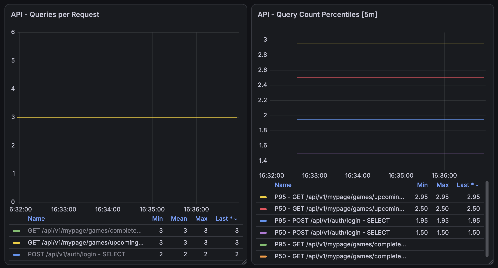
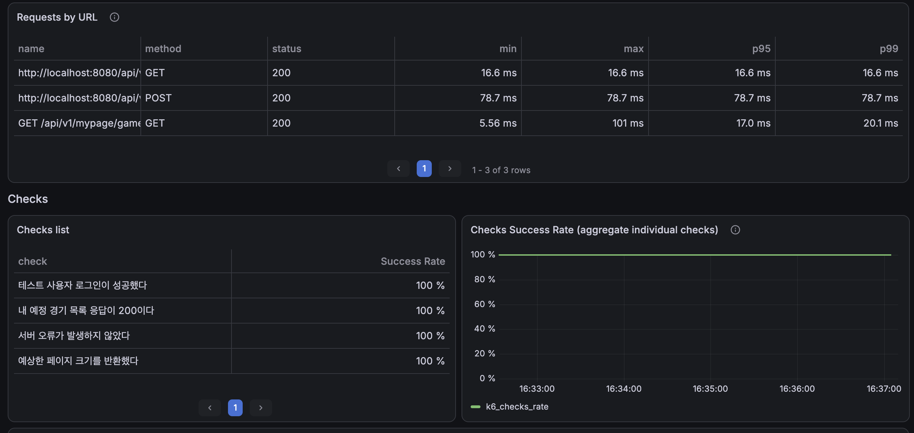
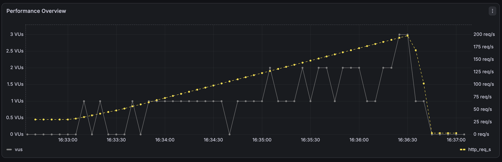
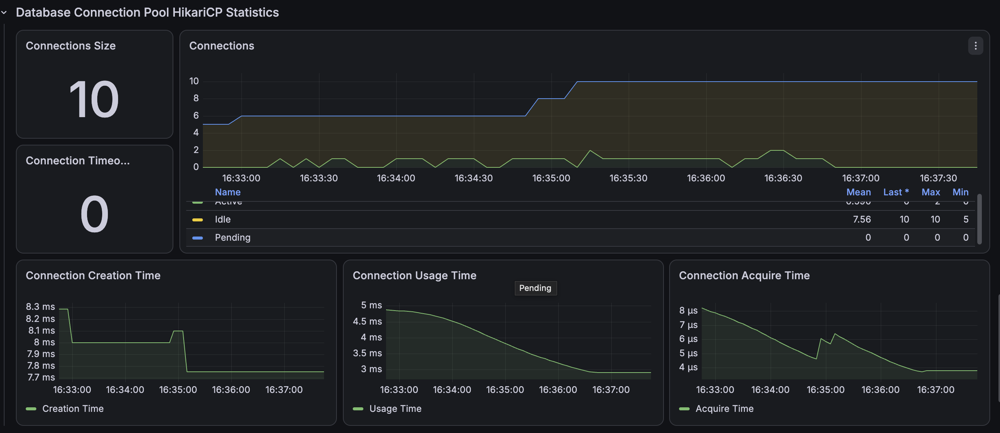
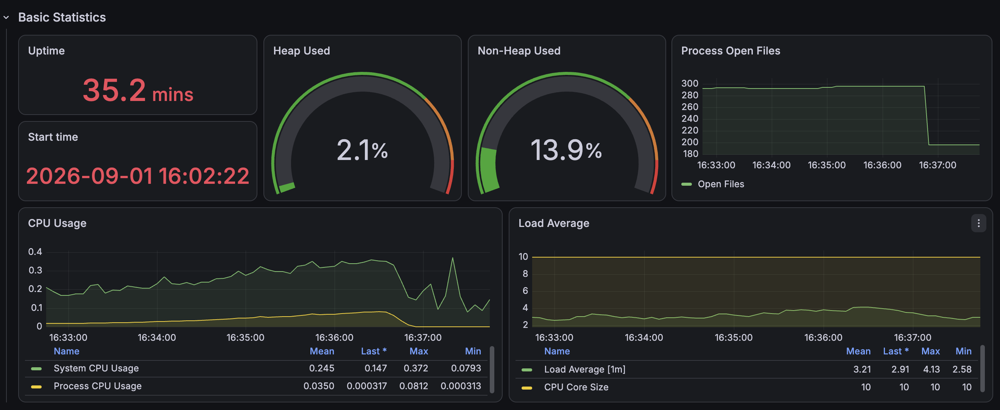

# 내 경기 목록 API: N+1 개선 후 성능 결과

## 1. 개선 목적과 적용 방식

내 예정 경기와 지난 경기 목록 조회에서 페이지 항목마다 `GameEntity`를 지연 로딩하면서 발생하던 N+1 문제를 제거하고, 동일한 부하 조건에서 쿼리 수와 응답시간, 처리량 및 서버 자원 사용량의 변화를 검증했다.

```http
GET /api/v1/mypage/games/upcoming?page=0&size=100
GET /api/v1/mypage/games/completed?page=0&size=100
```

개선 전에는 `ParticipantGameEntity` 목록을 조회한 뒤 DTO 변환 과정에서 각 항목의 `GameEntity`에 접근해 페이지 크기만큼 추가 SELECT가 실행됐다.

```text
개선 전: ParticipantGameEntity 목록 조회 + GameEntity 지연 로딩 N회
개선 후: ParticipantGameEntity와 GameEntity를 Fetch Join으로 한 번에 조회
```

예정 경기와 지난 경기의 content 쿼리에 `ManyToOne` 연관관계인 `gameEntity` Fetch Join을 적용했다. COUNT 쿼리에는 Fetch Join을 사용하지 않고 검색 조건 계산에 필요한 일반 Join만 유지했다.

```java
.selectFrom(participation)
.join(participation.gameEntity, game).fetchJoin()
```

이번 Fetch Join은 컬렉션이 아닌 `ManyToOne` 단건 연관관계에 적용하므로 결과 행이 중복 증가하지 않으며 DB 페이지네이션을 그대로 사용할 수 있다.

## 2. 측정 환경

| 항목 | 값 |
|---|---:|
| 테스트 단계 | `after` |
| 대상 API | 내 예정 경기 목록 |
| 비교 확인 API | 내 지난 경기 목록 |
| 테스트 사용자 예정 경기 | 100건 |
| 테스트 사용자 지난 경기 | 100건 |
| 측정 페이지 | 0 |
| 본 테스트 페이지 크기 | 100 |
| k6 executor | `ramping-arrival-rate` |
| 기준선 요청률 | 5 → 10 → 20 → 30 RPS |
| 기준선 실행시간 | 회차당 3분 15초 |
| 기준선 반복 횟수 | 3회 |
| 스트레스 목표 요청률 | 30 → 50 → 100 → 150 → 200 RPS |
| 스트레스 실행시간 | 4분 15초 |
| 스트레스 반복 횟수 | 탐색 1회 |
| 기준선 VU | 사전 할당 100, 최대 300 |
| 스트레스 VU | 사전 할당 100, 최대 500 |
| Spring Profile | `local,performance` |
| 측정 도구 | k6, Prometheus, Grafana |
| 정량 결과 원본 | k6 summary JSON |

개선 전과 같은 데이터, 부하 프로파일 및 측정 도구를 사용했다. 기능 변경으로 인한 오류를 먼저 배제하기 위해 스모크 테스트를 통과한 뒤 쿼리 수, 기준선 3회 및 스트레스 1회를 순서대로 측정했다.

## 3. 쿼리 수 검증

페이지 크기를 1, 10, 20, 100으로 변경하면서 요청 한 번에 실행된 SELECT 수를 측정했다.

| API | 페이지 크기 | 반환 항목 | 개선 전 SELECT | 개선 후 SELECT | 감소율 | 판정 |
|---|---:|---:|---:|---:|---:|---|
| 예정 경기 | 1 | 1 | 4 | 3 | 25.00% | 제거 |
| 예정 경기 | 10 | 10 | 13 | 3 | 76.92% | 제거 |
| 예정 경기 | 20 | 20 | 23 | 3 | 86.96% | 제거 |
| 예정 경기 | 100 | 100 | 103 | 3 | 97.09% | 제거 |
| 지난 경기 | 1 | 1 | 4 | 3 | 25.00% | 제거 |
| 지난 경기 | 10 | 10 | 13 | 3 | 76.92% | 제거 |
| 지난 경기 | 20 | 20 | 23 | 3 | 86.96% | 제거 |
| 지난 경기 | 100 | 100 | 103 | 3 | 97.09% | 제거 |

개선 후 쿼리 구성은 다음과 같다.

```text
사용자 유효성 검증 SELECT 1회
ParticipantGameEntity와 GameEntity Fetch Join SELECT 1회
페이지 전체 개수 COUNT SELECT 1회

총 SELECT = 3회
```

두 API 모두 페이지 크기가 1에서 100으로 증가해도 SELECT가 3회로 일정했다. 따라서 `ParticipantGameEntity → GameEntity` 지연 로딩으로 발생하던 N+1이 제거됐다고 판정한다.

쿼리 수 원본:

- [페이지 크기별 쿼리 수](./query-count-by-page-size.csv)

## 4. 스모크 테스트

Fetch Join 적용 후 인증, 응답 상태, 페이지 크기 및 쿼리 메트릭 수집을 먼저 검증했다.

| 항목 | 결과 |
|---|---:|
| 요청 횟수 | 10건 |
| HTTP 오류율 | 0% |
| Check 성공률 | 100% |
| dropped iteration | 0건 |
| p95 | 47.62ms |

- [Smoke JSON](./k6/smoke-summary.json)

스모크 테스트가 모든 임계값을 통과했으므로 동일한 기준선 및 스트레스 부하 테스트를 진행했다.

## 5. 기준선 부하 테스트 결과

각 회차에서 페이지 크기 100인 내 예정 경기 목록을 5 RPS에서 30 RPS까지 단계적으로 조회했다.

| 회차 | 평균 | 중앙값 | p90 | p95 | p99 | 최대 | 측정 요청 | 실패 | 누락 |
|---|---:|---:|---:|---:|---:|---:|---:|---:|---:|
| Run 1 | 18.80ms | 17.41ms | 26.74ms | 31.71ms | 37.92ms | 85.19ms | 2,999 | 0 | 0 |
| Run 2 | 18.62ms | 17.52ms | 25.67ms | 29.88ms | 36.45ms | 68.18ms | 2,999 | 0 | 0 |
| Run 3 | 18.89ms | 17.60ms | 26.49ms | 30.47ms | 36.83ms | 112.42ms | 3,000 | 0 | 0 |
| 3회 중앙값 | **18.80ms** | **17.52ms** | **26.49ms** | **30.47ms** | **36.83ms** | **85.19ms** | **2,999** | **0** | **0** |

3회 모두 다음 조건을 충족했다.

- HTTP 오류율: **0%**
- Check 성공률: **100%**
- `dropped_iterations`: **0건**
- 응답 페이지 크기 검증: **100%**
- 서버 오류 및 예상하지 못한 응답: **0건**

회차별 JSON 원본:

- [Run 1](./k6/run-01-summary.json)
- [Run 2](./k6/run-02-summary.json)
- [Run 3](./k6/run-03-summary.json)

### 개선 전·후 기준선 비교

각 단계 3회 결과의 중앙값을 기준으로 비교했다.

| 지표 | 개선 전 | 개선 후 | 개선율 |
|---|---:|---:|---:|
| 요청당 SELECT | 103회 | 3회 | **97.09% 감소** |
| 평균 | 28.91ms | 18.80ms | **34.97% 감소** |
| 중앙값 | 25.50ms | 17.52ms | **31.29% 감소** |
| p90 | 38.69ms | 26.49ms | **31.53% 감소** |
| p95 | 50.55ms | 30.47ms | **39.73% 감소** |
| p99 | 57.98ms | 36.83ms | **36.49% 감소** |
| 최대 | 127.75ms | 85.19ms | **33.31% 감소** |
| HTTP 오류율 | 0% | 0% | 정상 유지 |
| dropped iteration | 0건 | 0건 | 정상 유지 |

낮은 부하에서도 p95가 50.55ms에서 30.47ms로 감소했다. 더 중요한 결과는 요청당 SELECT가 103회에서 3회로 줄어 페이지 크기에 비례하던 DB 접근량이 상수로 바뀐 점이다.

## 6. 스트레스 테스트 결과

개선 전과 동일하게 요청률을 최대 200 RPS까지 단계적으로 높였다.

| 항목 | 개선 전 | 개선 후 | 변화 |
|---|---:|---:|---:|
| 목표 최대 요청률 | 200 RPS | 200 RPS | 동일 |
| Grafana 실제 관측 최대 처리량 | 약 120 RPS | 약 200 RPS | **66.7% 이상 증가** |
| 완료 iteration | 21,654건 | 26,100건 | **20.53% 증가** |
| dropped iteration | 4,445건 | 0건 | **100% 제거** |
| 평균 응답시간 | 2,157.80ms | 8.42ms | **99.61% 감소** |
| 중앙값 | 1,837.21ms | 7.29ms | **99.60% 감소** |
| p90 | 4,559.69ms | 12.36ms | **99.73% 감소** |
| p95 | 4,744.71ms | 14.70ms | **99.69% 감소** |
| p99 | 5,171.14ms | 18.45ms | **99.64% 감소** |
| 최대 | 6,438.99ms | 100.79ms | **98.43% 감소** |
| 실제 최대 사용 VU | 500 | 3 | **99.4% 감소** |
| HTTP 오류율 | 0% | 0% | 정상 유지 |
| Check 성공률 | 100% | 100% | 정상 유지 |
| 요청당 SELECT | 103회 | 3회 | **97.09% 감소** |

- [Stress Run 1 JSON](./k6/stress-run-01-summary.json)

개선 전에는 최대 VU 500개를 모두 사용하고도 약 120 RPS에서 정체돼 전체 예정 iteration의 17.03%인 4,445건을 스케줄하지 못했다. 개선 후에는 실제 사용 VU 최대 3개로 테스트 상한인 200 RPS까지 처리했으며 누락된 iteration은 없었다.

```text
개선 전: 21,654 완료 + 4,445 누락 = 26,099 예정
개선 후: 26,100 완료 + 0 누락 = 26,100 예정
```

실행 경계에서 예정 iteration이 1건 차이 나지만 사실상 동일한 부하 스케줄이다. 개선 후에는 기능 정확성과 성능 수용량을 모두 충족했다.

```text
기능 정확성: PASS
- HTTP 오류율 0%
- Check 성공률 100%
- 서버 오류 및 예상하지 못한 응답 0건

성능 수용량: PASS
- 테스트 상한 200 RPS 도달
- dropped iteration 0건
- p95 14.70ms, p99 18.45ms
- HikariCP Pending 및 Timeout 0
```

200 RPS는 이번 테스트에서 검증한 상한이지 시스템의 최대 처리 한계를 의미하지 않는다. 따라서 결과는 “최대 처리량이 200 RPS”가 아니라 “로컬 테스트 환경에서 200 RPS까지 안정적으로 처리했다”로 해석한다.

## 7. Grafana 관측

### 스트레스 요청당 쿼리 수



스트레스 구간에서도 예정 경기와 지난 경기 조회의 요청당 SELECT가 3회로 유지됐다. 페이지 크기 및 요청률 증가와 관계없이 쿼리 수가 상수이므로 N+1 제거가 부하 환경에서도 유지됐다.

### 스트레스 HTTP 결과



모든 Check가 성공했고 HTTP 오류는 발생하지 않았다. Grafana는 선택한 시간 구간에서 p95 약 17.0ms, p99 약 20.1ms를 표시하며 실행 전체를 집계한 k6 JSON은 p95 14.70ms, p99 18.45ms를 기록했다. 집계 구간과 방식이 다르므로 정량 비교에는 k6 JSON을 사용한다.

### 스트레스 부하 프로파일



목표 요청률이 200 RPS까지 증가하는 동안 실제 처리량도 이를 추종했다. 최대 사용 VU는 3개였고 dropped iteration은 발생하지 않았다.

### 스트레스 HikariCP



| 지표 | 개선 전 | 개선 후 |
|---|---:|---:|
| Pool Size | 10 | 10 |
| Active Connection | 최대 10 | 최대 2 |
| Pending Connection | 평균 75.7, 최대 189 | 0 |
| Connection Timeout | 0 | 0 |
| Connection Usage Time | 약 20ms까지 증가 | 약 4.8ms 이하 |
| Connection Acquire Time | 약 220ms까지 증가 | 약 8μs 이하 |

요청당 SELECT 감소로 커넥션 점유시간이 짧아졌고, 개선 전 최대 189였던 Pending Connection이 0으로 감소했다. 커넥션 풀 대기 병목이 해소된 것이 응답시간과 처리량 개선으로 이어진 것으로 판단한다.

### 스트레스 JVM과 시스템 자원



| 지표 | 개선 전 | 개선 후 |
|---|---:|---:|
| System CPU | 거의 100% | 평균 24.5%, 최대 37.2% |
| Process CPU | - | 평균 3.50%, 최대 8.12% |
| Load Average | 최대 14.2 | 평균 3.21, 최대 4.13 |
| Heap Used | 6.1% | 2.1% |
| Non-Heap Used | 14.8% | 13.9% |

개선 전에는 10개 CPU 코어보다 높은 Load Average와 거의 100%의 System CPU가 관측됐지만 개선 후에는 부하가 더 높아졌음에도 CPU와 Load Average가 안정적으로 유지됐다. 지속적인 JVM 메모리 압박도 관측되지 않았다.

System CPU는 Spring Boot, MySQL, k6가 함께 실행되는 로컬 호스트 전체 지표다. 따라서 특정 프로세스의 CPU 개선으로 단정하지 않고, 쿼리 수·HikariCP 대기·응답시간·처리량 지표와 함께 병목 해소의 보조 근거로 사용한다.

## 8. 기준선 Grafana 증빙

각 회차의 결과가 일관적인지 확인하기 위해 쿼리 수, k6, HikariCP 및 JVM 캡처를 모두 보관했다.

| 회차 | 쿼리 수 | HTTP·Checks | 부하 프로파일 | HikariCP | JVM·CPU |
|---|---|---|---|---|---|
| Run 1 | [이미지](./grafana/after-query-count-run-01.png) | [이미지](./grafana/after-k6-http-checks-run-01.png) | [이미지](./grafana/after-k6-load-profile-run-01.png) | [이미지](./grafana/after-hikari-run-01.png) | [이미지](./grafana/after-jvm-cpu-run-01.png) |
| Run 2 | [이미지](./grafana/after-query-count-run-02.png) | [이미지](./grafana/after-k6-http-checks-run-02.png) | [이미지](./grafana/after-k6-load-profile-run-02.png) | [이미지](./grafana/after-hikari-run-02.png) | [이미지](./grafana/after-jvm-cpu-run-02.png) |
| Run 3 | [이미지](./grafana/after-query-count-run-03.png) | [이미지](./grafana/after-k6-http-checks-run-03.png) | [이미지](./grafana/after-k6-load-profile-run-03.png) | [이미지](./grafana/after-hikari-run-03.png) | [이미지](./grafana/after-jvm-cpu-run-03.png) |

세 회차 모두 요청당 SELECT 3회, HTTP 오류율 0%, Check 성공률 100%, dropped iteration 0건을 유지했다. 기준선 부하에서는 HikariCP Pending 및 Timeout이 발생하지 않았고 CPU와 JVM 메모리도 안정적으로 유지됐다.

## 9. 최종 판정

| 검증 항목 | 목표 | 결과 | 판정 |
|---|---:|---:|---|
| 예정 경기 페이지 크기 100 SELECT | 3회 | 3회 | PASS |
| 지난 경기 페이지 크기 100 SELECT | 3회 | 3회 | PASS |
| 페이지 크기에 따른 쿼리 증가 제거 | 상수 유지 | 모든 크기에서 3회 | PASS |
| 기준선 HTTP 오류율 | 0% | 0% | PASS |
| 기준선 dropped iteration | 0건 | 0건 | PASS |
| 스트레스 목표 200 RPS | 도달 | 도달 | PASS |
| 스트레스 dropped iteration | 0건 | 0건 | PASS |
| 스트레스 Check 성공률 | 100% | 100% | PASS |
| 스트레스 HikariCP Pending | 감소 | 189 → 0 | PASS |

Fetch Join 적용으로 페이지 크기 100 기준 요청당 SELECT를 103회에서 3회로 97.09% 줄였다. 기준선 p95는 50.55ms에서 30.47ms로 39.73% 감소했고, 스트레스 p95는 4,744.71ms에서 14.70ms로 99.69% 감소했다. 개선 전 4,445건이던 dropped iteration과 최대 189의 HikariCP Pending도 모두 0으로 제거됐다.

따라서 이번 개선은 단순 응답시간 단축뿐 아니라 다음 문제를 함께 해결했다.

```text
페이지 크기에 비례하는 SQL 증폭 제거
DB 커넥션 풀 대기 제거
높은 부하에서 VU 포화 및 요청 누락 제거
테스트 상한 200 RPS 안정 처리
기존 응답과 페이지네이션 정확성 유지
```

## 10. 해석 범위와 후속 과제

이번 결과는 동일한 로컬 환경에서 개선 전·후를 비교한 값이다. Spring Boot, MySQL, k6가 같은 호스트의 자원을 공유하므로 운영 환경의 절대 처리량으로 일반화하지 않는다. 또한 스트레스 테스트는 병목 탐색을 위한 단일 회차이므로 장시간 안정성과 최대 처리 한계는 별도 Soak 또는 Capacity 테스트로 검증해야 한다.

현재 조회 구조에서는 `ManyToOne` Fetch Join이 변경 범위가 작고 페이지네이션에도 안전해 적절한 개선 방법이다. 향후 응답에 필요한 컬럼이 제한되고 읽기 트래픽이 더 커진다면 DTO Projection을 별도 후보로 비교할 수 있다.

후속 과제:

1. 예정 경기와 지난 경기 조회 결과, 정렬, 전체 개수 및 페이지 정보를 통합 테스트로 고정한다.
2. 페이지 크기 증가에도 쿼리 수가 상수인지 회귀 테스트 또는 성능 테스트로 지속 검증한다.
3. 필요 시 200 RPS를 넘는 Capacity 테스트로 실제 처리 한계를 탐색한다.
4. 장시간 Soak 테스트로 커넥션, 메모리 및 응답시간의 안정성을 검증한다.

