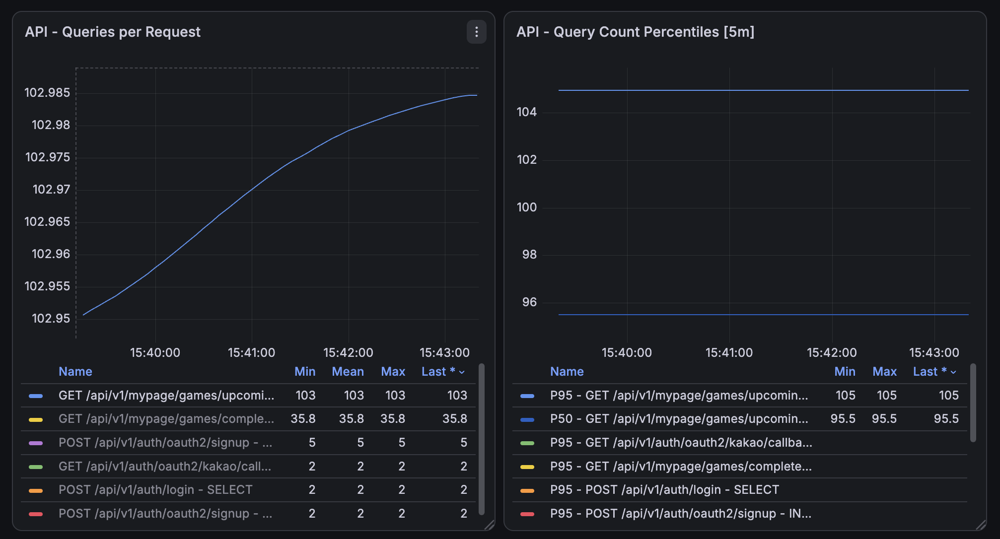
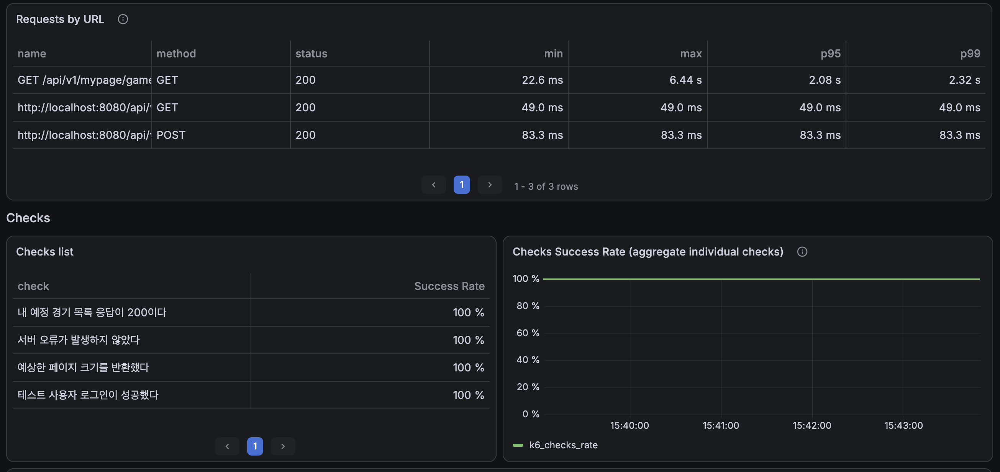
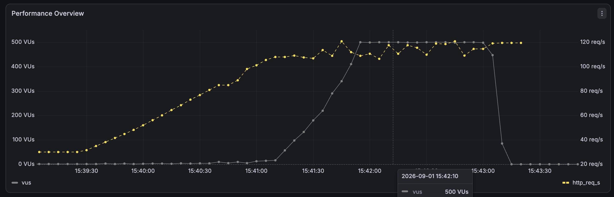
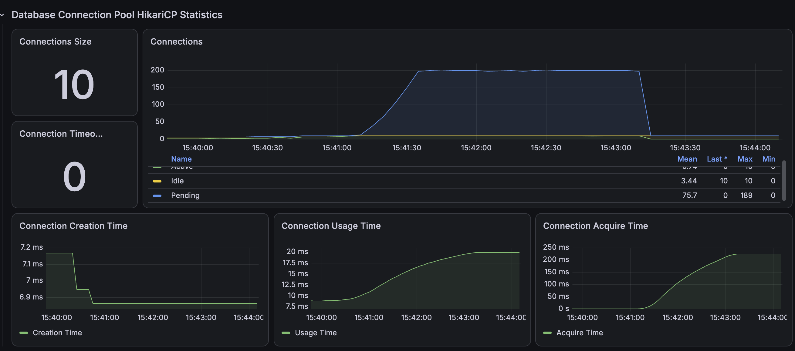
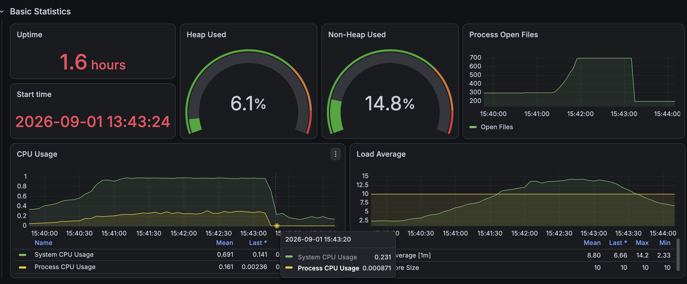
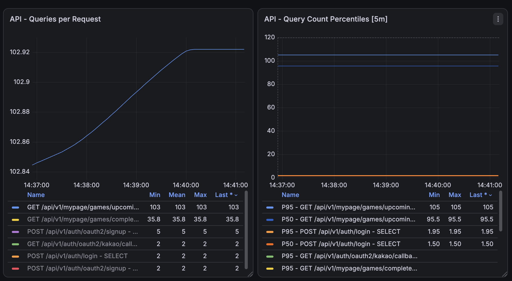
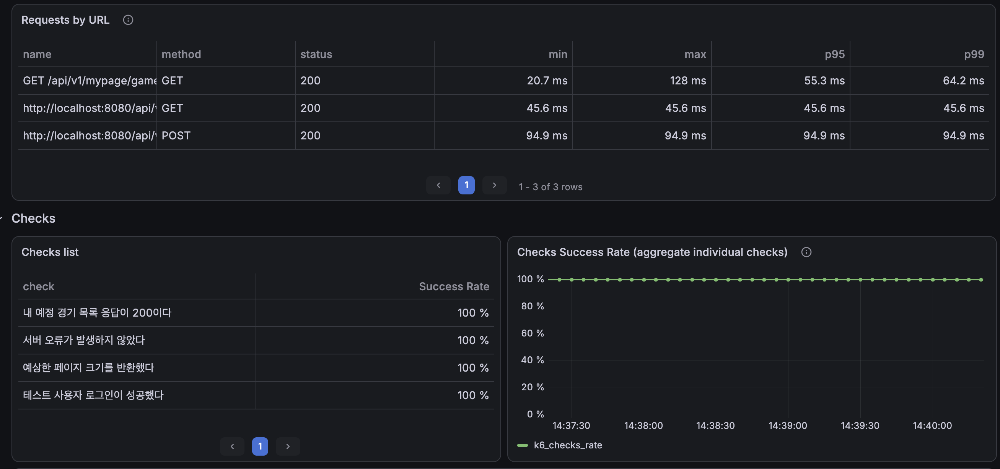
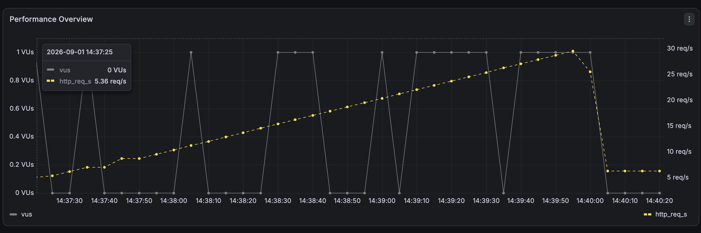
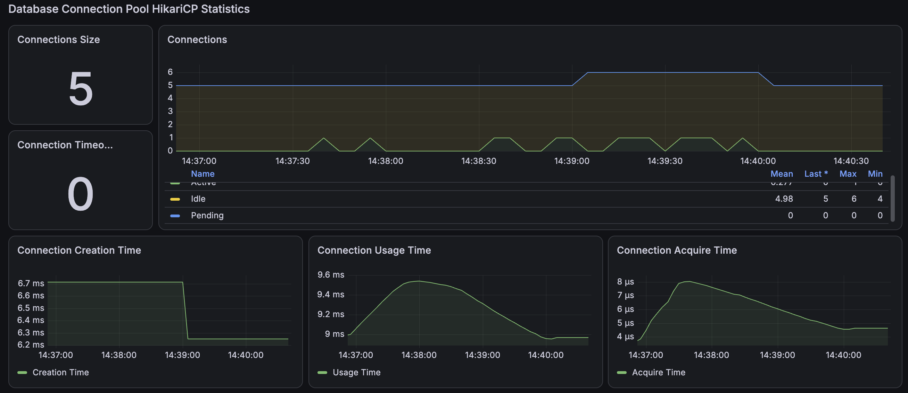
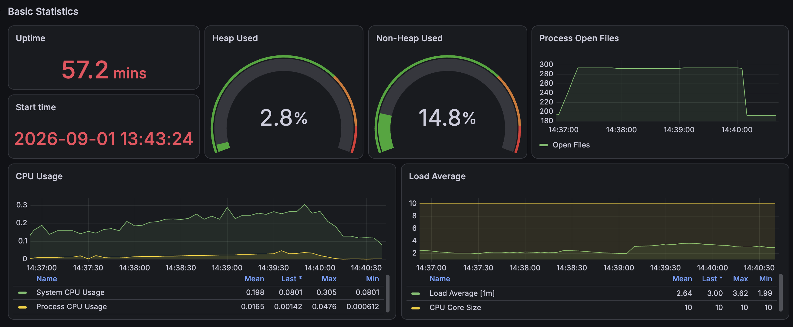

# 내 경기 목록 API: N+1 개선 전 성능 기준선

## 1. 측정 목적

내 예정 경기와 지난 경기 목록 조회에서 페이지 크기에 따라 SQL 실행 횟수가 증가하는지 확인하고, 개선 전 API 응답시간과 서버 자원 사용량을 기준선으로 확보한다.

```http
GET /api/v1/mypage/games/upcoming?page=0&size=100
GET /api/v1/mypage/games/completed?page=0&size=100
```

두 API는 `ParticipantGameEntity`를 조회한 뒤 응답 DTO를 생성하면서 지연 로딩된 `GameEntity`에 접근한다.

```text
ParticipantGameEntity 목록 조회
→ 응답 DTO 변환
→ 각 참가 정보의 GameEntity 접근
→ 페이지 항목 수만큼 추가 SELECT 발생
```

## 2. 측정 환경

| 항목 | 값 |
|---|---:|
| 테스트 단계 | `before` |
| 대상 API | 내 예정 경기 목록 |
| 비교 확인 API | 내 지난 경기 목록 |
| 테스트 사용자 예정 경기 | 100건 |
| 테스트 사용자 지난 경기 | 100건 |
| 측정 페이지 | 0 |
| 본 테스트 페이지 크기 | 100 |
| k6 executor | `ramping-arrival-rate` |
| 기준선 요청률 | 5 → 10 → 20 → 30 RPS |
| 기준선 실행시간 | 회차당 3분 15초 |
| 기준선 반복 횟수 | 3회 |
| 스트레스 목표 요청률 | 30 → 50 → 100 → 150 → 200 RPS |
| 스트레스 실행시간 | 4분 15초 |
| 스트레스 반복 횟수 | 탐색 1회 |
| 기준선 VU | 사전 할당 100, 최대 300 |
| 스트레스 VU | 사전 할당 100, 최대 500 |
| Spring Profile | `local,performance` |
| 측정 도구 | k6, Prometheus, Grafana |
| 정량 결과 원본 | k6 summary JSON |

본 테스트 전에 스모크 테스트를 실행해 인증, HTTP 200 응답, 페이지 크기 및 쿼리 메트릭 수집 여부를 확인했다.

## 3. 쿼리 수 측정

페이지 크기를 1, 10, 20, 100으로 변경하면서 요청 한 번에 실행된 SELECT 수를 측정했다.

| API | 페이지 크기 | 반환 항목 | SELECT | 예상 N+1 수식 | 판정 |
|---|---:|---:|---:|---:|---|
| 예정 경기 | 1 | 1 | 4 | 1 + 3 | 일치 |
| 예정 경기 | 10 | 10 | 13 | 10 + 3 | 일치 |
| 예정 경기 | 20 | 20 | 23 | 20 + 3 | 일치 |
| 예정 경기 | 100 | 100 | 103 | 100 + 3 | 일치 |
| 지난 경기 | 1 | 1 | 4 | 1 + 3 | 일치 |
| 지난 경기 | 10 | 10 | 13 | 10 + 3 | 일치 |
| 지난 경기 | 20 | 20 | 23 | 20 + 3 | 일치 |
| 지난 경기 | 100 | 100 | 103 | 100 + 3 | 일치 |

쿼리 구성은 다음과 같다.

```text
사용자 유효성 검증 SELECT 1회
ParticipantGameEntity 목록 SELECT 1회
페이지 전체 개수 COUNT SELECT 1회
GameEntity 지연 로딩 SELECT N회

총 SELECT = N + 3
```

페이지 크기가 100일 때 요청당 SELECT가 정확히 103회 발생했다. 예정 경기와 지난 경기에서 같은 증가 패턴이 재현됐으므로 두 조회 모두 동일한 N+1 문제를 가진다.

쿼리 수 원본:

- [페이지 크기별 쿼리 수](./query-count-by-page-size.csv)

## 4. 원인 분석

목록 쿼리는 `ParticipantGameEntity`만 조회한다.

```text
SELECT participant_game_entity ...
```

하지만 `MyUpcomingGameResponse.fromEntity()`와 `MyCompletedGameResponse.fromEntity()`는 각 참가 엔티티에서 다음 연관관계에 접근한다.

```java
GameEntity game = participation.getGameEntity();
```

`ParticipantGameEntity.gameEntity`는 `LAZY` 연관관계이므로 영속성 컨텍스트에 없는 경기마다 추가 SELECT가 실행된다.

```text
목록 크기 1   → 4회
목록 크기 10  → 13회
목록 크기 20  → 23회
목록 크기 100 → 103회
```

DTO는 경기 생성자의 식별자에도 접근하지만 현재 쿼리 수가 `2N+3`이 아니라 `N+3`으로 측정됐다. 따라서 이번 N+1의 직접적인 원인은 `ParticipantGameEntity → GameEntity` 지연 로딩이다.

## 5. k6 부하 테스트 결과

각 회차에서 내 예정 경기 100건을 조회했다.

| 회차 | 평균 | 중앙값 | p90 | p95 | p99 | 최대 | 측정 요청 | 실패 | 누락 |
|---|---:|---:|---:|---:|---:|---:|---:|---:|---:|
| Run 1 | 28.86ms | 25.44ms | 38.69ms | 51.33ms | 58.18ms | 78.62ms | 2,999 | 0 | 0 |
| Run 2 | 28.97ms | 25.62ms | 38.67ms | 49.63ms | 57.90ms | 127.99ms | 2,999 | 0 | 0 |
| Run 3 | 28.91ms | 25.50ms | 38.83ms | 50.55ms | 57.98ms | 127.75ms | 2,999 | 0 | 0 |
| 3회 중앙값 | **28.91ms** | **25.50ms** | **38.69ms** | **50.55ms** | **57.98ms** | **127.75ms** | **2,999** | **0** | **0** |

3회 모두 다음 조건을 충족했다.

- HTTP 오류율: **0%**
- Check 성공률: **100%**
- `dropped_iterations`: **0건**
- 응답 페이지 크기 검증: **100%**
- 서버 오류 및 예상하지 못한 응답: **0건**

회차별 JSON 원본:

- [Run 1](./k6/run-01-summary.json)
- [Run 2](./k6/run-02-summary.json)
- [Run 3](./k6/run-03-summary.json)

응답시간은 세 회차에서 비슷하게 유지됐다. 로컬 DB와 테스트 데이터가 메모리 및 버퍼에 적재된 환경에서는 개별 PK 조회가 빠르기 때문에 N+1이 즉시 높은 지연으로 나타나지 않았다.

그러나 회차당 2,999개의 측정 요청에 요청당 103개의 SELECT가 실행되므로 내 예정 경기 API에서만 약 308,897개의 SELECT가 발생한다.

```text
2,999 요청 × 103 SELECT
= 308,897 SELECT
```

따라서 이번 문제는 현재 p95만으로 판단하는 지연 장애가 아니라, 요청량과 페이지 크기가 커질수록 DB 작업량이 불필요하게 증폭되는 확장성 문제다.

## 6. 스트레스 테스트 결과

30 RPS 기준선에서는 오류와 누락이 발생하지 않았으므로 Fetch Join 적용 전에 요청률을 최대 200 RPS까지 단계적으로 높여 포화 구간을 탐색했다.

| 항목 | 결과 |
|---|---:|
| 목표 최대 요청률 | 200 RPS |
| Grafana 실제 관측 최대 처리량 | 약 120 RPS |
| 완료 iteration | 21,654건 |
| dropped iteration | 4,445건 |
| 전체 예정 iteration | 26,099건 |
| 요청 누락 비율 | 17.03% |
| 평균 응답시간 | 2,157.80ms |
| 중앙값 | 1,837.21ms |
| p90 | 4,559.69ms |
| p95 | 4,744.71ms |
| p99 | 5,171.14ms |
| 최대 | 6,438.99ms |
| 최대 VU | 500/500 |
| HTTP 오류율 | 0% |
| Check 성공률 | 100% |
| 요청당 SELECT | 103회 |

- [Stress Run 1 JSON](./k6/stress-run-01-summary.json)

전체 예정 iteration 중 완료되지 못한 비율은 다음과 같다.

```text
21,654 완료 + 4,445 누락 = 26,099 예정
4,445 / 26,099 × 100 = 17.03%
```

기준선 3회의 중앙값과 비교하면 높은 부하에서 지연이 급격하게 증가했다.

| 지표 | 30 RPS 기준선 중앙값 | 스트레스 | 증가 |
|---|---:|---:|---:|
| 평균 | 28.91ms | 2,157.80ms | 약 74.6배 |
| p95 | 50.55ms | 4,744.71ms | 약 93.9배 |
| p99 | 57.98ms | 5,171.14ms | 약 89.2배 |
| dropped iteration | 0건 | 4,445건 | 포화 발생 |
| 요청당 SELECT | 103회 | 103회 | 동일 |

완료된 요청은 모두 HTTP 200을 반환했고 응답 페이지와 서버 오류 검증도 통과했다. 그러나 k6가 최대 VU 500개를 모두 사용한 뒤에도 목표 요청률을 유지하지 못해 4,445개의 iteration을 스케줄하지 못했다. 따라서 기능 정확성은 유지됐지만 성능 수용량은 한계에 도달한 것으로 판정한다.

```text
기능 정확성: PASS
- HTTP 200: 100%
- Check 성공률: 100%
- HTTP 500 및 예상하지 못한 응답: 0건

성능 수용량: FAIL
- 최대 VU 500 도달
- 실제 처리량 약 120 RPS에서 정체
- dropped iteration 4,445건
- p95 4.74초, p99 5.17초
```

p95 5초 임계값은 통과했지만 `dropped_iterations == 0` 임계값을 충족하지 못했다. 처리하지 못한 요청을 제외한 응답시간만으로 시스템이 200 RPS를 수용했다고 판단할 수 없다.

### 스트레스 요청당 쿼리 수



부하가 증가해도 페이지 크기 100의 요청당 SELECT는 103회로 유지됐다. Grafana의 쿼리 p95 약 105는 히스토그램 버킷 보간값이므로 정확한 쿼리 수 판정에는 누적값 차이로 확인한 103회를 사용한다.

### 스트레스 HTTP 결과



Grafana 선택 구간에서는 p95 약 2.08초로 표시됐지만, 실행 전체 구간을 집계한 k6 JSON은 p95 4,744.71ms를 기록했다. 집계 구간과 방식이 다르므로 개선 전후 정량 비교에는 k6 JSON을 사용한다.

### 스트레스 부하 프로파일



목표 요청률은 200 RPS까지 증가했지만 VU가 최대값 500에 도달한 뒤 실제 처리량은 약 120 RPS에서 정체됐다.

### 스트레스 HikariCP



| 지표 | 관측값 |
|---|---:|
| Pool Size | 10 |
| Active Connection | 최대 10 |
| Pending Connection | 평균 75.7, 최대 189 |
| Connection Timeout | 0 |
| Connection Usage Time | 약 20ms까지 증가 |
| Connection Acquire Time | 약 220ms까지 증가 |

Connection Timeout은 발생하지 않았지만 최대 189개의 요청이 DB 커넥션을 기다렸다. 요청당 103회의 반복 SQL이 커넥션 점유와 대기를 늘리고 API 지연으로 이어진 것으로 판단한다.

### 스트레스 JVM과 시스템 자원



System CPU는 부하 구간에서 거의 100%까지 상승했고 Load Average는 10개 CPU 코어보다 높은 최대 14.2를 기록했다. 반면 Heap Used 6.1%, Non-Heap Used 14.8%로 지속적인 메모리 압박은 관측되지 않았다.

System CPU는 Spring Boot, MySQL, k6가 함께 실행되는 로컬 호스트 전체 지표이므로 MySQL CPU라고 단정하지 않는다. 요청당 103회의 SQL, HikariCP Pending 증가, VU 포화와 CPU 상승을 함께 근거로 과도한 DB 접근량을 주요 병목으로 판단한다.

## 7. 기준선 Grafana 관측

### 요청당 쿼리 수



페이지 크기 100인 내 예정 경기 조회에서 요청당 SELECT 103회가 지속적으로 관측됐다.

Grafana의 쿼리 p95 약 105는 Prometheus 히스토그램 버킷 보간값이다. 정확한 쿼리 수 판정에는 요청 전후 누적값 차이로 측정한 103회를 사용한다.

### k6 HTTP 결과



내 예정 경기 API는 HTTP 200을 반환했고 모든 check가 성공했다. Grafana와 k6 JSON의 집계 구간 및 방식이 다를 수 있으므로 정량 비교에는 k6 summary JSON을 사용한다.

### 부하 프로파일



요청률을 5 RPS에서 최대 30 RPS까지 단계적으로 증가시켰으며 요청 누락은 발생하지 않았다.

### HikariCP



측정 구간에서 Connection Timeout과 Pending Connection은 0으로 관측됐다. 현재 로컬 환경에서는 커넥션 풀 고갈이 발생하지 않았다.

### JVM과 시스템 자원



지속적인 JVM 메모리, GC 또는 CPU 포화는 관측되지 않았다. 따라서 이번 개선의 핵심 판단 지표는 CPU나 메모리가 아니라 요청당 SQL 실행 횟수다.

모든 회차의 Grafana 캡처는 [`grafana/`](./grafana/)에 보관한다.

## 8. 해결 후보 비교

| 방법 | 장점 | 한계 | 이번 적용 여부 |
|---|---|---|---|
| Fetch Join | N+1 제거, 기존 엔티티·DTO 구조 유지, 변경 범위가 작음 | 컬렉션 fetch join은 페이지네이션에 주의 필요 | **적용 후보** |
| DTO Projection | 필요한 컬럼만 조회해 가장 가벼운 읽기 가능 | Repository와 DTO 구조 변경 범위가 큼 | 후속 검토 |
| EntityGraph | 선언적으로 연관관계 로딩 가능 | 현재 QueryDSL 동적 쿼리에서 의도가 덜 명확함 | 미선택 |
| Batch Fetch | 추가 조회를 묶어 쿼리 감소 | N+1 자체를 제거하지 않고 전역 설정 영향 가능 | 미선택 |
| EAGER 변경 | 별도 설정 없이 즉시 로딩 | 모든 조회에 영향을 주고 불필요한 조인 유발 가능 | 미선택 |

현재 조회는 `ManyToOne`인 `gameEntity`만 fetch join한다. 컬렉션 fetch join이 아니므로 결과 행이 증가하지 않고 DB 페이지네이션을 그대로 적용할 수 있다.

COUNT 쿼리에는 fetch join을 적용하지 않고 조건 계산에 필요한 일반 join만 사용한다.

## 9. 개선 목표

Fetch Join 적용 후 다음 조건을 검증한다.

| 항목 | 개선 전 | 목표 |
|---|---:|---:|
| 페이지 크기 1 SELECT | 4회 | 3회 |
| 페이지 크기 10 SELECT | 13회 | 3회 |
| 페이지 크기 20 SELECT | 23회 | 3회 |
| 페이지 크기 100 SELECT | 103회 | 3회 |
| 쿼리 증가 형태 | `N + 3` | 상수 |
| HTTP 오류율 | 0% | 0% 유지 |
| Check 성공률 | 100% | 100% 유지 |
| dropped iteration | 0건 | 0건 유지 |
| 스트레스 실제 최대 처리량 | 약 120 RPS | 증가 여부 확인 |
| 스트레스 dropped iteration | 4,445건 | 감소 여부 확인 |
| 스트레스 HikariCP Pending | 최대 189 | 감소 여부 확인 |

예상 쿼리 구성:

```text
사용자 유효성 검증 SELECT 1회
GameEntity를 함께 조회하는 목록 SELECT 1회
COUNT SELECT 1회

총 SELECT = 3회
```

응답시간 감소도 함께 측정하되, 이번 개선의 1차 성공 기준은 p95 감소가 아니라 페이지 크기와 무관하게 요청당 쿼리 수가 3회로 유지되는 것이다.

## 10. 다음 단계

1. 예정 경기와 지난 경기의 content 쿼리에 `GameEntity` fetch join을 적용한다.
2. COUNT 쿼리에는 일반 join만 적용한다.
3. 기능 테스트로 조회 결과, 정렬, 전체 개수 및 페이지 정보를 검증한다.
4. 페이지 크기 1, 10, 20, 100에서 쿼리 수를 다시 측정한다.
5. 개선 후에도 모든 페이지 크기에서 SELECT 3회인지 확인한다.
6. 기준선 부하를 동일하게 3회 반복한다.
7. 최대 200 RPS 스트레스 부하를 동일하게 1회 실행한다.
8. 적용 전·후 쿼리 수, 실제 처리량, p95, p99, dropped iteration, HikariCP와 JVM 지표를 비교한다.

k6 JSON을 정량 비교의 원본으로 사용하고 Grafana는 쿼리 수와 자원 추세를 확인하는 시각적 증거로 사용한다.
